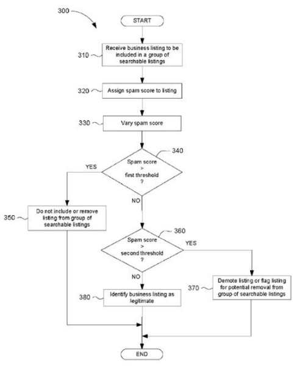

The title from a Google local search patent reached out and grabbed me as I was skimming through Google’s patents. It has the kind of title that captures your attention, as a weapon in the war that Google wages against people who might engage in Business spam against the search engine.

The title for the patent is [Reverse engineering circumvention of spam detection algorithms](http://patft.uspto.gov/netacgi/nph-Parser?Sect1=PTO2&Sect2=HITOFF&p=1&u=%2Fnetahtml%2FPTO%2Fsearch-adv.htm&r=1&f=G&l=50&d=PALL&S1=08612436&OS=PN/08612436&RS=PN/08612436). The context is local search, where some business owners might be striving to show up in results in places where they don’t actually have a business location, or where heavy competition might convince them that having additional or better entries in Google Maps is going to help their business.

The result of such efforts might be for their local search listings to disappear completely from Google Maps results. The category Google seems to have placed such listings under is “Fake Business Spam.”

Google has filed and been granted a number of patents in a category I’ve called [Web Spam](https://www.seobythesea.com/category/web-spam/).

I like finding those, reading about them, and making sure that they don’t inadvertently target sites that they shouldn’t. A false positive, or a site mistakenly positively identified as spamming a search engine, may mean more than just a site getting demoted in rankings.

It could mean that sites might just disappear from rankings completely.

## Rank-Modifying Spammers Patent

One patent, filed a couple of years back, took sites that Google was suspicious of using spam to improve rankings and instead of increasing their ranks, decreased their rankings, or kept them the same, or let rankings fluctuate randomly. That patent wasn’t limited to just local search like this newer one.

It focused on providing an incorrect ranking intended to get a spammer to reverse changes they may have made to a site, or roll some of them back.

If the changes were reversed by (possibly the same person), Google might decide that the changes were done by a spammer, especially if new changes were even more spammy (unnatural links, keyword stuffing, etc.). I titled my post about that patent, [The Google Rank-Modifying Spammers Patent](https://www.seobythesea.com/2012/08/google-rank-modifying-spammers-patent/).

The post and patent inspired a few discussions and a few questions to the Google Spam fighting team. Matt Cutts [released a video](https://www.seobythesea.com/2013/05/avoiding-misinformation-from-search-related-patents/) sometime after, warning people that, “Just because we have a patent on something doesn’t mean we are currently using it.

## Fake Business Spam

Google local search business listings provide data identifying a business and its location both in the world and on the web. It targets helping people find businesses of certain types, close to specific locations. People do create bogus listings, attached to very real phone numbers to generate business leads. Often many of such businesses don’t necessarily even need nearby offices to conduct the kind of business that they perform. As the patent warns us:

> The customer may be defrauded by contacting or visiting an entity believed to be at a particular location only to learn that the business is actually operating from a completely different location. Such fraudulent marketing tactics are commonly referred to as “fake business spam”.

We’re next told that search engines try to identify such business spammers, who sometimes experiment with search listing submissions to see if they can manipulate search results. They might do this by generating a spam score for business listings based upon a number of factors and then adding some random numbers to that score so that it isn’t easy for spammers to reverse engineer those scores. This seems to be an inspiration for making such changes:

*The amount of noise that is added is sufficient to affect spammer’s attempts to reverse engineer spam-identification algorithms, but small enough so that the search experience of end users is minimally affected because the ranking of legitimate listings is unaffected.*

[Reverse engineering circumvention of spam detection algorithms](http://patft.uspto.gov/netacgi/nph-Parser?Sect1=PTO2&Sect2=HITOFF&p=1&u=%2Fnetahtml%2FPTO%2Fsearch-adv.htm&r=1&f=G&l=50&d=PALL&S1=08612436&OS=PN/08612436&RS=PN/08612436)
Invented by Douglas Richard Grundman
Assigned to Google
US Patent 8,612,436
Granted December 17, 2013
Filed September 27, 2011

Abstract

> A spam score is assigned to a business listing when the listing is received at a search entity. A noise function is added to the spam score such that the spam score is varied.
>
> In the event that the spam score is greater than a first threshold, the listing is identified as fraudulent and the listing is not included in (or is removed from) the group of searchable business listings. In the event that the spam score is greater than a second threshold that is less than the first threshold, the listing may be flagged for inspection.
>
> The addition of the noise to the spam scores prevents potential spammers from reverse engineering the spam detecting algorithm such that more listings that are submitted to the search entity may be identified as fraudulent and not included in the group of searchable listings.

## Local Search Business Spam Scores

The patent lists some of the things it looks at in generating an initial business spam score, such as:

- The geographic density of businesses in the same category
- Repeated identifying information in different listings
- Ratios of common terms in the business listing title to total words in the title
- Any other number of known methods for determining whether a listing is fraudulent

I didn’t write this post to help people who might be spamming business local search listings, but rather because I know how important search listings can be to legitimate businesses of all types that rely to a degree upon Google local search listings for the success of their businesses.

The patent does provide more details on the process behind how Google might use a business spam score and how random amounts of noise might be added. If you’re interested, I’d suggest digging into the patent a bit more.

Updated May 22, 2019
