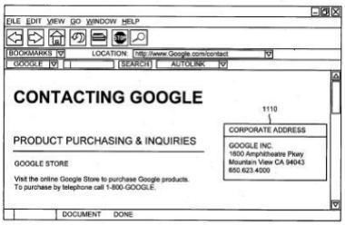

A patent application filed at the end of last week appeared to describe how Google Autolink worked – [Providing useful information associated with an item in a document](http://appft1.uspto.gov/netacgi/nph-Parser?Sect1=PTO2&Sect2=HITOFF&u=%2Fnetahtml%2FPTO%2Fsearch-adv.html&r=1&f=G&l=50&d=PG01&p=1&S1=20060129910&OS=20060129910&RS=20060129910).

The United States Patent and Trademark Office assignment database shows that this document was assigned to Google in December of 2004, but, as close as it seemed to describe how autolink worked, I wasn’t completely convinced.

At least until I looked closer at the “figures” filed with the document. Note the “autolink” button on the bottom toolbar in the picture of a browser window below.

There were a lot of great articles and blog posts written on Google’s Autolink when it was first described, and released onto the [Google Toolbar](https://support.google.com/toolbar/answer/81376?hl=en), from [Jason Kottke](https://kottke.org/05/03/google-toolbar-autolink) through [Danny Sullivan](https://www.searchenginewatch.com/2005/02/25/google-toolbars-autolink-the-need-for-opt-out/). It’s hard to believe that more than a year has passed.

**How does Autolink work?**

Pattern matching.

The toolbar might remove formatting from the page and analyze its contents to try to recognize the information.

The items of information it may look for could include:

- Postal addresses,
- Telephone numbers,
- Flight information,
- Traffic information,
- Product identification information,
- Tracking numbers,
- Document identification numbers (e.g., International Standard Book Number (ISBN)),
- International Standard Serial Number (ISSN),
- [Digital Object Identifier](http://www.doi.org/) (DOI)),
- Vehicle identification numbers (VINs), and;
- Others,

These items are the kind that might be identified based on pattern matching. They differ in content, but there’s a match in the general pattern of the characters they contain for many of them. The “Digital Object Identifier” is an interesting thing to include in this list from the patent application, and it’s probably worth a visit to the page I linked to it above, to see what types of things can have a [Digital Object Identifier](http://www.doi.org/) (quite a few, actually).

Here’s a snippet from the document explaining how the easier patterns from some items can be identified and matched:

> A postal address, for example, may contain information commonly associated with an address, such as a number (street or zip code), a street name, a street type (road, street, lane, etc.), a city name, and a state name in relative proximity to one another. Similarly, tracking numbers for a particular company may contain the same format. For example, the United Parcel Service (UPS) uses the following three formats for its tracking numbers: 1Z 000 000 00 0000 000 0; 0000 0000 0000; and T000 0000 000. Therefore, these patterns of characters may be used to identify UPS tracking numbers. The other types of information identified above may contain their patterns of characters.

In addition to looking at the patterns, the toolbar may also look for some words near the item that it is trying to find a pattern for. So, for a tracking number, it might expect to see words like these near the number:

> “ship,” “shipment,” “shipping,” “track,” “tracking,” “delivery,” and “package.”

The patent application goes on to explain how the button and autolink drop down might work, and tie in with a mapping program and page, or tracking or book or vehicle information provider. It also describes the process of inserting underlines on the page, and a hyperlink to a page that shows more information based upon the item of information found by the toolbar.

It also provides detailed explanations of how this might work with tracking numbers and mailing addresses.

**Conclusion**

Google has limited the use of autolink to a handful of information items. This document gives us an idea of how they could expand it if they were so inclined.
