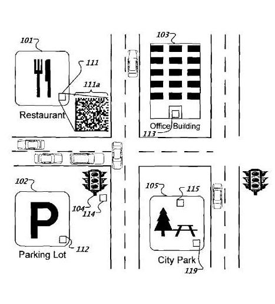
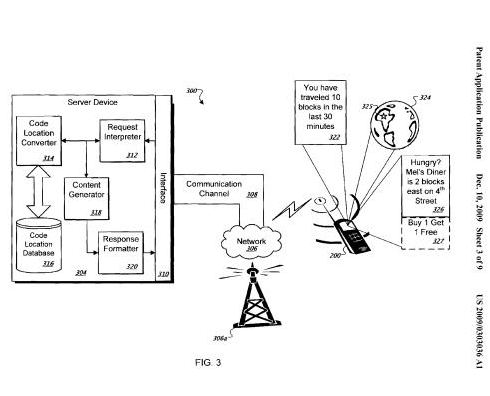

A couple of days ago, the Official Google Blog announced a new way of learning more about locations that you come across, using mobile phones that are capable of taking pictures of, or scanning barcodes.

The post, [Explore a whole new way to window shop, with Google and your mobile phone](https://googleblog.blogspot.com/search?updated-max=2009-12-07T11:31:00-08:00&max-results=10) describes how Google is sending out window decals to “more than 100,000 local businesses in the U.S.” that people can scan or take pictures of with their mobile phones to learn more about those businesses.

A patent application assigned to Google was published today which provides a fair amount of detail on how a system like this might work and goes beyond the use of barcodes for businesses to include parks, government buildings, attractions, and landmarks, as seen in the image above from the patent filing.

Taking a picture of a barcode might result in the display of more information on a phone’s screen or an audio message. The content returned in response to someone scanning one of these barcodes could include other things such as maps, coupons, advertisements, reviews, and more.

The patent application is:

[Machine-Readable Representation of Geographic Information](http://appft.uspto.gov/netacgi/nph-Parser?Sect1=PTO2&Sect2=HITOFF&u=%2Fnetahtml%2FPTO%2Fsearch-adv.html&r=1&p=1&f=G&l=50&d=PG01&S1=20090303036.PGNR.&OS=dn/20090303036&RS=DN/20090303036)
Invented by Arnaud Sahuguet
US Patent Application 20090303036
Published December 10, 2009
Filed June 10, 2008

Abstract

> A computer-implemented location identification method involves obtaining a digital image of a machine-readable representation encoded with a geographic location identifier that is associated with a geographic location, decoding the image of the machine-readable representation to produce the geographic location identifier, and presenting content related to the geographic location and identified using the decoded geographic location identifier.

One question that needs to be asked, is why would Google rely upon stickers for a system like this instead of using something like Global Positioning Satellite (GPS) information, or cell phone triangulation, or some other method that would negate the need for someone to take an actual picture?

We’re told in the patent filing that GPS systems have some limitations, such as:

- Subscription to a GPS navigation system may be expensive, and difficult to use
- GPS Functionality requires unobstructed skyward views, which may not be possible in some places, like metropolitan areas with skyscrapers
- Privacy concerns with GPS may keep some people from using a device that permits precise tracking of their location without their consent

Barcodes like the kinds found on the stickers that Google is sending out to businesses might not just be found in the windows of businesses, but could also be located on the pavement of parking lots or signs associated with those lots, near the entrance to an office building, on a traffic light pole, at or near the base of a monument, or in many other places.

The barcodes could include text explanations of how they might be used, and could also use non-visual components such as Radio Frequency (RF) tags, for handheld devices that can read those.

We’re also told in the patent application that privacy concerns could be addressed by letting the user of a phone or other kind of handheld manual control when they wanted more information about the barcode or RF tag.

The barcodes could also be used by people to provide them with maps of their locations, which they could zoom in and out to view what else might be around them, whether on a city block level, or a larger portion of a city, or state. It can also show other possible “areas of interest,” such as parks or restaurants, post offices, capitol buildings, etc.

If you want to find other nearby restaurants, for example, you might run a restaurant locating application on your phone to find other restaurants that might offer similar fare. You might also be able to locate advertisements, promotions, coupons, and reminders for other nearby destinations.

As I mentioned quickly above with the use of barcodes possibly placed on the pavement of a parking log, barcodes aren’t limited to window stickers but could also be affixed to “paper, plastic, wood, metal, or any other appropriate material.”

While Google is mailing out stickers to a large number of businesses, the patent tells us that recipients of such barcodes might be able to receive them electronically so that they can print them out, or generate them in some other fashion:

> As one example of the process just described, an organization, such as a franchisor, may identify many different geographic locations, such as the locations of various restaurants within its franchisee network. A mailing list for the restaurants may be imported into an application which may then convert the address information to a two-dimensional barcode and may print the two-dimensional barcode along with the address information in a human-readable format.
>
> For example, the two-dimensional barcode can be printed on a sticker and the human-readable address may be printed on a mailing label so that the two-dimensional barcode can be mailed to the appropriate restaurant. The items may be accompanied by instructions telling a manager at each restaurant where to post the two-dimensional barcode (e.g., near a front door, on a promotional poster).
>
> In another example of the process, an entrepreneur may visit a web site for a promotion (e.g., a COCA-COLA.RTM. sales promotion) and may use a mapping interface to locate her store on a map. The web site may then generate a screen containing a two-dimensional barcode for the location that the person may print out on a home or business printer, such as onto an adhesive label. The web site could also instruct her what to do with the label.

How did Google decide which businesses to include in their initial mailing of stickers?

The more than 100,000 businesses are supposedly the “local businesses in the U.S. that have been the most sought out and researched on Google.com and Google Maps,” which Google is calling Favorite Places on Google.

Ash Nallawalla wrote a post, [Google PlaceRank in the wild](http://www.netmagellan.com/google-placerank-in-the-wild-750.html), about Google’s favorite places’ selections, noting that John Hanke, Google VP of Google Earth, Maps, and Local, mentioned in a Techcrunch quote that “Google will be adding these businesses incrementally,” and that “They are selected based on their PlaceRank.”

The very detailed post from Ash looks at some of the different ranking factors that Google may be looking for when deciding upon the PlaceRank. In doing so, he points to a post of mine from 2007, [Google’s Place Rank and Interestingness – Ranking Geographic Entities in Maps/Earth for Display](https://www.seobythesea.com/2007/06/googles-placerank-and-interestingness-ranking-geographic-entities-in-mapsearth-for-display/), which describes Google’s patent filing on [Place Rank – Entity Display Priority in a Distributed Geographic Information System](http://appft1.uspto.gov/netacgi/nph-Parser?Sect1=PTO2&Sect2=HITOFF&u=%2Fnetahtml%2FPTO%2Fsearch-adv.html&r=1&p=1&f=G&l=50&d=PG01&S1=20070143345.PGNR.&OS=dn/20070143345&RS=DN/20070143345).

It’s interesting to see the processes behind that older patent filing used together with the barcode system described in this newer patent application in a way that could expand Google’s ability to provide local search information in a significant manner.
