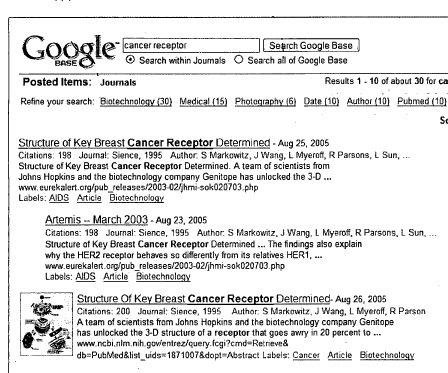
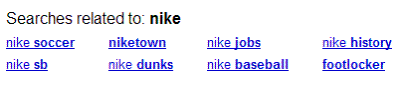

When Google Base first came out, it didn’t have the friendliest looking interface, and its use and purpose wasn’t very clear. A couple of new patent applications provide some more information about the ideas behind Google Base.

The name, Google Base, is a play off the phrase “data base.” At the simplest level, it’s a way of letting people upload information (user generated content) to the Web in a structured format, with attributes and values associated with that information. Want to upload information about jobs, or products for sale, or library holdings? Google Base lets you do that.

The uses for Google Base can be purely informational, such as a collection of information about journals: title, author, publication, article. Google Base can also contain commercial information, such as products for sale and information about those products.

Because the information is entered in a structured format, it should be easy to search for items contained within the many Google Base entries, and when people enter that information, they can also attach labels to it. The [Google Base Help Center](https://web.archive.org/web/20070430152236/http://base.google.com/support/bin/answer.py?answer=59260&hl=en) does a nice job of explaining what Google Base is, and how it can be used.

**History and Purpose of Google Base**

The public perception of Google Base, from the time it was introduced in 2005, to the present is pretty interesting. Is it a competitor to eBay or Craig’s List? Is it helplessly flawed? The replacement to Froogle? A way of taking on job sites, and dating sites, and real estate web pages?

From reading the patent applications, it appears that the main idea behind it is to allow people to create searchable databases that they can use for their desktops, their networks, or the internet. If someone wants to build a jobs database, or a products database, then Google Base will let them.

If allowing people to share their information in a structured manner on the Web provides some interesting information that Google can let people search by labels, or through a vertical search such as a products search, then Google will use that information.

Here’s a timeline showing some of the issues raised by the media involving Google Base over the past couple of years. It shows some of the confusion over Google Base that people have had:

- 2005/10/25 – Google Base: A New Rival for eBay and Craigslist?

- 2005/11/16 – Google Base Debuts for Hosting All Content

- 2005/11/17 – [With Google Base, Ubiquitous Web Company Extends Its Reach](https://www.washingtonpost.com/wp-dyn/content/article/2005/11/16/AR2005111602205.html)

- 2005/11/25 – Google Patches its Base

- 2005/12/6 – Help Wanted on Google Base

- 2006/2/26 – [Update: Google Base will get e-commerce functions](https://www.infoworld.com/article/2656856/update--google-base-will-get-e-commerce-functions.html)

- 2006/3/29 – [Is Google Gunning For EBay?](https://www.forbes.com/2006/03/28/ebay-google-advertising_cx_rr_0328ebaygoogle.html)

- 2007/1/12 – Google Base – The Comparison Shopping Story of Q1 2007

- 2007/4/18 – [Google takes the pun out of shopping](https://www.cnet.com/news/google-takes-the-pun-out-of-shopping/)

The official [Google Base Blog](http://googlebase.blogspot.com/) is also a good place to learn more about the history of Google Base.

**The Patent Applications**

The patent applications for Google Base haven’t been published at the US Patent and Trademark Office, but they were published at the World Intellectual Property Organization (WIPO) last week.

- [Search Over Structured Data](https://patentscope.wipo.int/search/en/detail.jsf?docId=WO2007046830)
- [Adding Attributes and Labels to Structured Data](https://patents.google.com/patent/WO2007046829A3/en)

Chances are good that if you read through the Google Base Help pages, you’ll get a good sense of a lot of what is covered in the patent applications. There is some additional information in there.

The two areas that I questioned the most were how items might be ranked, and how the “query refinement” terms that show up in Web search are decided upon. The patent applications provide a few different answers for the first of those – the ranking of items, and discuss the concept of “core” attributes which may correspond with the query refinements.

**Ranking Items in Google Base**

The patent filings state that there are 2 major signals looked at to score items:

- Query Dependent Rank – Mainly an information retrieval (IR) score (relevancy to the query)
- Query Independent Rank – Mixture of page rank and item rank

The PageRank would be the provider’s website page rank. Some items aren’t associated with Web pages (one of the points behind Google Base is that you can upload information even if you don’t have a Web site to associate it with).

So, PageRank many not exist in cases where the items are hosted only in a collection of data on Google Base, and/or the items are not linked or connected to other items.

In addition to PageRank, the patent documents mention “Item rank,” which can be determined by a number of factors. There are two main ways to classify these signals:

- Provider specific signals, (e.g. rating)
- Offer specific signals (e.g., Length of description, number of attributes, labels, pictures etc.)

Item Rank can be defined by the following signals

- Length of Description
- Length of Title
- Number of Labels
- Number of Attributes
- Pictures
- Number of times offer has been reported as spam
- Rating of the provider
- Recency of the offer

In addition to sorting items by these ranking factors, there may be a “maximum number of items per provider” to prevent a crowding of the page by a specific provider (just like only showing a couple of Web results from the same site during a Web search).

When a searcher chooses attributes and/or labels to narrow a search, the system will search labels, titles, description and attribute values. Attribute names should also be searchable as complete names. Here’s some more that we are told in the patent applications involving those searches:

- Phrases are weighted heavily compared to words that occur far away.
- Labels are weighted more heavily than titles, which are weighted more heavily than descriptions.
- Attribute values are weighted the same as labels.

A screen shot from the patent shows items listed in Google Base:

**Query Refinements in Google Web search from Google Base**

In a Web search, you might see a list of query refinements for a particular search term. When I conducted a search for the word [nike] I received a list of ten results, and then the following query refinements, taken from labels and attributes from Google Base:

So, how are those decided? It’s hard to tell. In the image above, we see a list of labels and attributes across the top of a search in Google Base. The patent applications describe how those are determined. Is the process the same for the query refinements that are shown in Google Web Searches? It’s difficult to tell. They might be.

In Google Base, when a result is determined for a query, some attribute names and labels for the query result may be displayed.

The attributes that show up on top of the query result are:

- The most common in the query result
- The ones that have been clicked on or refined by searchers the most.

Here’s the more technically detailed explanation:

> When an end-user performs a search, the q most relevant results are determined by the search engine and the n most popular attributes are determined for the q most relevant results. For the top n attribute names, the system determines the top m attribute/label values. It then calculates histograms, or offer counts, by counting the number of matching offers in the set of relevant results. The values q, n, and m are all configurable. Example values, which are not to be taken in a limiting sense are: q- 1,000 – 100,000 K (q can also be set to ALL results that match a particular query term.) N is in the range of 100s and M is in the range of 20-100.

**Conclusion**

Google Base allows Google to let users create content for the search engine in a manner that is easy to index (and search) because it is structured in attribute/value pairs for different items, and because it can be labeled even further by the people entering information.

We see Google try to extract information from data it receives from telecoms, directories, and Web pages for local search, to create a structured database that it can use to supply searchers with information about business locations. It isn’t always easy for Google to construct a database from a mix of structured, semi-structured, and unstructured data.

Google can try to do the same to populate a products database (or other databases), but if they can get people to upload that information in a structured manner, it may become a lot easier for them to index that information.
