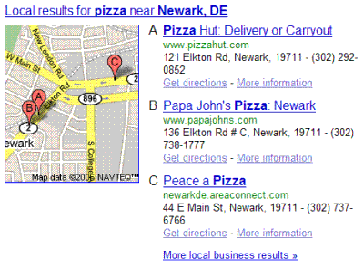

I had the pleasure of talking with Anita Campbell a couple of weeks back, for an article published today on the Technology portal web pages of Inc. Magazine – Local Search — How Do I Use it for My Business? If you don’t know Anita or her writings, I heartily recommend that you visit her [Small Business Trends](https://smallbiztrends.com/) site, which is filled with useful and usable information about small businesses.

We didn’t know when we were discussing local search then that Google would make a change that would make [local searches even more prominent](https://googleblog.blogspot.com/2007/01/find-and-compare-local-businesses.html), which they announced this morning.

You can find local search information on Google’s [Local Search](https://www.google.com/maps) pages, but they also will sometimes show information in a regular Google Web search in a section above their Web search results about local businesses when they think that a search is intended to be a local search. See the post I made about [Google OneBox Results](https://searchengineland.com/googles-onebox-patent-application-10325) at *Search Engine Land* if you want a technical explanation about how they might decide to show those results.

In the past, these “OneBox” local results were just links that people might skim past to see the Web search results. But, there’s a new format for those local results, and they have added a map and fuller descriptions for them, which makes them much more visible, and less likely to be something you would skim past, as you can see in the image below.

The other thing about these that is interesting is that there isn’t much of a gap between the local search results and the Web search results in Google like there was previously. Presenting them this way makes them look a lot more like they are part of the Web search results.

I suspect that this will be a real boon to businesses that are listed in those top local results. Interestingly, you don’t even need to have a web site to rank well in local search.
