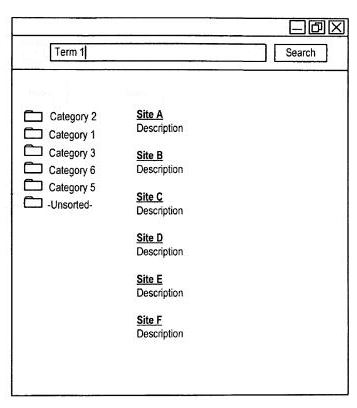
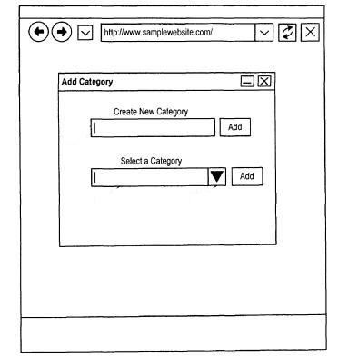

Last week, I wrote a post on the Webimax blog about an approach that Google might take in response to the fact that there are often so many results in response to a particular query. The post, [How Google May Re-Rank Search Results Based the Context of What You Click](https://www.webimax.com/blog/seo/how-google-may-re-rank-search-results-based-the-context-of-what-you-click), described how Google might re-rank your search results for related followup queries within the same search session. Search for [jaguar] and choose a result related to the Jacksonville football team, and Google might boost results related to the football team or sports in general in your search results within the same search session.

Google might try to use a “Contextual Click Model” as I described in that post, to try to identify related sites within sets of search results. They would do that by looking at its search query log files for search sessions from multiple searchers to cluster those clicks into related categories.

There are other ways that Google might potentially categorize documents that show up in search results. One place that they might look at is knowledge base information tied to search query log information, to create some categories. For example, a search for [jaguar] on Wikipedia shows many possible topics, including the car, the cat, a band from Iceland, the Jacksonville football team, a Formula One racing team, an Atari game console, a type of Fender guitar, and many others.

While the Wikipedia results might present a lot of potential categories, Google query log information might help the search engine understand which [jaguar] a searcher might mean by the query.

Another approach to categorization of queries that might be used is described in a Google patent granted this week.

When you perform that search for [jaguar], Google may show you a set of categories that you could click upon to choose a category. If you don’t see one you like, Google may also provide a chance for you to add a category. The category that you add might be a personalized result that only you might see. If enough people add a particular category, it might be added to the categories that others see as well.

Each category might be associated with one or more search results. The categories may also be organized into a hierarchy of categories. For example, there might a “sports” category associated with the word [jaguar], and that could include the NFL football team, as well as the racing team, and a large number of other teams with the name Jaguar or Jaguars. There may be lower-level “sports” categories such as “football,” “racing,” “lacrosse,” and others. A searcher might not only be able to add categories, but also have the ability to modify this hierarchy of categories.

Users of this system could also possibly associate specific websites with at least one category as well.

The hierarchy of categories could also possibly be presented to users in a visual graphical interface as well. Searchers might be able to submit a data set to the search engine, which could return search results organized in a set of categories as well. For instance, you could submit a list of counties in New Jersey to the search engine, and it might return associated categories with search results for each of those categories based upon your data.

In addition to adding categories, and modifying the hierarchy of categories, you could also remove some categories from the results you see. This category system would also include a feedback module where you could provide feedback about categories and the hierarchy of categories. The changes you make and the feedback that you provide might influence the categories that everyone might see in response to a query.

The feedback added to a particular query might also be visible to searchers as well, which could act as described in the patent, as “adding a wiki-type element of intelligence and content to a category-based search engine.”

The patent is:

[Organizing search results in a topic hierarchy](http://patft.uspto.gov/netacgi/nph-Parser?Sect1=PTO2&Sect2=HITOFF&p=1&u=%2Fnetahtml%2FPTO%2Fsearch-adv.htm&r=1&f=G&l=50&d=PALL&S1=08214361&OS=PN/08214361&RS=PN/08214361)
Invented by Mark M. Sandler and Kushal Dave
Assigned to Google
US Patent 8,214,361
Granted July 3, 2012
Filed: September 30, 2008

Abstract

> Methods, systems, and apparatus, including medium-encoded computer program products, for searching a data set and returning search results organized in a hierarchy of categories are disclosed. A set of categories is provided for organizing a set of search results, wherein each category is associated with one or more search results.
>
> The set of search results is organized into a hierarchy of categories, the hierarchy including at least one category from the set of categories.
>  At least a portion of the hierarchy of categories is displayed and a user request to modify the hierarchy of categories is received. The hierarchy of categories is modified following the user request.

While a categorization approach like this could be used on Google itself, an alternative described in the patent is that it could be used on a web page or portal associated with the website, or through a software tool like an add on or plugin or toolbar for a browser, stored on a computer or other device

The patent provides some more details on how such a hierarchical category set-up might be arranged. For instance, users might be able to “whitelist” some results within certain categories, as well as blacklist others from categories. Categories could also be blacklisted or whitelisted for categorical hierarchies.

If someone attempts to add a category, and there aren’t any search results that might be associated with the new category, an error message might be returned.

While the patent was filed in 2008, it does mention that “user feedback data and category preferences may be limited to a social network including the user.”

## Take Aways

Around a year ago, Google pulled its [Google Directory off the Web](https://www.seroundtable.com/google-directory-gone-13731.html). The Google Directory was an adaptation of the Open Directory Project which used the structure of that directory for categories, but listed links within those categories based upon Google’s ranking signals. In the message that Google provided to people looking for the missing directory, we were told, “We believe that web search is the fastest way to find the information you need on the Web,” with the words “web search” linked to Google’s home page.

Given the size of the Web, it’s possible to come away with the thought that it’s just too hard for the editors of a directory to keep up with the growth of the Web. Wikipedia has attracted a good number of editors who contribute to and edit the online encyclopedia. Might people be as active or interested in adding and modifying categories associated with search results on Google?

Would Google offer a system like this as a plugin or toolbar addition to individuals, who might categorize and modify their search results? Would they add categories like these to signed-in Google searchers? Is the idea of using this approach one that Google decided against when they moved towards Knowledge Base results, or would it be a useful addition to Knowledge Base results? Might different knowledge base results be tied to different categories?

A Google patent I wrote about last year in [How Google May Boost Search Rankings for Your Relevant Pages Using Keywords in the Same Category as Your Website](https://www.seobythesea.com/2011/08/google-boost-search-rankings-category/) described the possibility that Google might assign categories to every page and/or every site that it indexes. Search queries might also be assigned specific categories as well. As I noted in that post:

> Since Google can make a strong statistical association between the query [sushi bar] and documents that would fall into a category of “Japanese restaurants,” it’s possible that the search engine might boost pages that have been categorized as “Japanese restaurants” in search results on a search for [sushi bar]. My supermarket [sushi bar] page might not get the same boost.

If Google is using a category approach like that, it might be helpful to have many millions of searchers able to categorize pages as well and to be able to modify those categories and categorical structures. Then again, putting that ability in the hands of searchers might provide a way for some people to try to manipulate search results that might potentially be based upon categories.

Such a category system might be associated with Google Profiles, and changes made to categories might be given a certain amount of weight based upon the reputation scores of Google users, especially when one of the categories might be associated with a topic that they might be considered by Google to be an authority on.

Will Google users be able to categorize search results in the future? Will they become part of knowledge base results?

We may have to wait to see.
