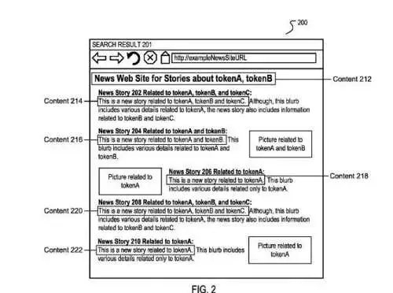

## Google Shows Dynamic Search Snippets to Show Pages in SERPs that Include Searcher’s Query Terms

If you go to Google Webmaster Tools and see the list of queries a page of yours might rank well for, you might see some query terms or phrases that you want to show up in search results. Webmaster Tools will show you how many “search impressions” your page might receive, as well as how many people have clicked on it when they have seen it. So what if your page has received 10,000 search impressions for that term or phrase but only 50 clicks?

## One Question You Should Probably Ask Yourself Is If the Term or Phrase is Satisfied By Your Page

Sometimes a query term has more than one meaning, and most people searching for it might be looking for a different meaning. For example, you create a page about Java the drink, and most searchers may be looking for the programming language.

Sometimes Google may have associated the query term with a specific site (as a navigational query result) and shows that site first, possibly even including additional pages for that site in the form of sitelinks. Someone searching for ESPN is most likely searching for the ESPN homepage, so if you create a page about the history of ESPN, it might not get a lot of clicks.

Sometimes Google sees a query associated with a named entity and associates a site with part or all of a query. For a query such as [spaceneedle hours], Google might show many results from the spaceneedle.com website before showing a page on your site about touring Seattle and the space needle page you created.

If you’re doing keyword research for a specific term or phrase and looking at search results for that term, you might see results like that. You can see those as a warning that the term or phrase you’re targeting might not be a good choice, or you could see them as a challenge that might be hard to overcome.

## A Good Rank and A Poor Click-Through Rate Can Be a Sign That You Need to Make Changes.

You see the query you rank well for in Google Webmaster Tools and a low number of clicks. You type the query term into Google and see your page appear in one of the search results, but the snippet is different from your meta description and doesn’t even match any of the content you created for the page.

Let’s say that the page is a blog post, and someone left a comment on the page that includes your query terms. It’s what appears as a snippet. What do you do? One approach might be to review your meta description and your content and see if you can improve both where those query terms appear so that they might be what Google shows as a snippet in the future.

## Ultimately, Google is the one that decides what dynamic search snippets appear to describe your page.

In my last post, I wrote about a Google patent that describes how Google might sometimes choose a snippet within the content it finds on a page, in the post, [How Google Might Generate Snippets for Search Results](https://www.seobythesea.com/2013/02/google-snippets-search-results/). That patent was originally filed in 2005 but not granted until 7 years later. It tells us that Google will look at different signals in paragraphs found on a page, such as if all the query terms appear within it, whether or not there’s too much punctuation if too many of the words in the paragraph are bolded italicized, and other signals.

It might give different weights to the different paragraphs it finds, and choose one of them before the others, to represent the page. Chances are that Google may have made some changes to the features described in that patent, but ultimately the search engine wants to provide a good idea of what searchers would see if they visited pages from results.

## Google Might Give Some Pages Second Chances When Some of The Same Terms Are In A Query, and The Page Shows in Search Results.

When someone searches at Google, the results they see provide hints about what a searcher might find if they click through to those pages. A combination of title (doing double duty as a link as well in Google and Bing), snippet description, and URL might tell us why a page was ranked high enough for us to see it when we type some words into a search box and hit the button next to or it or our enter button. Some sites do a great job crafting titles and meta descriptions, and content that might be shown might convince us to visit a page. Some sites don’t do quite as well.

And sometimes, when we search for a second query that might contain one or more of the same terms (or “tokens”) as our first query, and one of the same pages shows up in search results, Google might transform the result to give it a completely new snippet, at least according to a patent filed in 2011 and granted on February 19th. Google refers to this as “dynamic snippet generation” and tells us that.

This month, a patent granted to Google describes how Google might decide upon a different and dynamic search snippet in that instance. The patent is:

[Session-based dynamic search snippets](http://patft.uspto.gov/netacgi/nph-Parser?Sect1=PTO2&Sect2=HITOFF&p=1&u=%2Fnetahtml%2FPTO%2Fsearch-adv.htm&r=1&f=G&l=50&d=PALL&S1=08380707&OS=PN/08380707&RS=PN/08380707)
Invented by Ashutosh Garg and Kedar Dhamdhere
Assigned to Google
US Patent 8,380,707
Granted February 19, 2013
Filed: July 11, 2011

Abstract

> The first set of search results responsive to the first query during a search session is identified. A snippet is identified for each search result related to the first query. The snippet can be selected based on the location of the search tokens from the query in the search result. The second set of search results responsive to a second query during a search session is identified. Repetitive search results can be identified.
>
> A second snippet for the repetitive search result is identified. The second snippet can be selected based on the location of the second search tokens in the repetitive search result and the content of the first snippet.

The assumption behind this approach seems to be that a searcher will look through the snippets shown during the first search, and if they didn’t find one engaging enough to click through, they might try a different but related search. If the same page appears in the results, it might be better to show a different snippet for that page to let people decide if it might be worth visiting than to show them the very same snippet.

**Example of a dynamic search snippet**

Someone wants more information about a soccer team named the Pirates, located in Atlanta. They search for [Atlanta pirates] (without the brackets), and among the results is the home page for the team. For some reason, they decide not to click upon that results but instead perform a new query. They follow up with a query for [Atlanta soccer schedule], and the home page for the team appears in the results again. Google notices the follow-up query and that they both share one term (or a “token,” as the patent refers to it).

Instead of showing the same snippet for the page, Google looks through its choices among the different weighted paragraphs and chooses a different one.

This “dynamic generation of a snippet” for a repetitive search result is an attempt by Google to give that page a second chance of being clicked upon. In my previous post about snippets, I described some of the things that the search engine might look for in a paragraph on a page to choose a snippet from and how it might give those paragraphs different weights.

This patent adds additional weight by giving a negative score to the paragraph chosen previously if it’s in the same query session, and it may share one or more tokens (or terms). That paragraph might be chosen again if it still outranks other paragraphs that might have been given some weight as a potential snippet. Or another snippet might be shown instead.

## Dynamic Search Snioppets Conclusion

It’s worth spending your time crafting a meta description that might be used as a snippet since it could make the difference between whether or not someone clicks on one of your pages.

It is also worth the effort of creating well-written, interesting, and engaging content on your pages, including paragraphs where those terms appear upon your pages. Your page could rank for more than one term or phrase, and it might be showing up highly ranked for some of those and getting lots of search impressions but few clicks.

In some instances, improving the quality of your content where those query terms appear might earn you more clicks.

Just remember, Google is the one who decides what snippets to show, and it might show dynamic search snippets in some instances.
