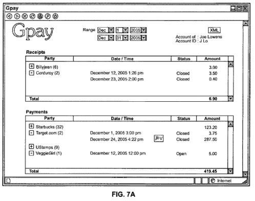
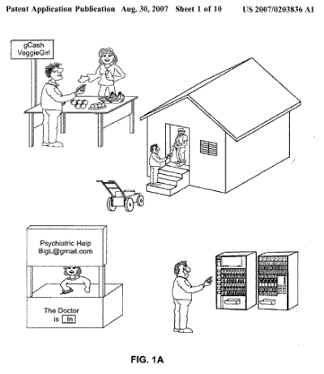
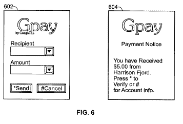

In April of 2006, I wrote about a patent application from Google that described a [micropayment system](https://www.seobythesea.com/2006/04/google-micropayments-patent-application-published/). Since then, we’ve seen Google launch another payment program, Google Checkout, that differs in a number of significant ways from that micropayment system. It’s a pretty [simplified way](https://www.searchenginewatch.com/2006/06/28/google-launches-checkout-not-the-rumored-gbuy/) of making payments.

Google just published a new patent application that takes payments much further than the world of online ecommerce. Screen shots from the filing show the name Gpay attached to this system, a name that Eric Schmidt had been using to refer to a payment system during the March Analyst day in 2006.

Google’s CEO insisted that Gpay was “not made to compete with PayPal or to replace existing peer to peer payment systems but that it’s meant to be a new solution to a new problem.”

If this new patent application is any indication of what problem Gpay was intended to solve, it is a much broader payment method than Paypal. The patent is detailed in:

[Text message payment](http://appft1.uspto.gov/netacgi/nph-Parser?Sect1=PTO2&Sect2=HITOFF&u=%2Fnetahtml%2FPTO%2Fsearch-adv.html&r=1&p=1&f=G&l=50&d=PG01&S1=20070203836.PGNR.&OS=dn/20070203836&RS=DN/20070203836)
Invented by Ramy Dodin
US Patent Application 20070203836
Published August 30, 2007
Filed: February 28, 2006

Abstract

> A computer-implemented method of effectuating an electronic on-line payment includes receiving at a computer server system a text message from a payor containing a payment request representing a payment amount sent by a payor device operating independently of the computer server system, determining a payment amount associated with the text message and debiting a payor account for an amount corresponding to the amount of the payment request, and crediting an account of a payee that is independent of the computer server system.

The description in the patent provides a look at four different examples of payments that could be made using this system. Interestingly, none of them are online transactions, but rather involve the use of text messages for the purchase of goods or services with a payment made by the person making a purchase, and verification received by the seller.

Payments to vending machines, and to community honor systems (for example, an office lunchroom snack program) are also included within examples in the document.

The patent provides a lot of information on how this system would work, and well as giving us some screenshots of the system. It provides information on how an API could be used with the system for even more flexibility in how people make purchases, as well as other innovations. Here’s an image of payment and verification screens:

This payment system isn’t a competitor for Paypal. Such a comparison would be selling Gpay short.

Will Gpay be something that Google launches, and consumers and merchants adopt? I’d consider using it.
