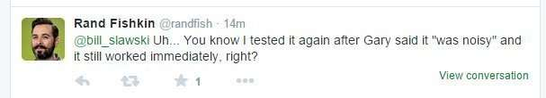
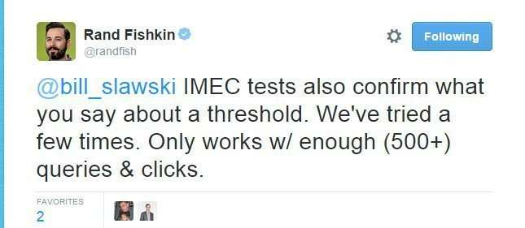

## User Feedback to Improve Search Rankings?

I was excited to see a Google Patent granted this past Thursday, which describes how Google may rank pages in part based upon user feedback (clicks) in response to rankings for those pages. The patent tells us that this kind of identifying of a user’s needs and determining which documents are returned that might be most useful to a searcher can involve “a fair amount of mind-reading” inferring from various clues what the user wants.” But, we’ve been told recently by a Google Spokesperson that such clues can be misleading. I thought it was still worth pointing the patent out.

_[Just one click away…](https://www.flickr.com/photos/56218409@N03/16068904227/in/photolist-qtXkoT-iLeUxA-77gjdB-dF3qRs-eXWpHn-o5KFZ6-pwscHc-hZdJ9w-dEX2F2-eYbToQ-enyFr7-enyAKL-dF3rao-8dGuMq-7x3e38-biAoF4-nktzH3-t1Zxv-8q5ed5-5CbcTW-8q24Ev-8t47qR-bwLSLa-n8GT8f-9AAbDL-5SCo9Z-bxk84r-qW4LA9-bwKNoi-bwKMFT-bwKGpc-bw4kge-bvXQRx-bxfA3p-bx9VER-bwDUnZ-bvWKWv-pMgYpc-bwHMDg-bUiCrm-9XczoL-bwK51z-bwHhhV-bxhxUD-7rmYZh-frkW9s-oWEWFd-93fmWS-aAe3DA-8HtLcK), [Matthias Ripp](https://www.flickr.com/photos/56218409@N03/), [Some rights reserved](https://creativecommons.org/licenses/by/2.0/)_

Some clues may be user-specific, the patent authors tell us, and when a searcher searches from a mobile device and Google know the location of that device, the results returned “can result in much better search results for such a user.” That does make sense.

Another clue Google may consider, they share with us, is that some pages may be linked to by several pages that are results for a query, and those “linked-to” pages are often good responses for that query as well. The patent tells us, “if authors of web pages felt that another web site was relevant enough to be linked to, then web searchers would also find the site to be particularly relevant. In short, the web authors “vote up” the relevance of the sites.”

The focus of this patent isn’t on those linked to pages, or on searches made from mobile devices, but instead tells us that Google may monitor responses to particular search results, to see what is clicked upon among those, and the results users often click upon will receive the highest rankings. They tell us that, “The general assumption under such an approach is that searching users are often the best judges of relevance, so that if they select a particular search result, it is likely to be relevant, or at least more relevant than the presented alternatives.”

This seems to go against a statement made a month ago by Google’s Gary Illyes, as reported in the blog post [How Google Uses Clicks in Search Results, According to Google](http://www.thesempost.com/how-google-uses-clicks-in-search-results-according-to-google/). He responded that User Feedback signals like click-throughs are too noisy a signal to rely upon for ranking purposes:

> He does say they see those who are trying to induce noise into the clicks and for this reason they know using those types of clicks for ranking would not be good. In other words, CTR would be too easily manipulated for it to be used for ranking purposes.

This patent does look closer at such a click-based feedback monitoring behavior to understand when such input should possibly be used to boost the ranking scores of particular search results, in the context of a search for a particular query. Is it used by Google? We don’t know. From Gary Illyes statements, it doesn’t seem likely, even with the recent granting of this patent.

## Implicit User Feedback Model

The patent tells us that it might adjust how much relevance such a click might carry by comparing a change over time in user selections of the document. It does talk about a “background population click trend model” that clicks might be compared to, but the statement from Gary Illyes tells us that some clicks for certain queries may be made in a manipulative manner, as noted in the blog post carrying his response to this question:

> It is well known that you can buy people and bots who will specifically click on links in the search results in a way that makes it appear your site is the better one and your competitor’s site is not. It is pretty easy to find those that do this kind of thing.

## Weighting of User Feedback From Selections after a Threshold Reached or Passage of Time

It appears that the patent anticipated some noise in clicks; but not necessarily of the level that Gary Illyes tells us about. The process in the patent wouldn’t start counting the number of user selections until after a certain threshold is reached, such as a hundred selections, and might weigh such selections differently within a certain amount of time. such as within a certain number of weeks from such results being chosen by searchers.

The user feedback patent is:

[Modifying search result ranking based on a temporal element of user feedback](https://patentscope.wipo.int/search/en/detail.jsf?docId=US146703304)
Publication Number: 09092510
Publication Date: July 28, 2015
Grant Date: 28.07.2015
Inventors: Robert J. Stets, Jr., Mark Andrew Paskin

Abstract:

> In general, the subject matter described in this specification can be embodied in a method that includes: obtaining user feedback associated with quality of an electronic document; adjusting a measure of relevance for the electronic document based on a temporal element of the user feedback; and outputting the measure of relevance to a ranking engine for ranking of search results, including the electronic document, for a search for which the electronic document is returned.
>
> Obtaining the user feedback can include receiving user selections of documents presented by a document search service, the method can include evaluating the user selections following an implicit user feedback model to determine the measure of relevance, and adjusting the measure of relevance can include adjusting the measure of relevance following the implicit user feedback model

## User Feedback Take Aways

The patent does list several advantages of an approach like the one it describes, but the statements from Gary Illyes seem to make it unlikely to be used. This is the first patent I’ve seen from Google that is so much unlikely to be used, but I am often asked about how easy or difficult it is to tell whether or not a patent I’ve written about has been implemented. So, I wrote about this one to show that sometimes the patents are possibly wrong.

This patent may have been granted this week, but the statement from Gary Illyes, made in June makes it unlikely that Google will use the process described in this patent; that Google looking at click-throughs for ranking is unlikely. I do usually search to see if there has been any news about processes described in patents before I write about them.

There was at least one positive take away from Gary Illye’s statements. Google may use clicks to explore and disambiguate queries for personalized results. So, when a query could cover more than one type of category, clicks might help Google decide upon which category Google may use to influence future searches for individuals, to give them personalized search results.

Rand sent me a tweet telling me that his experiments show a different result than what Gary Illyes said about the power of click-throughs:

_Rand’s tweet in response to my post, about his experiment._

And Rand remarked upon what I said about the Threshold described in the patent as well:

So, maybe the patent is describing something being used at Google now? It’s possible.
