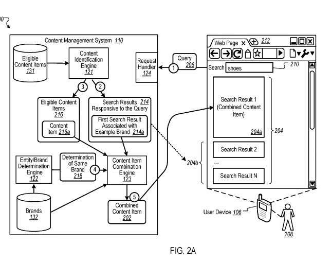
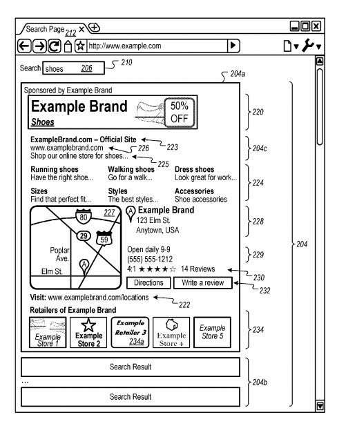

## Google Introduces Combined Content Results

This new patent is about “Combined content. What does that mean exactly? When Google patents talk about paid search, they refer to those paid results as “content” rather than as advertisements. This patent is about how Google might combine paid search results with organic results in certain instances.

The recent patent from Google (Combining Content with Search Results) tells us how Google might identify when organic search results might be about specific entities, such as brands. It may also recognize when paid results are about the same brands, whether they might be products from those brands.

If a set of search results contains high-ranking organic results from a specific brand and a paid search result from that same brand, the process described in the patent might allow for the creation of a combined content result of the organic result with the paid result.

## Merging Local and Organic Results in the Past

When I saw this new patent, it brought back memories of when Google found a way to merge organic search results with local search results. The day after I wrote about that, in the following post, I received a call from a co-worker who asked me if I had any idea why a top-ranking organic result for a client might have disappeared from Google’s search results.

I asked her what the query term was and who the client was. Then, I performed the search and noticed that our client was ranking highly for that query term in a local result, but their organic result had disappeared. I pointed her to the blog post I wrote the day before about Google possibly merging local and organic results. The organic result disappearing, and the local result getting boosted in rankings. It seemed like that is what happened to our client, and I sent her a link to my post, which described that.

[How Google May Diversify Search Results by Merging Local and Web Search Results](https://www.seobythesea.com/2013/07/how-google-may-diversify-search-results-by-merging-local-and-web-search-results/)

Google did merge that client’s organic listing with their local listing, but it appeared that it was something that they ended up not doing too often. I didn’t see them do that too many more times.

I am wondering, will Google start merging paid search results with organic search results? If they would do that for local and organic results, which rank things differently, they might with organic and paid. The patent describes how.

The newly granted patent does tell us about how paid search works in Search results at Google:

> Content slots can be allocated to content sponsors as part of a reservation system or an auction. For example, content sponsors can provide bids specifying amounts that the sponsors are willing to pay for the presentation of their content. In turn, an auction can be run, and the slots can be allocated to sponsors according, among other things, to their bids and/or the relevance of the sponsored content to content presented on a page hosting the slot or a request that is received for the sponsored content. The content can be provided to a user device such as a personal computer (PC), a smartphone, a laptop computer, a tablet computer, or some other user device.

## Combined Content – Combining Paid and Organic Results

Here is the process behind this new patent involving merging paid results (content) and organic results:

1. A search query is received.
2. Search results responsive to the query are returned, including one associated with a brand.
3. Content items (paid search results) based at least in part on the query are returned for delivery along with the search results responsive to the query.
4. This approach includes looking to see if eligible content items are associated with the same brand as the brand associated with the organic search results.
5. If there is a paid result and an organic result associated with each other, it may combine the organic search result and the eligible content item into a combined content item and provide the combined content item as a search result responsive to the request.

When Google decides whether the eligible content item is associated with the same brand as an organic result, it is a matter of determining that an owner of the brand sponsors one content item.

A combined result (of the paid and the organic results covering the same brand) includes combining what the patent is referring to as “a visual universal resource locator (VisURL),”

That combined content item would include:

- A title
- Text from the paid result
- A link to a landing page from the paid result into the combined content item

- A map to retail locations associated with brand retail presence.
- Retail location information associated with the brand.

In addition to the brand owner, the organic result that could be combined might be from a retailer associated with the brand.

It can involve designating content from the sponsored item included in the combined content item as sponsored content (so it may show that content from the paid result as being an ad.)

It may also include “monetizing interactions with material that is included from the at least one eligible content item that is included in the combined content item based on user interactions with the material.” For example, additional items shown could include an image or logo associated with the brand, or one or more products associated with the brand, or combine additional links relevant to the result.

The patent behind this approach of combining paid and organic results was this one, granted in April:

[Combining content with a search result](http://patft.uspto.gov/netacgi/nph-Parser?Sect1=PTO1&Sect2=HITOFF&d=PALL&p=1&u=%2Fnetahtml%2FPTO%2Fsrchnum.htm&r=1&f=G&l=50&s1=9,947,026.PN.&OS=PN/9,947,026&RS=PN/9,947,026)
Inventors: Conrad Wai, Christopher Souvey, Lewis Denizen, Gaurav Garg, Awaneesh Verma, Emily Kay Moxley, Jeremy Silber, Daniel Amaral de Medeiros Rocha, and Alexander Fischer
Assignee: Google LLC
US Patent: 9,947,026
Granted: April 17, 2018
Filed: May 12, 2016

Abstract

> Methods, systems, and apparatus include computer programs encoded on a computer-readable storage medium, including a method for providing the content. A search query is received. Search results responsive to the query are identified, including identifying a first search result in a top set of search results associated with a brand. Based at least in part on the query, one or more eligible content items are identified for the delivery along with the search results responsive to the query. A determination is made when at least one of the eligible content items is associated with the same brand as the brand associated with the first search result. The first search result and one of the determined at least one eligible content item are combined into a combined content item and providing the combined content item as a search result responsive to the request.

The patent does include details on things such as an “entity/brand determination engine,” which can compare paid results with organic results to see if they cover the same brand. This is one of the changes that indexing things instead of strings are bringing us.

The patent does have many other details, and until Google announces that they are introducing this, I suspect we won’t hear more details from them about it. But then again, they didn’t officially announce that they were merging organic and local results when they started doing that. So don’t be surprised if this becomes available at Google.
