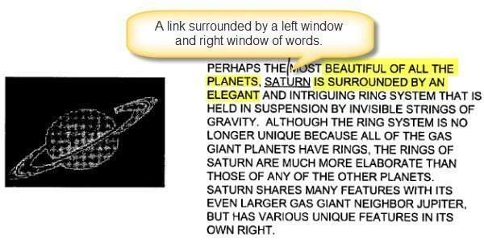

## How might Google Identify Link Spam?

With Google’s Penguin update, it appears that the search engine has been paying significantly more attention to link spam as attempts to manipulate links and anchor text to a page. The Penguin Update was launched at Google on April 24th, 2012. It was accompanied by a blog post on the Official Google Webmaster Central Blog titled [Another step to reward high-quality sites](https://webmasters.googleblog.com/2012/04/another-step-to-reward-high-quality.html)

The post tells us that Google is decreasing Web rankings for sites that violate Google’s Webmaster Guidelines with approaches using things like link spam. The post is written by Google’s Head of Web Spam, Matt Cutts, and in it, Matt tells us that:

> …we can’t divulge specific signals because we don’t want to give people a way to game our search results and worsen the experience for users; our advice for web admins is to focus on creating high-quality sites that create a good user experience and employ white hat SEO methods instead of engaging in aggressive webspam tactics.

The post points out examples of the kind of Web Spam that it targets, including keyword stuffing on pages of a site, and link spam appearing in “unusual linking patterns” and spun content. Last month, I wrote about a Google patent that described how Google might be trying to identify spun content in the post, [Google Scoring Gibberish Content to Demote Pages in Rankings?](https://www.seobythesea.com/2013/10/google-gibberish-content-to-demote-pages/)

In 2004, Google filed for a patent that describes how the search engine might pay more attention to the context of a link, such as the words surrounding the link. It would do this to understand the context of those links better. In the example of unnatural links from the Webmaster Central blog post, we see clearly how links in an example post might be created in a way where the context of those links makes little sense:

## Artificially Inflating Ranks of Documents Through Link Spam

The patent points out many link spam “techniques” that “artificially inflate the rank of a document, thereby degrading the quality of the search results.” These include:

***Link-Based Spamming*** – This involves obtaining a large number of links to a page to increase the rank of that page. They give an example of link spam using link farms, and tell us that “some spammers pay owners of highly ranked documents to include a link to their document to increase the rank of their document.”

***Anchor Text Spamming*** – This involves acquiring links from a large number of pages linking to a particular page using the same anchor text, to get that page to rank highly for that text in search results.

***Google Bombing*** – Very similar to anchor text spamming, this approach has its roots more in disrupting search results as a joke or to make a political statement rather than for commercial or economic gain.

***On-Site Framing*** – Many sites “frame” pages on their site with links such as “products” links, “jobs” links, “investor” links, etc., to try to “artificially inflate” the ranks of pages associated with these links.

To combat these link spam techniques, the patent describes how the search engine might pay more attention to the “context” of links on a page to either boost or demote the rankings of those pages.

The patent is:

[Ranking based on reference contexts](http://patft.uspto.gov/netacgi/nph-Parser?Sect1=PTO2&Sect2=HITOFF&p=1&u=%2Fnetahtml%2FPTO%2Fsearch-adv.htm&r=1&f=G&l=50&d=PALL&S1=08577893&OS=PN/08577893&RS=PN/08577893)
Invented by Anna Patterson and Paul Haahr
Assigned to Google
US Patent 8,577,893
Granted November 5, 2013
Filed: March 15, 2004

Abstract

> A system ranks documents based on contexts associated with the documents. The system identifies a reference in a first document, where the reference is associated with a second document. The system analyzes a portion of the first document associated with the reference, identifies a rare word (or words) from the portion, creates a context identifier based on the rare word(s), and ranks the second document based on the context identifier.

One of the inventors behind the patent is Anna Patterson, who is behind Google’s Phrase-Based Indexing patents.

## How Ranking Based on the Context of Links Works

The search engine crawls pages. It might identify links on a page and capture a window of text around the link, such as a left window of the five words before the link and a right window of five words after the link. In the picture above, we see a link with the anchor text “Saturn,” and the text on the left includes “Beautiful of all the planets,” and the text on the right includes the words, “Is surrounded by an elegant.”

The next step in this process is for Google to take what it believes is the “rarest” of the words from each of those segments of text from this text associated with the link over all documents on the Web that it has indexed, using a process such as an [inverse document frequency](https://nlp.stanford.edu/IR-book/html/htmledition/inverse-document-frequency-1.html) (IDF) weighting technique or a conventional linguistic modeling technique.

In this case, “planet” is the rarest word in the left window and “elegant” is the rarest word in the right window. The patent tells us that the number of words used in these windows might be more or less than five words, or that other content from pages where these links appear might also be used.

We are also told that only “real” words are used in this process. The words might be identified as real by looking at whether or not they appear in a certain number of documents on the Web a minimum number of times, such as within 50 different documents. This can keep random blocks of text that might include symbols or numbers from being used.

There may be many documents that link to the same pages, and this context approach means capturing all this context information from potentially a lot of pages. Many pages might include these words near a link, and a count of those is included in the context information. Since Saturn is a planet, the chances are good that many links might include “planet” near a link with the anchor text “Saturn” pointed to that page. Since Saturn is often referred to as the Elegant Planet, it’s also likely that the word “elegant” might appear near a link to a page about Saturn that uses the anchor text “Saturn.”

These “context” scores for the rarest words around a link, or “context identifiers” as they are called in the patent, are used to create a score for each link, to develop a ranking score for each document. Other elements that might be considered in such a score can include:

- The number of links to the document
- The importance of the documents linking to the document
- The freshness of the documents linking to the document
- Other known ranking factors

If you look at the example above about unusual linking patterns from the Google Webmaster Central blog post, the words around the links in that aren’t words that would likely appear near those links regularly.

If there aren’t many of the same context identifiers, or there are so many that they might be considered suspicious, any ranking value for that link that might be passed to the page being linked to might be ignored. The patent doesn’t refer to this as a PageRank signal or a hypertext relevance signal, but it’s possible that both are being referred to.

The counts of these context identifiers might be tracked over time so that a sudden surge of counts of those for a link might be identified. A page that acquires links to it in a short period of time that contains the same context identifiers might be considered suspicious, and those links might be considered link spam, and may not count in the ranking of the page linked to. A page that has a variety of valid context identifiers might be boosted in search results.

## Take Aways

This link spam patent was filed almost a decade ago, even though it was just granted recently. There’s no telling if Google has used the process described within it, or used it and replaced it with a different approach, or used it and continues to do so today.

The types of problems it is intended to solve, such as link spam, anchor text spam, Google Bombs, and framed on-site references are issues that Google seems to be still battling, though, with things like the Penguin Update and manual penalty notices sent to site owners in Google’s Webmaster Tools, it looks like Google has been active in fighting these types of problems. Is this context identifier approach part of the process that Google uses to identify unnatural linking? It looks like it would work in the Penguin Webspam example above.

How much attention will you be paying to the words that you place around links in the future?

I’ve written a few posts about links. These were ones that I found interesting:

5/30/2006 – [Web Decay and Broken Links Can be Bad for Your Site](https://www.seobythesea.com/2006/05/web-decay-and-dead-links-can-be-bad-for-your-site/)
12/11/2007 – [Google Patent on Anchor Text Indexing and Crawl Rates](https://www.seobythesea.com/2007/12/google-patent-on-anchor-text-and-different-crawling-rates/)
1/10/2009 – [What is a Reciprocal Link?](https://www.seobythesea.com/2009/01/what-are-reciprocal-links-and-what-do-search-engines-think-of-them/)
5/11/2010 – [Google’s Reasonable Surfer: How the Value of a Link May Differ Based upon Link and Document Features and User Data](https://www.seobythesea.com/2010/05/googles-reasonable-surfer-how-the-value-of-a-link-may-differ-based-upon-link-and-document-features-and-user-data/)
8/24/2010 – [Google’s Affiliated Page Link Patent](https://www.seobythesea.com/2010/08/googles-affiliated-page-link-patent/)
7/13/2011 – [Google Patent Granted on PageRank Sculpting and Opinion Passing Links](https://www.seobythesea.com/2011/07/google-patent-granted-on-pagerank-sculpting-and-opinion-passing-links/)
11/12/2013 – [How Google Might Use the Context of Links to Identify Link Spam](https://www.seobythesea.com/2013/11/google-context-of-links-identify-link-spam/)
12-10-2014 – [A Replacement for PageRank?](https://www.seobythesea.com/2014/12/replacement-pagerank/)
4/24/2018 – [PageRank Update](https://www.seobythesea.com/2018/04/pagerank-updated/)

Last Updated July 1, 2019
