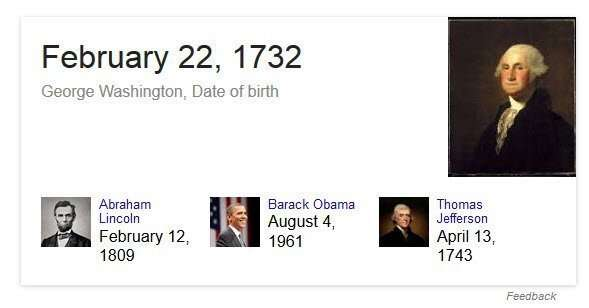
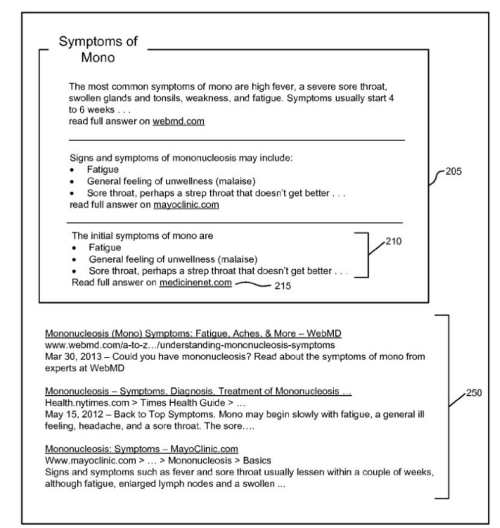

When someone searches the web and asks a question such as “what is the capital of Poland” or “what is the birth date of George Washington” a web search engine such as Google may not be very helpful in providing an answer if it provides a list of web pages that might answer that query instead of an actual answer. People in the SEO community have been referring to such answers as Featured Snippets.

_Google answering a direct question with a factual answer._

A patent granted to Google this week describes how Google indexes data across the web and may look to a large collection of facts (in a fact repository such as a knowledge graph) to check upon and verify such answers, so that it can deliver them with more confidence and certainty, like in the answer to the question about George Washington’s birthday shown above.

The patent tells us that some efforts to build a search engine that can “provide quick answers to factual questions have shortcomings.” One of these is that the answers may come from a single source, such as “a particular encyclopedia.” Why this is perceived as a shortcoming is that it is:

> …unlikely to answer any questions concerning popular cultures, such as questions about movies, songs or the like, and is also unlikely to answer any questions about products, services, retail and wholesale businesses and so on. If the set of sources used by such a search engine were to be expanded, however, such expansion might introduce the possibility of contradictory or ambiguous answers. Furthermore, as the universe of sources expands, information may be drawn from untrustworthy sources or sources of unknown reliability.

If we instead use all of the data across the web as a potential source of answers, we get a much wider range of topics and things that questions can be answered about.

If facts related to things that questions might arise about can be found on many pages, then the data about those things can be corroborated from many sources to identify how correct a fact about them might be. A search engine that might build up such a knowledge base, or fact-based repository could then answer a question such as “what is the capital of Poland,” or “what is the birth date of George Washington” and use that collection of corroborated facts to return a “likely correct fact,” as an answer.

The patent that was just granted is:

[Corroborating facts in electronic documents](http://patft.uspto.gov/netacgi/nph-Parser?Sect1=PTO2&Sect2=HITOFF&p=1&u=%2Fnetahtml%2FPTO%2Fsearch-adv.htm&r=1&f=G&l=50&d=PALL&S1=08954412&OS=PN/08954412&RS=PN/08954412)
Invented by Shubin Zhao and Krzysztof Czuba
Assigned to Google
US Patent 8,954,412
Granted February 10, 2015
Filed: September 28, 2006

Abstract

> A query is defined that has an answer formed of terms from electronic documents. A repository having facts is examined to identify attributes corresponding to terms in the query. The electronic documents are examined to find other terms that commonly appear near the query terms.
>
> Hypothetical facts representing possible answers to the query are created based on the information identified in the fact repository and the commonly-appearing terms. Corroborating facts is done using electronic documents to determine how many documents support each fact. Additionally, contextual clues in the documents are examined to determine whether the hypothetical facts can be expanded to include additional terms.
>
> A hypothetical fact that is supported by at least a certain number of documents, and is not contained within another fact with at least the same level of support, is presented as likely correct.

The patent’s description starts by telling us more about how Google crawls and indexes data from the Web, and [uses data janitors to clean up that data](https://www.seobythesea.com/2007/06/google-janitors-clean-up-facts-on-the-web/). The “fact repository” described in that post is an early version of Google’s knowledge graph before it was given that name.

This patent was also written before the fact repository it includes in its description was referred to as the knowledge graph by Google, and it is a precursor to the knowledge graph. The method of using lots of documents to see if facts from them support each other is similar to a desired consistency of citations in local search when it comes to NAP (name, address, and phone number). Google has much more confidence in the correctness of a local search listing or an answer to a question about facts when a lot of documents provide the same answer to a specific question.

As to how Google might provide answers to questions about facts, the patent does give us a description of how that is done:

> In one embodiment, the contents of the facts in the repository are also indexed in index. The index maintains a term index, which maps terms to {object, fact, field, token} tuples, where “field” is, e.g., an attribute or value. The service engine is adapted to receive keyword queries from clients such as object requestors and communicates with the index to retrieve the facts that are relevant to the user’s search query.
>
> For a generic query containing one or more terms, the service engine assumes the scope is at the object level. Thus, an object with one or more of the query terms somewhere (not necessarily on the same fact) will match the query for purposes of being ranked in the search results. The query syntax can also be used to limit results to only certain objects, attributes, and/or values.

An approach like that might turn up more than one fact that answers a question, so the patent also tells us about how it might rank answers:

> The relevance score for each fact is based on whether the fact includes one or more query terms (a hit) in either the attribute or value portion of the fact. Each hit is scored based on the frequency of the term that is hit, with more common terms getting lower scores and rarer terms getting higher scores (e.g., using a TD-IDF based term weighting model).
>
> The fact score is then adjusted based on additional factors. These factors include:
>
> - The appearance of consecutive query terms in a fact,
> - The appearance of consecutive query terms in a fact in the order in which they appear in the query,
> - The appearance of an exact match for the entire query,
> - The appearance of the query terms in the name fact (or other designated fact, e.g., property or category), and
> - The percentage of facts of the object containing at least one query term.
>
> Each fact’s score is also adjusted by its associated confidence measure and by its importance measure. Since each fact is independently scored, the facts most relevant and important to any individual query can be determined and selected. In one embodiment, a selected number (e.g., 5) of the top-scoring facts are retrieved in response to query.

## Take-Aways

The patent provides more details and additional examples of corroborating facts, including a detailed look at how it answers the question “Who did William Frawley play”?

The answer to that question is that he played the character of “Fred Mertz” in “I Love Lucy,” but he also played “Bub” in the even older TV series, “My Three Sons. The patent describes why it might answer with the more recent answer first, based upon search history.

In the Google Research blog, Google announced this week that they had updated their Knowledge Graph to show improved answers to medical questions, in the post [A remedy for your health-related questions: health info in the Knowledge Graph](https://googleblog.blogspot.com/2015/02/health-info-knowledge-graph.html). They told us in the post that they had worked with people at the Mayo Clinic to respond to a wide range of health-related questions. It goes beyond the process described in this patent on corroborating facts by looking at a wide range of other electronic documents on the Web. The answers to these health-related questions were reviewed by many actual doctors.

We had been getting answers to health-related questions as featured Snippets, such as “what are the symptoms to Mono” shown in a patent screenshot that I showed in the post [Featured Snippets “Natural Language Search Results for Intent Queries](https://www.seobythesea.com/2014/12/direct-answers-natural-language-search-results-intent-queries/)

Will we see Google updating other areas of knowledge using other subject matter experts to improve upon those answers? The idea in the patent on corroborating facts to provide answers does make sense, but we have an example from this week where Google was showing that it might not have been completely satisfied with those answers.

Have the corroborating facts approach described in the patent changed?

They might find ways to provide higher quality answers for other topics, too.

Some posts I’ve written about patents involving question answering:

- 7/19/2007 – [Search Engines Crawling FAQs to Learn How to Answer Questions?](https://www.seobythesea.com/2007/07/search-engines-crawling-faqs-to-learn-how-to-answer-questions/)
- 9/21/2014 – [Google May Use Question Answering to Populate the Knowledge Graph](https://www.seobythesea.com/2014/09/missing-incorrect-data-knowledge-graph/)
- 10/12/2014 – [How Google May Use Entity References to Answer Questions](https://www.seobythesea.com/2014/10/google-fact-questions-entity-references-unstructured-data/)
- 12/30/2014 – [Featured Snippets – Taken from Authority Websites](https://www.seobythesea.com/2014/12/direct-answers-taken-authority-websites/)
- 12/31/2014 – [Featured Snippets – Using Query Intent Templates to Identify Answers](https://www.seobythesea.com/2014/12/direct-answers-using-query-intent-templates-identify-answers/)
- 2/11/2015 – [How Google was Corroborating Facts for Featured Snippets](https://www.seobythesea.com/2015/02/google-corroborating-facts-direct-answers/)
- 7/12/2015 – [How Google May Answer Questions in Queries with Rich Content Results](https://www.seobythesea.com/2015/07/how-google-may-answer-questions-in-queries-with-rich-content-results/)
- 9/9/2015 – [When Google Started Showing Featured Snippets](https://www.seobythesea.com/2015/09/when-google-started-answering-factual-queries/)
- 11/30/2016 – [Answering Featured Snippets Timely, Using Sentence Compression on News](https://www.seobythesea.com/2016/11/featured-snippets-sentence-compression/)
- 6/19/2017 – [Google Extracts Facts from the Web to Provide Fact Answers](https://www.seobythesea.com/2017/06/fact-answers/)
- 7/10/2019 – [How Google May Handle Question Answering when Facts are Missing](https://www.seobythesea.com/2019/07/how-google-may-handle-question-answering-when-facts-are-missing/)

Last Updated July 11, 2019.
