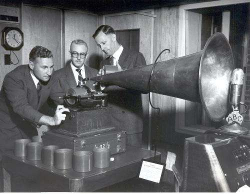

_[Historical recording Aboriginal Corroboree](https://www.flickr.com/photos/abcarchives/4407263589/in/photolist-7HsnVg-56A4z3-56bD3X-7HNGGH-57qAeo-57moCc-5yWTSH-9dPbgU-55VVqz-56R7J6-4rsAzB-Ad1Gip-5BXHs-brB2Yw-aAPbTz-aAS3Vw-qd9Zb-4MQ6qd-4MQ6rN-bDVxK8-56R6Ja-57qzE3-ePTwen-56fLCf-56fNqY-55HYvF-5y44g6-56U82n-561699-5773kc-55LayV-5yhTRK-57drbs-5z2bo5-57qyAS-5615uj-56AfTL-pD8YGX-pTt28y-pDepnE-pVoQ14-pD8YeT-pVGJ75-pVGHFW-pDenEb-5y42FT-PznxK-577a8F-5777JX-55QhUm), [Australian Broadcasting Corporation,](https://www.flickr.com/photos/abcarchives/)[Some rights reserved](https://creativecommons.org/licenses/by-nc/2.0/)_

## Is Google Using Cross-Device Tracking and Ultra-High Frequency Audio Watermarking?

Advertising on the Web is going through some changes because of how smartphones and tablets track visitors on a site and how advertisements may broadcast high-frequency sounds that may act as audio watermarking that other devices can pick up upon.

Imagine watching TV, and your TV broadcasts a high-frequency sound from an advertisement that your phone hears and shares with the advertiser, who may then track whether you search for or purchase the product offered on a website?

Cross-Device Tracking and Audio Watermarking are well described in the following Irish Examiner article, [Future of Mobile: Advertisers and the quest for your data](https://www.irishexaminer.com/viewpoints/analysis/future-of-mobile-advertisers-and-the-quest-for-your-data-374074.html).

If you read that and have some familiarity with how Google works, you may ask yourself if Google has followed such practices like Cross-Device Tracking or has shown any sign of doing so.

In November, the Federal Trade Commission (FTC) held a workshop on [Cross Device Tracking](https://www.ftc.gov/news-events/events-calendar/2015/11/cross-device-tracking), where they investigated practices that different companies were getting involved with, and they did some diving into the topic in a very informative way.

A couple of videos linked to that page are worth watching if you want to become better informed on how Cross-Device Tracking works.

I noticed a couple of recent patent filings at Google that were relevant to the workshop and to that article that fit into these changes and is worth thinking about:

## Cross Device Notification

The first of these considers some of the different types of devices that are quickly growing in usage across the Web, such as smartphones and tablets, that don’t use browsers that save cookie files and aren’t tracked type of approach as these Web users travel across the Web.

Instead, these devices often use an [Advertising ID](https://support.google.com/googleplay/android-developer/answer/6048248?hl=en), or other means of tracking behavior from one device and sharing that tracking with other devices.

[Cross Device Notifications](https://patentscope.wipo.int/search/en/detail.jsf?docId=WO2015200051)
Pub. No.: WO/2015/200051
Publication Date: 30.12.2015
International Filing Date: 16.06.2015
Inventors: Michael Koss Campbell, Justin Dewitt, Katie Jane Misserly, Dmitry Titov
Abstract:

> Techniques for cross-device notifications are provided. An example method includes receiving a first indication of an event detected at a first device associated with a user account, determining one or more characteristics of the event based on the first indication of the event, detecting whether the determined characteristics match at least one selection criterion, automatically identifying a second device from one or more devices associated with the user account, and providing, if the determined characteristics match the at least one selection criterion, the first indication of the event to the second device associated with the user account, where the provided the first indication of the event is displayed at the second device to allow management of the event at the first device from the second device.

## Audio Watermarking

This second approach, involving high-frequency audio watermarking using sounds that you wouldn’t even hear, surprised me. The patent itself doesn’t talk about that tracking itself. But, it does share information about what you’ve been subjected to (a particular advertisement) so that your future activities involving that advertisement might then be tracked.

[Communicating Information Between Devices using Ultra High Frequency Audio](https://patentscope.wipo.int/search/en/detail.jsf?docId=WO2015195808)
Pub. No.: WO/2015/195808
Publication Date: 23.12.2015
International Filing Date: 17.06.2015
Inventors: Shyam Narayan, Naveen Aerrabotu, Sreenivasulu Rayanki, Yun-Ming Wang

Abstract:

> A client device encodes data into an audio signal and communicates the audio data to an additional client device, which decodes the data from the audio signal. The data is partitioned into characters, which are subsequently partitioned into a plurality of sub-characters. Each sub-character is encoded into a frequency, and multiple frequencies that encode sub-characters are combined by the client device to generate an audio signal. Frequency encoding sub-characters may be above 16 kilohertz, so the sub-characters are transmitted using frequencies inaudible to humans. The audio signal is communicated to an additional client device, which decodes frequencies from the audio signal to sub-characters, combined into characters by the additional client device to generate the data.

The future of advertising and Cross-Device Tracking advertisements on the Web will involve multiple types of devices. It may also involve high-pitched frequency audio watermarking sounds outside of the normal hearing range by human beings. Google now has patent filings that describe its possible use of this kind of technology.
