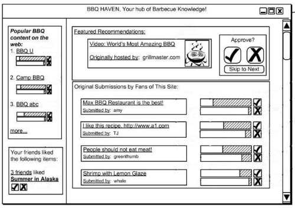

In the past few weeks, Google has introduced a [recommendation bar](https://www.sectortechno.com/2012/07/google-plus-has-recommendation-bar.html#.W0ooiNJKiUk) to Google Plus, and Facebook has introduced their own [recommendation bar](https://venturebeat.com/2012/07/26/facebooks-new-recommendations-bar-its-like-digg-for-your-facebook-friends/) as well. The Facebook recommendation bar appears like it will only show up when you’re on Facebook at this point, but the Google Recommendation Bar will appear when you hover over a “g +1” button on a site that you’re visiting, and will show you recommendations from that site.

A Google patent application that came out last week showed a different variation of a recommendation bar, and a screenshot from the patent filing shows what could have been, or might be sometime in the future. Here’s a glimpse:

In addition to providing recommendations, the interface from this patent filing will also let you vote up and vote down content from the site and from other sites as well. The patent filing is:

[Web-Wide Content Quality Crowd Sourcing](http://appft.uspto.gov/netacgi/nph-Parser?Sect1=PTO1&Sect2=HITOFF&d=PG01&p=1&u=%2Fnetahtml%2FPTO%2Fsrchnum.html&r=1&f=G&l=50&s1=%2220120197979%22.PGNR.&OS=DN/20120197979&RS=DN/20120197979)
Invented by Leon G. Palm, Doug Coker, Colby D. Ranger, Daniel J. Berlin, Helen V. Hunt, Ethan C. Ambabo, and John D. Westbrook
US Patent Application 20120197979
Published August 2, 2012
Filed: January 23, 2012

Abstract

> Method, computer-readable media, and systems for centralizing votes submitted for content items hosted on multiple distinct and uncoordinated content sources, and ranking the content items against one another across the multiple distinct and uncoordinated content sources based on the centralized votes are disclosed.
>
> Recommendations of content items hosted by an original content source can be provided to users on the content interfaces of other content sources and additional votes for the recommended content items can be collected through the voting controls accompanying the recommend content items on the content interfaces of these other content sources.

We’re told in the patent filing that the kinds of content that could be used with such a recommendation system could include a wide range of content types including blog posts, images, music files, articles, news items, advertisements for items on sale, from sources such as websites, blogs, online discussion boards, gaming communities, market place type sites, and other forums.

The voting/recommendation interface is something that a site owner could possibly insert via some java script code, though the patent filing provides a lot of different possible implementations for providing this kind of crowdsourced recommendation system. It also provides a lot of variations in how it could potentially be set up, such as allowing for votes to be anonymized in some cases, or show who voted for what in others.

Google has already decided to start showing recommendations on sites when someone hovers over a G +1 button. Will they provide the crowdsourced version of recommendations described in this new patent filing? Is it something that site owners will install on their sites? Is it something that will be abused by the visitors to a site, or is it something that people will find fun, interesting, and helpful?

Is this Google’s answer to the demise of Digg?
