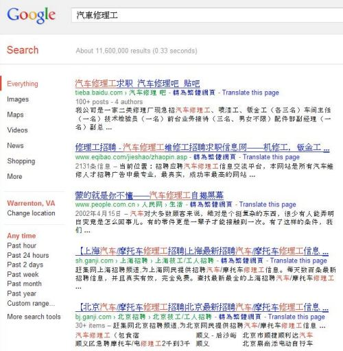

A Google patent granted last week describes how the indexes at different Google data centers may contain pages that are indexed and classified as global and pages that are indexed and classified as regional. Last summer, I wrote about how Google may [predict which data center](https://www.seobythesea.com/2011/06/how-google-might-classify-queries-differently-at-different-data-centers/) might provide the best results for a query. Google was also granted many patents last August that provided some insights into how Google’s [Planet Scale Distributed Storage of Data](https://www.seobythesea.com/2011/06/how-google-might-classify-queries-differently-at-different-data-centers/) may work.

Those patents from last summer give us an intriguing but incomplete look at the pages contained in Google’s data centers. The newly granted patent appears to fill in some significant gaps. Imagine that each data center might contain some unique pages and content that’s regional and some content that might be replicated across more than one data center that’s global. The global content could potentially take up between 50% and 75% of the storage area on each data center.

The process behind determining whether a page is regional or global involves the use of document classification scores. A global index includes documents that have a high-quality score regardless of the locations of people who view them, including popularity metrics such as PageRank. This global content is considered to be world-wide.

Content that isn’t world-wide could be included within a particular index as regional data content and may be located within a regional index at a data center based upon being similar to characteristics of the queries received at that particular data center. For example, if 75% of web queries from Lithuania are in the Lithuanian language, then many of the pages within the data center for those searches may be in Lithuanian. Pages that are popular in Lithuanian that aren’t in the Lithuania language may also be included in the regional index for that data center if those pages aren’t popular enough elsewhere to be included in the global index.

Chances are that many or most queries performed by searchers may be sent to the data center nearest them to be responded to, but they don’t have to be, as discussed in the prediction patent that I linked to in the first paragraph.

It’s also possible that a query in Chinese sent to a US data center may be re-routed to a Chinese data center, or it could be processed by both the US and a Chinese data center. It appears that a choice has been made that instead of trying to replicate Google’s index everywhere, that it makes more sense to try to use a machine training approach to try to include regional content closest to where it might be needed most often.

This approach does provide some interesting and peculiar results, though. If I search at Google, in traditional Chinese characters for an auto mechanic while in Virginia, it looks like I might be getting results from China, even though I might be better off getting information about local car repair places near me in Virginia. Note that the location setting in the left sidebar in the image below is set at “Warrenton, Virginia.”

The new Google patent is:

[Regional indexes](http://patft.uspto.gov/netacgi/nph-Parser?Sect1=PTO2&Sect2=HITOFF&p=1&u=%2Fnetahtml%2FPTO%2Fsearch-adv.htm&r=1&f=G&l=50&d=PALL&S1=08131712&OS=PN/08131712&RS=PN/08131712)
Invented by Gautham Thambidorai, Eisar A. Lipkovitz, Cosmos Nicolaou, and Li Fan
Assigned to Google Inc.
US Patent 8,131,712
Granted March 6, 2012
Filed: October 15, 2007

Abstract

> A corpus of documents is identified, such as a large corpus of web documents. A quality score is applied to each, and at least some of the documents in the corpus of documents are identified based on their respective quality scores.
>
> At least one query characteristic, for instance, the language of a query, associated with a plurality of search queries is identified. A subset of documents in the corpus of documents is identified that satisfies the at least one query characteristic. An index is built that includes the identified at least some documents and the identified subset of documents.

**More Local Web Pages in Google Search Results**

In a post from David Naylor’s web site a couple of days ago, titled [The Biggest Change In SEO To Date?](https://www.davidnaylor.co.uk/seo-2012.html), David Whitehouse wrote about being surprised to see his site and some other sites from nearby businesses listed on the first page of Google on a search for [SEO], after usually seeing sites that were more globally popular for that query in the past. Those results aren’t Google Place pages blended into search results from Google Maps, but rather Web pages. He reset his location in Google to some other locations in the UK and noticed that a range of pages on the first page of Google was being changed to reflect the new locations.

Back in 2009, I noticed one client ranking very well for a very generic, and hard to compete for term in the fourth position within Google’s search results, when my location was set to be near that client’s location. If I changed my location setting in Google, I would see another website in that same slot based upon the new location. While that “locally influenced ranking” persisted for a good number of months, it disappeared as quietly as it had started. If I try that same search now, I see a couple of web sites from local businesses showing up in those search results again, that change when I change my location.

Again, these aren’t Google Maps results blended into web search results, but rather a web page from businesses tied to the location listed in my Google search settings.

A Google Inside Search blog post from February 27th, [Search quality highlights: 40 changes for February](https://search.googleblog.com/2012/02/search-quality-highlights-40-changes.html), noted a few “improvements” for local search results:

One seemed to be an improvement involving showing “local” web pages within web search results:

> Improved local results. We launched a new system to find results from a user’s city more reliably. Now we’re better able to detect when both queries and documents are local to the user.

Another improvement involved showing more Google Places search results blended into web results when appropriate:

> Improvements to ranking for local search results. [launch codename “Venice”] This improvement improves the triggering of Local Universal results by relying more on the ranking of our main search results as a signal.

And another involved showing more locally relevant results in YouTube:

> More locally relevant predictions in YouTube. [project codename “Suggest”] We’ve improved the ranking for predictions in YouTube to provide more locally relevant queries. For example, for the query [lady gaga in ] performed on the US version of YouTube, we might predict [lady gaga in times square], but for the same search performed on the Indian version of YouTube, we might predict [lady gaga in India].

**Takeaways**

Google does seem to want to show more local web results in response to queries in Web search, in addition to Google Maps results that may also be included with those results.

From a technical standpoint, it makes sense for Google to include more than one index at its data centers, with one index that includes worldwide content, and another that includes regional data content frequently searched for at the nearest data center by searchers performing queries for that regional information. If a relatively rare search, like one for “automobile mechanics” written in Traditional Chinese, is performed in Virginia, it seems to make sense to re-route that query to a Chinese data center, though that might be a little far to take your car to get it repaired. :)

Google’s approach to including some more “regional” content in search results based upon location may or may not be related to the data center that a query takes place at, but it’s worth exploring Google’s recently returned emphasis on showing more local results in response to queries and the context of location from those searches.

Don’t confuse location with personalization either. If you missed it, an interview that Eric Enge conducted with Google’s Jack Menzel on [personalization at Google](https://blogs.perficient.com/2011/11/01/how-google-does-personalization-with-jack-menzel/) is worth reading. Here’s a snippet:

> Sometimes results that are a result of context get misinterpreted by people as personalization. If I respond to your query in your language that is really about context, not personalization. Personalization is more about recognizing that I like Dominion the card game and you really like Dominion the power company, and someone else likes a videogame called Dominion. Imagine you turned off personalization, and suddenly Google was responding to all of your queries in the wrong language, you would be like “oh come on”.

Are you seeing “local” web pages in web search results that you hadn’t been seeing before?

Last Updated May 22, 2019
