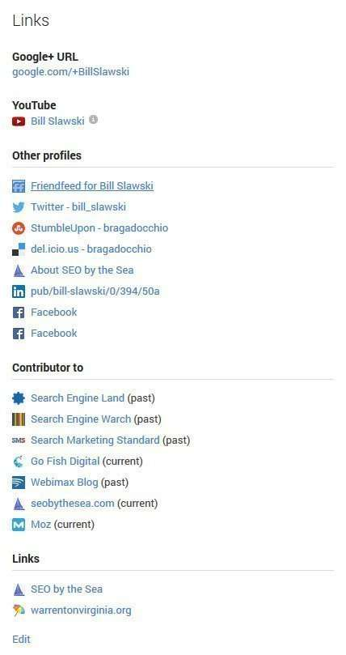
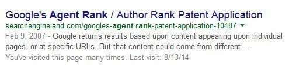
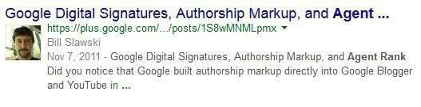

## How might Google decide upon Who Creates Authoritative Content?

At Google and Bing, both search engines have been experimenting with relevance and search. Both have shown profile photographs of people whom you may be connected to at places such as Google+ (for Google) and at Facebook (For Bing) in search results that include them. Both may have changed rankings for those pages as well.

Google was showing authorship photos in search results for some authors who had set up authorship markup on their Google profiles and their web pages. Google also showed profile pictures in search results for some pages authored by some people that didn’t contain any authorship markup as long as those pages or domains were linked to by the author’s Google profile page as “contributors to”.

The author profiles would sometimes appear in front of articles appearing in search results for content written by specific authors from those “linked to” sources.

## Then Authorship Changed

Recently, Google Webmaster Evangelist John Mueller announced that Google would be no longer requiring authorship markup and wouldn’t be showing photographs of authors in logged out search results at Google. As Eric Enge wrote at Search Engine Land, [“It’s Over: The Rise & Fall Of Google Authorship For Search Results](https://searchengineland.com/goodbye-google-authorship-201975).

Since then, you can sometimes still see author photos in search results when you are logged into Google for pages from Google Plus. You don’t see profile photos from non-Google Plus pages within those results, but you might see pages from those authors from outside of Google Plus if the pages are relevant for the query used.

On a search for [agentrank] (no brackets) while logged into Google, the following page used to rank at number one and show an authorship photo:

On the same search for [agentrank] (no brackets) while logged into Google, the following page ranks on the first page in search results, but does show an author photo:

The display or lack of display of the authorship photo appears to be immaterial as to whether either of these pages ranks on the first page in search results.

## Has Authorship Changed in Other Ways?

In a matter of interesting timing, a couple of days later, Google was granted a patent involving showing a page from an author connected to a searcher in Google+ if that author was determined to be authoritative for the query used by the searcher, or for a similar or synonym for that query. The patent doesn’t say that it requires authorship markup. It doesn’t say that it will show the authorship picture in search results next to that author. It doesn’t say that it will treat content on Google+ pages differently than web pages outside of Google+. It’s silent on topics like those.

The authoritative content patent is:

[Showing prominent users for information retrieval requests](http://patft.uspto.gov/netacgi/nph-Parser?Sect1=PTO2&Sect2=HITOFF&p=1&u=%2Fnetahtml%2FPTO%2Fsearch-adv.htm&r=1&f=G&l=50&d=PALL&S1=08825698&OS=PN/08825698&RS=PN/08825698)
Invented by Jun Gong, John E. Saalweachterm, Sheng Zhang, Wanda Wen-hui Hung, Bogdan Dorohonceanu, Yihua Wu, Sagar Kamdar, Jeremy Hylton, Othar Hansson, Kumar Mayur Thakur
Assigned to Google
US Patent 8,825,698
Granted September 2, 2014
Filed December 21, 2012

Abstract

> Implementations of the present disclosure include actions of:
>
> - Receiving a search query from a searching user
> - Determining that the search query corresponds to a trigger query and, in response
> - Providing data associated with the first set of authoritative users for a potential display to the searching user
> - Determining the second set of authoritative users based on the first set of authoritative users, for each authoritative user in the second set of authoritative users
> - Receiving a contact status between the authoritative user and the searching user within a social networking service, and
> - Transmitting instructions to display data associated with authoritative users of the second set of authoritative users with search results responsive to the search query, the data including the contact status for each authoritative user in the second set of authoritative users.

The authoritative content authors that rank in search results for a searcher they are connected to in Google+, do so because Google has decided that those authors rank for certain “Trigger Queries”. If that query is one used by a connected searcher. What the patent doesn’t tell us is how Google decides whether one or more people should have their content rank well for trigger queries.

The authoritative user data (from an authoritative user database) may include:

> - Query (Q) data
> - Authoritative user (AU) data and
> - Score (S) data, determined from one or more social networking services. In some examples, an authoritative content creator is authoritative for one or more queries with the score providing a relative measure of the authoritativeness of an authoritative user for a particular query. For example, a first user and a second user can be determined to be authoritative users for a query, and a first score and a second score can be respectively associated with the first and second users for the query. The first score can exceed, e.g., be greater than, the second score or a threshold, indicating that the first user is deemed to be more authoritative on topics underlying the query than the second user or an authoritative user in general, respectively. In some examples, the authoritative user data is organized in triples (e.g., (Q, AU, S)), where each triple denotes that user AU is authoritative for query Q with the score. S

The patent does also tell us that queries to be used as trigger queries may be decided upon by the popularity of those queries. If there are enough searches for a specific query, it might be chosen by Google to be associated with an authoritative content creator.

We don’t know if Google will be using an information extraction approach to attempt to identify who the “author” is of the content found on the Web in the future, but it’s possible. Rather than Google relying upon authors who aren’t setting up authorship markup in many cases (see the Eric Enge article), Google may sidestep that approach completely.

If people aren’t paying much attention to authorship badges when they are searching and are logged out of Google Plus, showing those badges doesn’t make sense. If Google re-ranks a search result by boosting its ranking because it thinks the author is authoritative for a particular query, Google doesn’t need to display an author photo. Google doesn’t annotate pages in search results with things like PageRank numbers, even though Lawrence Page did show off PageRank annotations in the first provisional patent for PageRank.

If Google were to tip its hat in some way to show that it was ranking a page higher because it believes that page and its author is authoritative for a topic, that knowledge might potentially be abused by people attempting to manipulate search results. If Google determines that you have created Authoritative Content for a query, it may not let you know. It might hide that decision. I would if I were Google.

Last Updated June 6, 2019.
