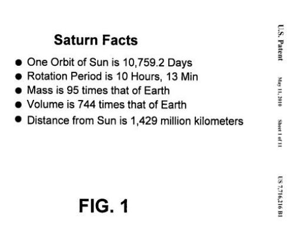

*This post may get you thinking about the benefits of using heading elements and lists on web pages for SEO purposes from a slightly different perspective than you may be used to.*

Google uses a large number of signals to decide upon the order of pages shown in search results. Some of those signals measure the quality or importance of a web page, while others may indicate how relevant a page is for a particular search query entered into a search engine’s search box.

One fairly obvious relevancy signal is whether or not the words in a query appear upon a page that might be a search result for that query. If those words appear on the page more than once, the page might be considered even more relevant for that particular query than other web pages where the terms only appear once, or not at all.

Another factor that might indicate how relevant a page is for a particular set of terms is how close those terms might be on a page. While you could easily count the number of words between individual query terms to determine how close they are to each other, the formatting of web pages presents some challenges to the approach of simply counting words between terms, such as in a list like the following:

Imagine that the list in the image above is all that appears upon a particular web page. Since every item listed is about Saturn, as shown by the heading of the page, it could be said that semantically each list item is equally relevant to Saturn in terms of closeness, even though the items listed grow in visual distance from the heading of the list when calculated by the number of words between “Saturn” and list items.

This way of calculating semantic closeness means that the page this list appears upon is equally relevant for the terms “Saturn Mass”, “Saturn Volume”, and “Saturn Rotation.”

A Google patent granted this week explores how the search engine might view how close words are together when they appear in semantic structures like a list, to determine how relevant a page might be to queries that contain those words.

The patent was filed back in 2004, but it provides a way of thinking about how semantic structures on web pages might be interpreted by a search engine in a way that might not be obvious on its face.

[Document ranking based on semantic distance between terms in a document](http://patft.uspto.gov/netacgi/nph-Parser?Sect1=PTO2&Sect2=HITOFF&u=%2Fnetahtml%2FPTO%2Fsearch-adv.htm&r=1&p=1&f=G&l=50&d=PTXT&S1=7,716,216.PN.&OS=pn/7,716,216&RS=PN/7,716,216)
Invented by Georges R. Harik and Monika H. Henzinger
Assigned to Google
US Patent 7,716,216
Granted May 11, 2010
Filed: March 31, 2004

Abstract

> Techniques are disclosed that locate implicitly defined semantic structures in a document, such as, for example, implicitly defined lists in an HTML document. The semantic structures can be used in the calculation of distance values between terms in the documents.
>
> The distance values may be used, for example, in the generation of ranking scores that indicate a relevance level of the document to a search query.

## HTML Formatting used to Determine Semantic Structures

One part of the process behind this approach involves a search engine analyzing the HTML structures on a page, looking for elements such as titles and headings on a page, unordered lists (<ul>) and ordered lists (<ol>), nested tables, divs, and line breaks ( ) that might be used to layout a list of items on a page.

Page headings might use an actual heading element such as an <h1> or a larger sized font such as , and text below that heading might be considered to belong to the heading.

In other words, the search engine is attempting to locate and understand visual structures on a page that might be semantically meaningful, such as a list of items associated with a heading. We’re told that this process may also look for other kinds of meaningful semantic structures other than just lists as well.

The patent gives us the following rules about headings and list items when it comes to the distance between words appearing within them:

1. If both terms appear in the same list item, the terms are considered close to one another;
2. If one term appears in a list item and the other term appears in the header, this pair of terms may be considered to be approximately equally distant to another pair of terms that appear in the header and another of the list items;
3. Pairs of terms appearing in different list items may be considered to be farther apart than the pairs of terms falling under 1 and 2.

So, in the Saturn example above, the words “Saturn” (from the heading of the list) and “Distance” (from the last list item) are considered closer together than the words “Days” and “Rotation” even though “Days” is the last word of the first list item and “Rotation” is the first word of the second list item.

## Conclusion

This Google patent was filed way back in 2004, but it does present some interesting ideas about how the search engine might look to semantic structures like lists to determine one aspect of how relevant a page might be for a particular query.

Are you thinking about headings and lists differently now?
