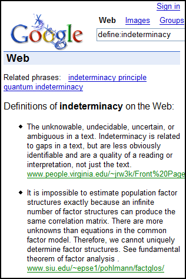

## How do Google Definitions appear at the top of search results?

Over at Threadwatch, Graywolf started a thread titled Are you Optimizing for Google Definitions? There are some insightful comments in the thread, and I recalled a Google patent application covering the topic.

I looked around the web to see if there had been any discussion about the Google Definitions patent application. I couldn’t find any. The document is [System and method for providing definitions](http://appft1.uspto.gov/netacgi/nph-Parser?Sect1=PTO1&Sect2=HITOFF&d=PG01&p=1&u=%2Fnetahtml%2FPTO%2Fsrchnum.html&r=1&f=G&l=50&s1=%2220040236739%22.PGNR.&OS=DN/20040236739&RS=DN/20040236739), (US Patent Application 240040236739), invented by Craig Nevill-Manning. It was filed on June 27, 2003, and was published on November 25, 2004. Granted as [System and method for providing definitions](https://patents.google.com/patent/US8255417B2) on 8/28/2012.

The abstract for the Google definitions application is pretty general, but the document is fairly detailed. Here’s the abstract:

> A system and method for providing definitions are described. A phrase to be defined is received. One or more documents, which each contain at least one definition, are determined. The phrase is matched to at least one of the definitions. One or more definitions for the phrase are presented.

## An example of Google Definitions in action

Google Definitions are one of the first position zero results at Google, appearing above organic search results on pages. This means that they could appear above other relevant pages for the terms they show off, which could be a good place to be seen.

Before looking at the words of the Google definitions patent application, let’s look at the results of a Google definition.

Below is a screenshot of search results for a Google search for [define: indeterminacy](https://www.google.com/search?hl=en&q=define%3Aindeterminacy&btnG=Google+Search). The search shows five results and includes clickable suggested related search queries for “indeterminacy principle” and “quantum indeterminacy.”

## Looking at sources of Google definitions

A quick look at the pages linked to the definitions of “indeterminacy” tells us a little about pages where Google definitions come from.

The first result listed is from [Critical Vocabulary](http://web.archive.org/web/20121010050508/http://people.virginia.edu/~jrw3k/Front%20Pages/Critical%20Vocabulary.htm), which has more than 40 definitions, and the words being defined stand out from the definitions by being encased in font, bold, and span elements like this:

> 
<b>Indeterminacy:
>  </b>

The second result listed was from Factor Analysis Glossary (no longer available), and it included over 50 definitions. Words defined were differentiated from definitions by being bolded and having a semicolon separate them from their definitions in this manner.

> <b>indeterminacy; </b>

Result number three, Classical Guitar Dictionary I, includes over 100 definitions. Dictionary terms and definitions are different colors and the defined terms are bolded as follows:

> <b>Indeterminacy</b>

The next result doesn’t come from a page listing several definitions, but could be said to be from an authority page: [WordNet Search – 3.0](http://wordnetweb.princeton.edu/perl/webwn?s=indeterminacy&o2=&o0=1&o7=&o5=&o1=1&o6=&o4=&o3=&h=). The WordNet Search pages are popular sources of definitions amongst computer scientists and people who work in information retrieval.

The last result listed is from another authority site. It’s the [indeterminacy entry](https://en.wikipedia.org/wiki/Indeterminacy) in Wikipedia.

## Where Do Google definitions come from

There are a couple of different potential sources for Google definitions, according to the patent application.

- They can be found during web-crawling or spidering by the search engines. If it is determined that a page contains definitions, either the document or information about it may be indexed by the search engine and stored.
- “Authoritative” sources for Google definitions could also be used, such as our WordNet Search or Wikipedia pages above.
- Alternatively, pages with definitions could be searched by querying the search engine in real-time instead of ahead of time.
- Or, a mix of both previously collected documents and new ones identified during real-time processing could be used to locate definitions, remove duplicates and clean up definitions in response to a query.

## Determining that a document has definitions

Exactly what might be looked for to decide that a page is a good candidate for Google definitions? These are some possibilities:

- Terms on the page such as “glossary,” “definition,” “dictionary,” and other similar words including variants and [canonicalizations](https://www.google.com/search?num=100&hl=en&lr=&rls=GGLD%2CGGLD%3A2003-40%2CGGLD%3Aen&q=define%3Acanonicalization&btnG=Search) of those.
- The search could look at the text of the whole document. I could also just look in certain areas such as title field, metadata, or other places within the document.
- Use of HTML within a document may also be important and meaningful.
- One version of this method would look for terms like “glossary,” “definitions,” or “dictionary” in the titles of Web pages.

## Possible methods used to parse documents, identify headwords, and/or return Google Definitions:

The application tells us that “definition containing documents” may be organized with “headwords.” A headword is a word or phrase that can be identified in some manner to separate from the definition for that word. In our examples above, HTML and punctuation are being used to distinguish words and their definitions.

Here are some examples from the Google definitions patent application:

1. Use of html definition tags:

<dl>
<dt>Headword 1 <dd>Definition of Headword 1
<dt>Headword 2 <dd>Definition of Headword 2
<dt>Headword 3 <dd>Definition of Headword 3</dl>

2. HTML separators between adjacent definitions:

There needs to be a way for the search engine to distinguish between different definitions, and it will look for HTML such as 
, <tr>, <li>, and   to figure out that there is more than one definition.

3. Punctuation needs to be removed from the definitions, like our semicolon above from the “Factor Analysis Glossary” page.

4. Headwords need to be identified.

HTML such as <b>, <strong>, <em>, <code>, or  may be helpful in identifying those headwords. Our first three examples above use a number of those elements to separate headwords from definitions.

5. The number of definitions on a page may be looked at

The Google definitions patent application notes that if there are less than a certain number of definitions on a page, all of the definitions from that page may be removed from consideration due to a definition query.

6. Precision versus Recall

Since there are potentially many documents on the web where definitions can be taken from, the focus of gathering definitions will be to get a few good definitions rather than a larger number, including duplicates or entries that accumulate other definitions.

## Presenting Google definitions

1. Order of results

One version of the process described in this pagerank application would return results in an order based upon the PageRank of the documents where the definitions came from.

2. Processing results

One or more of the following steps might be taken when presenting Google definitions:

Removing:

- HTML markup
- leading and trailing white space in the headword and definition
- punctuation: (. : ; ! ? -) in the headword
- leading non-alpha and non-parenthesis in the headword and definition
- trailing non-alphanumeric and non-parenthesis in the headword.

A definition could be thrown away if it:

- starts with “see”
- is a duplicate of one already retrieved.

The first letter of the definition will also be capitalized.

**Presenting additional information**

While it is possible that only exact matches for the definition query would be returned, it is also possible that the search engine will retrieve more.

1. Superstrings

The words or words are part of a larger phrase, like the “indeterminacy principle” and “quantum indeterminacy” shown above in the screenshot. Those may be returned with definitions or possibly as a link.

2. No definitions found

If there are no definitions found, other words may be presented to the searcher. These can include related terms, other ones that might be of interest, or even random results.

**Google Definitions Conclusion**

Google will often show some information from Google News, or Froogle, or Google images, instead of advertisements above organic results for some searches.

One of the many good points raised at threadwatch was that a query entered into Google structured like “what is indeterminacy” often returns a Google definition above the organic results.

It’s important to keep in mind that the process described in this patent application may not be what Google is using. Still, it may provide insight into how the search engine might be returning queries where people ask to have something defined and how pages need to be written to be considered sources of definitions.

Updated July 16, 2019
