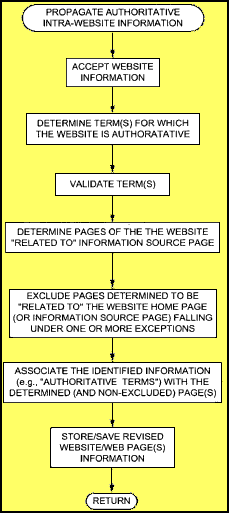
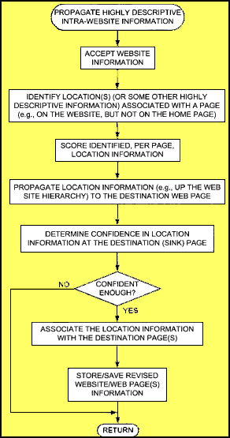

*Google has unveiled an approach to determining search authority pages for query terms and business locations and categories on a site and making other pages on the same site more relevant for that information, even if it isn’t mentioned on those other pages*.

Are there authority pages on the Web for some search terms or business locations or categories?

Can it be helpful for the content and categories of some pages on a website to be imputed to other pages of that site, so that those pages rank higher in search results?

How would such search authority pages be identified, and when and how would that information be propagated to other pages of the site?

**Local Search Process being Imported to Web Search?**

One of Google’s local search patent applications covers a similar process – [Authoritative document identification](http://appft1.uspto.gov/netacgi/nph-Parser?Sect1=PTO2&Sect2=HITOFF&u=%2Fnetahtml%2FPTO%2Fsearch-adv.html&r=1&f=G&l=50&d=PG01&p=1&S1=20060149800&OS=20060149800&RS=20060149800). I wrote about it last July in a post titled [Authority Documents for Google’s Local Search](https://www.seobythesea.com/2006/07/authority-documents-for-googles-local-search/).

That document described a way to find authority documents associated with a location, looked at signals associated with those documents, and determined their authoritativeness for the location based on many signals.

## Google’s Search Authority Patent Application

A new patent application from Google explores the ideas of determining search authoritative pages for specific query phrases as well as business locations and categories and making related pages on the same site also to be found more relevant to those phrases or locations or categories, even if that information doesn’t appear on those related pages.

[Propagating useful information among related web pages, such as web pages of a website](http://appft1.uspto.gov/netacgi/nph-Parser?Sect1=PTO2&Sect2=HITOFF&u=%2Fnetahtml%2FPTO%2Fsearch-adv.html&r=1&p=1&f=G&l=50&d=PG01&S1=20070233808.PGNR.&OS=dn/20070233808&RS=DN/20070233808)
Invented by Daniel Egnor, Paul Haahr, Kevin Lacker, John Lamping, Amitabh K. Singhal, and Ke Yang
US Patent Application 20070233808
Published October 4, 2007
Filed: March 31, 2006

Abstract

> Web pages of a Website may be processed to improve search results. For example, information likely to pertain to more than just the Web page it is directly associated with may be identified. One or more other, related, Web pages that such information is likely to pertain to is also identified. The identified information is associated with the identified other Web page(s) and this association is saved in a way to affect a search result score of the Web page(s).

## Search Authority Pages

Some evidence that a search engine possibly may consider when determining a term for which the Website/web page may be deemed authoritative:

1. Use of the term in one or more references to the page, such as links to the page.
2. Use of the term, such as a business name, in directories like the Yellow Pages entry which shows the home page as the website for the business.
3. Use of the term in the domain name.
4. The term is a registered trademark, and the trademark registration is associated with the home page of the Website.
5. The probability that the search query term will provide a good search result which users clicked upon, and where those users may stay for a while before returning to the search results to click upon a different result. This probability may be used in determining the strength of the evidence.
6. Other sources that show a Website is authoritative for a term.
7. As Contri-evidence, whether the term is relevant to other Web pages of one or more other Websites.

The strength of each piece of evidence and the totality of the evidence could be used to determine how strong the association is between the term and the destination page. If strong enough, the term and page may be associated. Deciding upon one authoritative page might depend upon the probability of how good a result it is compared to either all other results or a certain number of them.

If the term is a phrase, the entire phrase (or at least all words of the phrase) might be required to occur in the query. So, for a query such as “American century investments,” a web site may be considered authoritative for the whole query “American century investments”, it may not be authoritative for the component words “American”, “century” and “investment” of the query.

## Authoritative location information

Locations associated with a Web page might be identified by looking at various sources of data:

- Full addresses on the Web page,
- Occurrences of location names on the Web page,
- Yellow page data (e.g., with home pages and/or telephone numbers) giving an address or location for the Web page,
- Meta information from domain registration,
- Country code of domain,
- Data bases including terms that are places,
- Location names occurring on other pages near links to the page,
- etc.

Location names from the different sources might be associated with the Web page, and the kind and number of sources providing each piece of information might be tracked and used to score the identified location information.

A couple of years back, Google came out with a patent application on [Assigning Geographic Locations to Web Pages](http://appft1.uspto.gov/netacgi/nph-Parser?Sect1=PTO2&Sect2=HITOFF&u=%2Fnetahtml%2FPTO%2Fsearch-adv.html&r=1&p=1&f=G&l=50&d=PG01&S1=20050182770.PGNR.&OS=dn/20050182770&RS=DN/20050182770). I wrote several detailed posts about it at Cre8asite Forums. That patent filing described how Google might identify a location for a page, and make other pages on the same site “geographically relevant” for that location. It reminded me of some of the processes in this patent filing of “propagating” relevance for related pages.

We’re told that a machine learning system might be used to decide how to weigh the different kinds of “location confidence” evidence, and pointed towards a couple of other granted Google patents:

- [Ranking documents based on large data sets](http://patft.uspto.gov/netacgi/nph-Parser?Sect1=PTO2&Sect2=HITOFF&u=%2Fnetahtml%2FPTO%2Fsearch-adv.htm&r=1&p=1&f=G&l=50&d=PTXT&S1=7231399.PN.&OS=pn/7231399&RS=PN/7231399)
- [Large scale machine learning systems and methods](https://patents.google.com/patent/US7222127B1/en)

## Associating a Web site with a location

The patent filing provides some details on how location evidence might be used to determine an authoritative location for a site, but what I found interesting was how sites that have lots of addresses associated with them might be treated. If a website has too many locations deemed relevant, those locations may not be propagated up to the home page of the Website.

One point of finding authoritative information on a page of a web site is that doing so makes it possible to associate that location with the home page of the site, even it that location information doesn’t appear on the home page.

A franchise like McDonald’s has too many locations associated with it for this process to be used reasonably.

## Propagating Location and Other Information

Information other than just location information may be identified and propagated up and down a website.

*Uncommon terms* – such as high inverse document frequency (IDF) terms, maybe propagated up to the home or root page.
*Page categories* – from predefined lists or vertical categories, from concepts, from topics, from genres, etc., might be propagated up to the home or root page.

Here’s a little on how that would work in the context of location information:

1. Locations mentioned on each page of a site might be collected.
2. Scores based upon factors such as sources of location information, and frequencies of those locations, would be collected from those pages.
3. A confidence value for each location would be determined based upon those accumulated scores or score factors.
4. The confidence scoring might be done for each Web page, where the confidence score is a function of information only on Web pages below the particular Web page in the Website topology.
5. Location information might be propagated up only to the home or root page of the Website.
6. When processing a query, the Web page might be given credit for having all the words of the location, provided there are other significant words in the query besides the location. (It might be desired to not give added location credit to the Web page if the query is only about an address.)
7. If there are other significant, non-location, words in the query, it might be desirable to give each location word as much as credit as there is for the strongest significant non-location word of the query.
8. If there are many locations associated with a Website, it might be desired to reduce the amount of credit given.

## Association of intra-Website information

1. Website information (e.g., Web pages, Web page content, Web page metadata, yellow pages data, domain registration data, etc. is crawled and extracted.
2. Information which is likely to pertain to pages of the site other than from the page it is found upon is identified.
3. Other related pages that the identified information is likely to pertain to are identified.
4. That identified information is associated with the identified Web pages.
5. The revised Website and/or Web page(s) (e.g., the Web pages with the new associated information) information is saved so that the revised page would have a higher search score for a search query including the identified information than the original pages would have had

Sometimes determined query information might not be propagated down to certain pages of a site:

1. Low PageRank – pages with a low PageRank might not get the identified information associated with them.
2. Degrees from Home – A limit might be based upon a predetermined number (e.g., 2) of degrees of separation (e.g., number of backslashes from a source Web page) of the source (e.g., home or root) Web page and the destination Web page in the Website.
3. Other types of pages – press releases, message boards, forums, foreign language pages (in a language other than that of the source page) might be excluded.

## Interaction with Duplicate Content

This method of propagating information from a source page to a destination page where the information doesn’t appear might affect pages that are otherwise identical, but on different Websites, and may cause them to have different scores.

Example

A Web page of the Cincinnati Ramada on the Website of www.ramada.com might have a higher score than the identical Web page on the Website of www.hotels.com (at least for search queries including the term “ramada”).

This is an aim of the patent filing, and is useful because most users searching for the Ramada hotel in Cincinnati would likely prefer the Web page from the authoritative Website when the search query includes the term “ramada”.

## Propagating Highly Descriptive Information

Some highly descriptive words and other information on a Website are often not located on the home page of a Website. It could be useful to identify that kind of information and associate it with the home or root page of a site.

Here’s how such highly descriptive information might be propagated up a Website topology within a site:

1. The Website information is crawled and extracted.
2. Locations or some other highly descriptive information associated with a page other than the home or root page of a site, is identified.
3. The identified information might be scored per Web page.
4. The identified information is propagated (e.g., up the Web site topology) to one or more destination Web pages.
5. A confidence in the pertinence of the identified location or other information to a destination Web page is determined.
6. If the confidence score is not high enough, the information doesn’t get associated with that destination page.
7. If the confidence score is high enough, the identified location or other information is associated with the destination Web page and saved.

## Propagating Authoritative Information Down

Assume that the home page of Ramada’s Website has been determined to be authoritative for the term “Ramada”. One piece of evidence used to make that determination was that the majority of links consisting of the text “Ramada” point to Web pages on the Ramada.com web site.

Other pieces of evidence might be gathered to validate that when people search for “Ramada” they likely want the Ramada web site.

Chances are that all of the other pages on the site are “related to” the home page and are associated with the query term, except that some pages purposefully left out, such as press releases.

> The identified information–“Ramada”–may be associated with the non-exempted Web page and its descendants, The Web page and its descendants, and the other Web page and its descendants on Ramada’s Website related to the home page. Such an association may be made by annotating a copy of each non-excluded Web page in ramada.com, or information derived from such Web pages used for IR, as being topical for the term “ramada”.

How might that be done?

When processing a query, if the query contains the entire term, each annotated Web page, may be considered as having a certain number (e.g., six) of additional Web pages pointing to it, using the phrase as anchor text, thereby boosting a Page rank score of the page when Google search techniques are used.

## Propagating Highly Descriptive Information Up

Take a web site for a Vietnamese restaurant named “Saigon II”.

Assume that the home or root page of the site doesn’t include the address of the restaurant, but a lower Web page of the site does include the address 123 Main Street, Anytown, CA.

If you assume further that “123 Main Street, Anytown, CA” may be deemed an address or location with the desired level of confidence (e.g., due to the terms “street”, the state abbreviation “CA”, the syntax of the address, etc.), then the home page for the site may be given credit for the location “123 Main Street, Anytown, CA,” for purposes of search even though the name of the location doesn’t appear on that home page.

Location information may not be the only information on this site that may be propagated from one page to another. Imagine that a page of the site includes menu items for the restaurant, including “pho,” which is a beef noodle soup.

Assume that “pho” is considered to be a highly descriptive term because it isn’t frequently used in a wide collection of Web pages.

This term “pho” may be identified and propagated up to the home page of the site as well, and be treated as if the word appears on the home page, even though it doesn’t.

Now assume that someone from or near Anytown, CA searches for “pho restaurants” the home page may show up as a relevant match, even though neither the term “pho” nor the location appears on the home page of the site. otherwise.

## Propagating Highly Descriptive Category Information Up

Take the web site for electronics retailer Best Buy. The home page links to pages corresponding to various product categories. Those pages link to specific product pages.

The product categories may be considered to be highly descriptive. Those product categories may be identified in the Web pages and propagated up to the home page of the Website.

So, the Best Buy home page may be given credit for (e.g., treated as including) the terms “televisions”, “computers”, “video games”, “DVDs”, “CDs”, “cameras” and “video cameras,” for purposes of search, even if these terms don’t appear on the home page.

On a search for “televisions and video games,” the home page for Best Buy would be more relevant to such a query with this kind of propagation than it would have been otherwise.

## Propagating Search Authority Off Site

A Web page from one site may include an address, and a reference such as a link near the address, to another Web page on a second website. That might suggest that the address found on the first Web page of the first Website might pertain to the second Web page of the second Website.

The address might be saved in association with the page on the second web site so that the page would have a higher search score for a search query including the address, or perhaps a portion of the address than it would otherwise have.

The source of the original information doesn’t need to be a Web page, and the relationship doesn’t need to be a link. Other kinds of documents could be such things as an SEC filing, a business license filing, etc., which might include a business name and an address of the business.

If a Website is registered to the business or has a URL including the business name, or prominently displays the business name, but no address information, that address information might be taken from documents like the SEC filing or the business listing, and rank in searches for a query related to the location.

This kind of propagation of authority might be limited to certain classes or types of information, such as addresses, telephone numbers, type of business, genre of page, etc.

## Relationships between Terms

Instead of documents, relationships between terms might take advantage of the process described in this patent application. The relationship would have to be a strong one. An example would be a web page including the term “Cleveland”, the information might be “Ohio”.

A web page with a telephone number that has a Chicago area code,. but doesn’t use the term “Chicago,” may rank a little higher for a query that includes “Chicago” within it.
