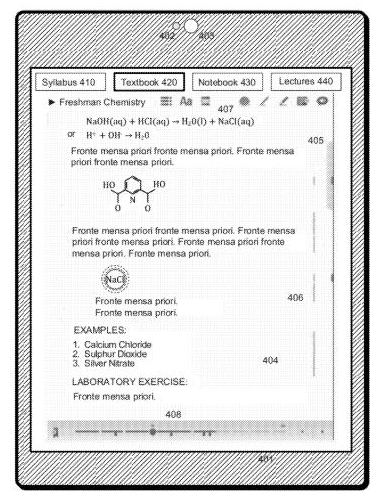

*A series of Google patent applications describe the use of an electronic textbook reader application that makes using an electronic textbook a much better experience than just reading a book on a screen.*

I remember lugging around a lot of books while traveling to classes on foot or my bicycle, or even while driving to law school. As an English degree undergraduate, I got away with buying a lot of my books for literature classes from a used book store (I probably left with a few hundred dollars in trade-in credit). Many of those were paperbacks that didn’t put a burden on the backpacks I wore out in those years, but many others were weighty volumes. Especially the texts from law school. I couldn’t carry all of my law school texts at the same time if I wanted – they just took up too much space.

Google published 6 patents last week that cover different aspects of the use of electronic textbooks that attempt to capture some of the benefits of using real books while adding new value to the use of electronic texts. As the first patent I’ve listed notes:

> Although some attempts have been made to transform study material from Gutenberg’s era to the digital era, some of the advantages of using paper books for study purposes have not been replicated. Students from time immemorial have used their texts in different ways.
>
> Some highlight portions of particular interest; others place notes in the margins to keep track of clarifications of difficult concepts. Some used textbooks are more useful than new ones because they naturally fall open to the most important pages after repeated use, or because particularly important pages or sections are more dog-eared than others. **Electronic reading devices have not to date provided interfaces to implement some of these subtle yet important features that help students learn from their texts most efficiently***.

* My Emphasis.

Are the patent applications an indication that Google might start selling or renting electronic textbooks? It’s hard to say for certain. The patent filings are an indication that they’ve explored the idea.

Would you rent or buy electronic textbooks that make it easy for you to remember what you had been looking at and doing with the textbook last, including using a gesture to get you to the place you had last left off?

Or display or hide annotations that you’ve left on the book with a gesture, or by moving your ebook reader in a certain way?

Or even to find out more about books or articles that might be referenced in an ebook, including publisher, price, user feedback, and sources if available.

The electronic textbooks described would also enable you to share notes in a collaborative manner between members of a study group, or even publicly, or to use a specific gesture to connect with a teaching assistant or the class professor to ask questions. For example:

> As a second example, specific annotations are immediately recognized as corresponding to commands rather than actual annotations. For example, in one embodiment a handwritten annotation in the form of a question mark with a circle around it is interpreted as a request to send a question regarding the nearby text to the appropriate teaching assistant for that course (or other predetermined moderator), and a dialog box immediately opens, preaddressed to the teaching assistant, allowing the student to ask the question.
>
> In one embodiment, the message to the teaching assistant is automatically tagged with the corresponding portion of the text so that the student does not need to include any context with the specific question, but can just include the question in a way that might be confusing without context. For example, if the text shows an illegal divide-by-zero operation, the student’s question could simply be: “Why can’t you do this?” without any further contextual information.

You could also set up a way to quickly move to a glossary section of a page, and then back to where you were previously, and then back again quickly.

If you wanted to clip and copy a portion of the textbook into an electronic notebook to include with notes, instead of leaving an annotation within the body of the book, that’s also a possibility.

Another aspect of this electronic text application would be to make it very easy to quickly create a personal study guide. It can take a fair amount of time to do that – I remember suggesting to a friend who entered law school in my last year that he use a laptop for all of the briefs that he created, so that he could quickly pull the important parts out into a study guide for each class.

The patent filings themselves provide more details on features that could be associated with the electronic textbook reading application involved. I’ve read enough to wish that I had one of these readers in the classes I took, and didn’t wear out all of the book bags that I did.

Here are the patent applications:

[Electronic Book Contextual Menu Systems and Methods](http://appft.uspto.gov/netacgi/nph-Parser?Sect1=PTO1&Sect2=HITOFF&d=PG01&p=1&u=%2Fnetahtml%2FPTO%2Fsrchnum.html&r=1&f=G&l=50&s1=%2220120221972%22.PGNR.&OS=DN/20120221972&RS=DN/20120221972)
Invented by James Patterson, Nathan Moody, and Scott Dougall
Assigned to Google
US Patent Application 20120221972
Published August 30, 2012
Filed: July 14, 2011

Abstract

> An electronic book system provides interfaces particularly suited to students’ use of textbooks. A finger press on a touch screen produces a contextual menu with user choices that relate to where the finger was pressed or what the user was recently doing with the book. A student provisionally navigates through a book by a specific gesture which, when it stops, returns the user to the previous position in the book. Annotations are displayed and hidden using specific gestures and through selective movement of the reader as sensed by its accelerometer.

[Electronic Book Navigation Systems and Methods](http://appft.uspto.gov/netacgi/nph-Parser?Sect1=PTO1&Sect2=HITOFF&d=PG01&p=1&u=%2Fnetahtml%2FPTO%2Fsrchnum.html&r=1&f=G&l=50&s1=%2220120221968%22.PGNR.&OS=DN/20120221968&RS=DN/20120221968)
Invented by James Patterson, Nathan Moody, and Scott Dougall
Assigned to Google
US Patent Application 20120221968
Published August 30, 2012
Filed: July 14, 2011

Abstract

> An electronic book system provides interfaces particularly suited to students’ use of textbooks. A finger press on a touch screen produces a contextual menu with user choices that relate to where the finger was pressed or what the user was recently doing with the book. A student provisionally navigates through a book by a specific gesture which, when it stops, returns the user to the previous position in the book. Annotations are displayed and hidden using specific gestures and through selective movement of the reader as sensed by its accelerometer.

[Electronic Book Interface Systems and Methods](http://appft.uspto.gov/netacgi/nph-Parser?Sect1=PTO1&Sect2=HITOFF&d=PG01&p=1&u=%2Fnetahtml%2FPTO%2Fsrchnum.html&r=1&f=G&l=50&s1=%2220120221938%22.PGNR.&OS=DN/20120221938&RS=DN/20120221938)
Invented by James Patterson, Nathan Moody, and Scott Dougall
Assigned to Google
US Patent Application 20120221938
Published August 30, 2012
Filed: June 28, 2011

Abstract

> An electronic book system provides interfaces particularly suited to students’ use of textbooks. A finger press on a touch screen produces a contextual menu with user choices that relate to where the finger was pressed or what the user was recently doing with the book. A student provisionally navigates through a book by a specific gesture which, when it stops, returns the user to the previous position in the book. Annotations are displayed and hidden using specific gestures and through selective movement of the reader as sensed by its accelerometer.

[Systems and Methods for Remote Collaborative Studying Using Electronic Books](http://appft.uspto.gov/netacgi/nph-Parser?Sect1=PTO1&Sect2=HITOFF&d=PG01&p=1&u=%2Fnetahtml%2FPTO%2Fsrchnum.html&r=1&f=G&l=50&s1=%2220120221937%22.PGNR.&OS=DN/20120221937&RS=DN/20120221937)
Invented by James Patterson, Nathan Moody, and Scott Dougall
Assigned to Google
US Patent Application 20120221937
Published August 30, 2012
Filed: July 14, 2011

Abstract

> An electronic book system provides interfaces particularly suited to students’ use of textbooks. A finger press on a touch screen produces a contextual menu with user choices that relate to where the finger was pressed or what the user was recently doing with the book. A student provisionally navigates through a book by a specific gesture which, when it stops, returns the user to the previous position in the book. Annotations are displayed and hidden using specific gestures and through selective movement of the reader as sensed by its accelerometer.

[IDENTIFYING AND USING BIBLIOGRAPHICAL REFERENCES IN ELECTRONIC BOOKS](http://appft.uspto.gov/netacgi/nph-Parser?Sect1=PTO1&Sect2=HITOFF&d=PG01&p=1&u=%2Fnetahtml%2FPTO%2Fsrchnum.html&r=1&f=G&l=50&s1=%2220120221441%22.PGNR.&OS=DN/20120221441&RS=DN/20120221441)
Invented by James Patterson and Nathan Moody
Assigned to Google
US Patent Application 20120221441
Published August 30, 2012
Filed: August 24, 2011

Abstract

> An electronic book system recognizes patterns in texts that correspond to bibliographical references. User selection of a bibliographical reference causes a digital copy of the work referenced to be made available to the user. Factors such as price, reference format and user feedback are used to select a source from which the digital copy of the work is obtained.

[Systems and Methods for Manipulating User Annotations in Electronic Books](http://appft.uspto.gov/netacgi/nph-Parser?Sect1=PTO1&Sect2=HITOFF&d=PG01&p=1&u=%2Fnetahtml%2FPTO%2Fsrchnum.html&r=1&f=G&l=50&s1=%2220120218305%22.PGNR.&OS=DN/20120218305&RS=DN/20120218305)
Invented by James Patterson, Nathan Moody, and Scott Dougall
Assigned to Google
US Patent Application 20120218305
Published August 30, 2012
Filed: July 14, 2011

Abstract

> An electronic book system provides interfaces particularly suited to students’ use of textbooks. A finger press on a touch screen produces a contextual menu with user choices that relate to where the finger was pressed or what the user was recently doing with the book. A student provisionally navigates through a book by a specific gesture which, when it stops, returns the user to the previous position in the book. Annotations are displayed and hidden using specific gestures and through selective movement of the reader as sensed by its accelerometer.
