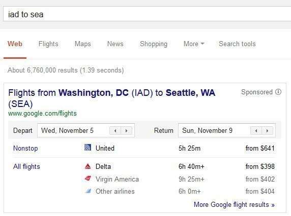
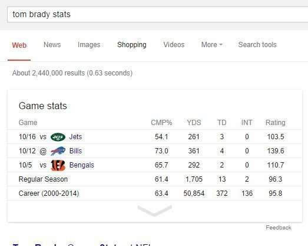
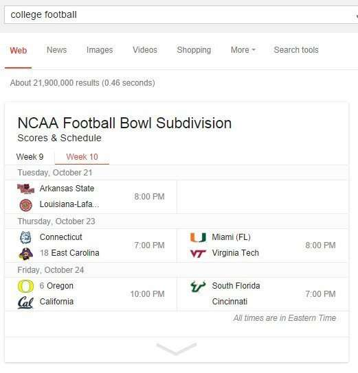
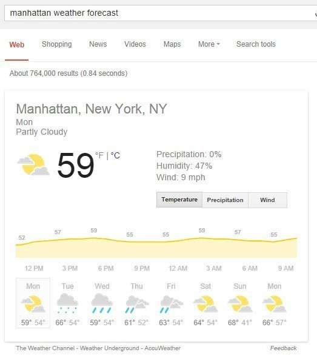
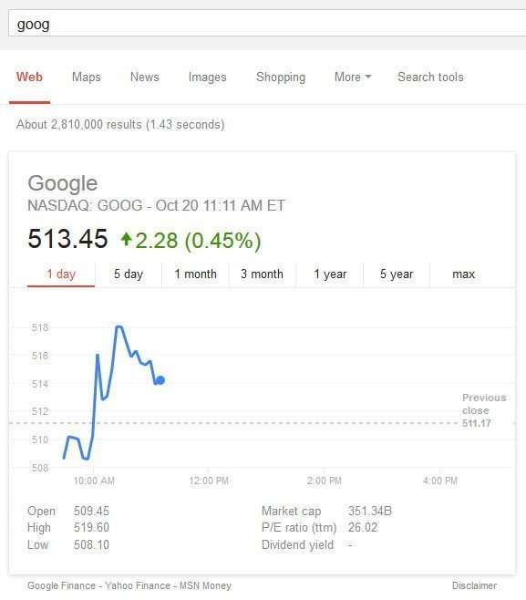

I’ve been exploring some of the different search results that we see at Google, including things such as [rich snippets](https://www.seobythesea.com/2014/10/rich-snippets-patterned-queries/) and [question-answering results](https://www.seobythesea.com/2014/10/google-fact-questions-entity-references-unstructured-data/), and came across a couple of patent filings from Google that describe something called “Enriched Results.”

You’ve seen enriched results before. As the first of the patent filings tells us, these results tend to be for things such as:

- Airlines flights – live flight status information
- Athletes – player statistics
- Sports – League Scores
- Weather – local weather information
- Financial topics – financial data; and
- Television programs- programming schedules

The first of the patent filings are:

[Enriching Search Results](http://appft.uspto.gov/netacgi/nph-Parser?Sect1=PTO1&Sect2=HITOFF&d=PG01&p=1&u=%2Fnetahtml%2FPTO%2Fsrchnum.html&r=1&f=G&l=50&s1=%2220120109941%22.PGNR.&OS=DN/20120109941&RS=DN/20120109941)
Invented by Tal Cohen, Ziv Bar-Yossef, Igor Tsvetkov, Tomer Kol, Adi Mano, Oren Naim, Nitsan Oz, Pravir K. Gupta, Kavi J. Goel
Assigned to Google
US Patent Application 20120109941
Published May 3, 2012
Filed: May 27, 2011

Abstract

> Methods, systems, and apparatus, including computer programs encoded on a computer storage medium, enhance search results.
>
> In one aspect, a method includes identifying a plurality of registered publishers for enriched search results and, for each registered publisher, obtaining enrichment information from the registered publisher and associating the enrichment information with a resource provided by the publisher. A query is received.
>
> A plurality of responsive resources that are responsive to the query is identified. A first responsive resource is determined to be associated with enrichment information. An enriched search result is provided; the enriched search results identify the first responsive resource and include the first responsive resource’s associated enrichment information.

This patent tells us about “registered publishers” who may have registered with Google in some manner that enables these enriched results to show up. While this sounds like Rich Snippets, it isn’t the result of using schema to get these types of results, but the exact mechanism isn’t explained well in this patent filing.

## Becoming a Registered Publisher

I’ve done some searching for becoming a “registered publisher” and wasn’t successful in finding out more about this. Are there actually officially registered publishers? Are the site owners or content owners who have partnered with Google or agree to some licensing agreement?

The patent application tells us this:

Registration information can be added to the registered publishers’ database imanyof ways:

- Publishers could include registration information on a web page, such as in metadata for a home page for a domain. When Google crawls the web page, it may determine that the web page indicates that the publisher is requesting to be registered. Google may then add the registration information to the registered publishers’ database.

- A publisher might register with Google using a registration web page, and someone from the publisher might enter the publisher’s registration information at the registration web page.

- Someone associated with the publisher could provide the registration information to a system administrator for the search system. The system administrator adds the registration information to the registration information database.

This last alternative was the one that was most interesting to me:

- The search engine may register publishers without any explicit registration action from the publishers. Google may determine that certain information on a website is frequently updated and then register the website’s publisher so that some of the frequently updated information is used to enrich search results for the website.

The second patent filing describes this enriched results process differently and more detailedly and a plugin that searchers might use to draw forth different enriched results. Unfortunately, I haven’t seen any signs of such a plugin, but I will be searching for it to find out more.

## Enriched Results Takeaways

There is a lot of stuff behind the scenes at a search engine that brings us the results that we might see, and some of them aren’t explained well.

I’ve seen enriched results for a while, especially when it comes to things like Weather results and sports scores, but I didn’t have a name for them or any idea of how they might have been triggered.

We will explore some more of that with the next post.

Interestingly, the patent filing tells us that some sites might be automatically considered registered sites by Google because they make frequently updated material available that searchers might be interested in for use by searchers and the search engine.

Last Updated June 6, 2019.
