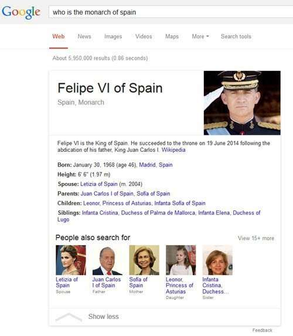
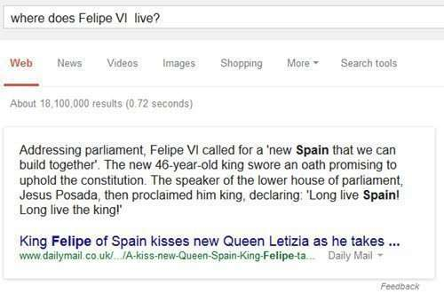
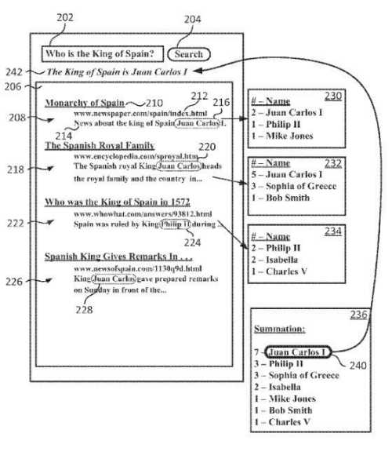
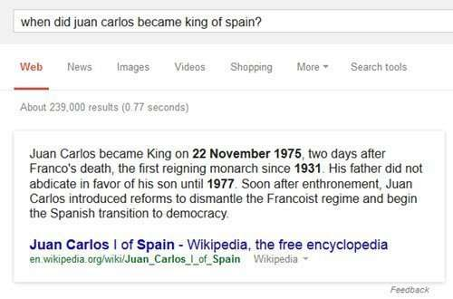

*Added October 2, 2019 – the patent this post is about was granted on July 2, 2019: [Question answering using entity references in unstructured data](http://patft.uspto.gov/netacgi/nph-Parser?Sect1=PTO1&Sect2=HITOFF&d=PALL&p=1&u=%2Fnetahtml%2FPTO%2Fsrchnum.htm&r=1&f=G&l=50&s1=10,339,190.PN.&OS=PN/10,339,190&RS=PN/10,339,190) – US patent 10,339,190*

A Google patent application explores how Google may use entity references to answer factual questions from unstructured Web pages and results rather than from more structured sources such as Freebase or Wikipedia. The processes described in the patent are pretty interesting, and they might be more familiar to an SEO-trained audience than a Semantic Web one, like a result that ranks well because of a “query deserves freshness” approach.

They also avoid a problem for the search engines that I’ve been thinking about for a while.

*“What happens when the world changes in some dramatic fashion, such as a country ceasing to exist, or a well-known figure passing away?”*

How is a Knowledge graph updated in such instances? Is it something that might be done by hand? A way of updating such information quickly with less possibility of human error than a manual update would be good to hear about.

Sometimes a lot of things change in the world quickly, all at the same time.

If knowledge graph updates are needed to answer some fact-based questions, there’s the potential for those answers to be incorrect until an editor makes an update, when a change takes place. How do search engines such as Google and Bing respond to such changes?

How does [Google’s Knowledge Graph get updated](https://searchengineland.com/google-knowledge-graph-now-news-box-203073) or does it wait until Freebase and other sources are edited to reflect such changes? And what of [Bing’s Satori](https://searchengineland.com/bing-snapshot-adds-150-million-new-entities-relationships-search-engine-188076)? I’m not sure of either, and I don’t know if investigating will reveal much.

I came across a Google patent application that was published roughly at the same time as the conference when Nicholas was giving that answer, and it pointed to a method where such questions might be answered with search results that could make it more likely that a timely answer could be given. A question such as, “Who is the monarch of Spain?”

Not all questions are answered so well. I followed that up with a question that might seem obvious on its face, but which might provide a more specific or well-defined answer, and while the result was pretty timely, it wasn’t that helpful, asking, “Where does he live?”

Regardless of Google’s lack of information about this recently (July) crowned King of Spain, it did know who he was, and not much may have been written about him on the web.

The patent tells us that there are some advantages to using the entity references processes described in the patent filing:

- Answers may be provided for queries in an automated and continuously updated fashion, rather than relying upon a knowledge graph being updated.
- Question answering may take advantage of search result ranking techniques like rankings for freshness or topicality.
- Question answers may be identified automatically based on unstructured content of a network such as the Web.

Yahoo doesn’t seem to have updated information about the new king, or at least it doesn’t return him as an answer at all. Then again, while Google has more timely news, they still seem to have some issues. It’s exciting watching things like these evolve.

So let’s look at this new Google patent application, and see how these “advantages” might play a roll in what we see.

## Question Answering Using Entity References in Unstructured Data

The patent application was filed in March and not published by the patent office until September. Here are more details:

[Question Answering Using Entity References in Unstructured Data](http://appft.uspto.gov/netacgi/nph-Parser?Sect1=PTO1&Sect2=HITOFF&d=PG01&p=1&u=%2Fnetahtml%2FPTO%2Fsrchnum.html&r=1&f=G&l=50&s1=%2220140280114%22.PGNR.&OS=DN/20140280114&RS=DN/20140280114)
Invented by Dvir Keysar and Tomer Shmiel
US Patent Application 20140280114
Published September 18, 2014
Filed: March 15, 2013

Abstract

> Methods, systems, and computer-readable media are provided for collective reconciliation. In some implementations, a query is received, wherein the query is associated at least in part with a type of entity.
>
> One or more search results are generated based at least in part on the query.
>
> Previously generated data is retrieved associated with at least one search result of the one or more of search results, the data comprising one or more entity references in the at least one search result corresponding to the type of entity. The one or more entity references are ranked, and an entity result is selected from the one or more entity references based at least in part on the ranking.
>
> An answer to the query is provided based at least in part on the entity result.

This image from the patent filing hints at some of the things that appear in the description:

It looks like the patent missed the latest regime change in Spain, still listing Juan Carlos. This is *one of the problems* that the patent is aimed at solving.

Asking “who” in a query makes the query a “who query,” but the patent tells us of other query forms or types as well, such as “where queries” or “time queries” (which I like calling “when” queries.)

One important element of this patent is that it looks for mentions of entities in snippets and search results (entity references) to answer questions, and it does a nice job of describing what an entity is, so I’m going to quote the patent on that one to give you a taste for the patent itself (if you like it, you can click through and get this information even more directly)

> As used herein, an entity is a thing or concept that is singular, unique, well-defined, and distinguishable.
>
> For example, an entity may be a person, place, item, idea, abstract concept, concrete element, other suitable things, or any combination thereof. Generally, entities include things or concepts represented linguistically by nouns. For example, the color “Blue,” the city “San Francisco,” and the imaginary animal “Unicorn” may each be entities. An entity generally refers to the concept of the entity. In some implementations, an entity reference is a reference, for example, a text string, which refers to the entity. For example, the entity reference “New York City” is a reference to the physical city.
>
> In some implementations, an entity is associated with a type of entity.
>
> As used herein, a type is a categorization or defining characteristic associated with one or more entities. For example, types may include persons, locations, movies, musicians, animals, and so on. For example, “who” questions may have answers to the person type. It will be understood that while the system described below is generally shown about natural language “who” questions, Any suitable type of question may be answered.

## A System for question answering, based upon entity references

A query may be a natural language search query (written or spoken), or received from user input, from another application, or generated by the search system based on previously received input or data.

As part of the process, search results may be returned based on the query that may come from an index of webpages and other content, on the web. This system next looks for from entity references such as references from the top ten search results.

Those retrieved entity references may be ranked, an entity result may be selected based on the ranking, and an answer may be provided, based on the entity result to answer the question.

Ranking and/or selecting may be based upon search-based criteria such as:

- [A quality score](https://www.seobythesea.com/2011/06/googles-quality-score-patent-the-birth-of-panda/)
- A freshness score
- [A relevance score](https://www.seobythesea.com/2012/07/relevance-search-engines/)
- Any other suitable information
- Any combination thereof

Sometimes information retrieved from entity references associated with a particular webpage may be in a list of persons appearing on that webpage. That list by itself might be a good answer if the question appears to be asking for a list, but the top listed result may be chosen as an answer like in the pictured example above.

Sometimes the top ten or top 20 results might be looked at, and an entity chosen from those. The chosen answer would have to fit the question type correctly, such as being a correct type of entity to fit a “who” query.

If multiple entities turn up as candidate answers, they might be put into a list, and ranking signals associated with them might be used to choose what may be the best answer. The highest-ranked entity could be chosen as the answer.

The most commonly occurring entity reference could be chosen as an answer, but other ranking signals might fit better. These are two types of signals that might be used:

***Frequency of occurrence*** relates to the number of times an entity reference occurs within a particular document, collection of documents, or other content.

***Topicality scores*** include a relationship between the entity reference and the content in which it appears.

## Take Aways

It’s probably worth testing and re-testing this from time to time to see if it appears that Google is using this approach, and looking at the search results that might appear in response to a question-answering query, to see if it looks like Google has used search results to try to answer a question.

The patent tells us that one quality score that could be used might be the number of links pointed to a page about a certain entity. While that is fairly simple, it’s a little different than the number of times a “fact” object appears in a data “object” such as a knowledge base that might act as an answer to a query.

It is as if Google is using the entire web as a data object where it can find answers to questions.

The patent provides an additional number of details, and I didn’t provide all of them here, though I’m going to include some others right now.

When ranking an entity reference mentioned in a search result based upon “Freshness,”, these things might be looked at:

- The age of the document
- The number of links to and/or from the document
- The number of selections of that document in previous search results
- A strength of the relationship between the document and the query
- Any other suitable score, or
- Any combination thereof

The patent gets a little more obtuse when it tells us that it might rank entities in the top ten search results based upon number of mentions of them while looking at the following things:

- System design
- User preferences
- The type of query
- System availability
- System speed
- Network speed
- Previous question answering
- The quality of an identified answer
- Any other suitable criteria, or
- Any combination thereof

How those all might fit is isn’t necessarily made clear in the patent, but what is clear from it is that sometimes answers aren’t readily available from a source such as Freebase, and when those times come about, sometimes Google may use the Web as a knowledge base, and look for entities in search results to find those answers.

Some posts I’ve written about patents involving question answering:

- 7/19/2007 – [Search Engines Crawling FAQs to Learn How to Answer Questions?](https://www.seobythesea.com/2007/07/search-engines-crawling-faqs-to-learn-how-to-answer-questions/)
- 9/21/2014 – [Google May Use Question Answering to Populate the Knowledge Graph](https://www.seobythesea.com/2014/09/missing-incorrect-data-knowledge-graph/)
- 10/12/2014 – [How Google May Use Entity References to Answer Questions](https://www.seobythesea.com/2014/10/google-fact-questions-entity-references-unstructured-data/)
- 12/30/2014 – [Featured Snippets – Taken from Authority Websites](https://www.seobythesea.com/2014/12/direct-answers-taken-authority-websites/)
- 12/31/2014 – [Featured Snippets – Using Query Intent Templates to Identify Answers](https://www.seobythesea.com/2014/12/direct-answers-using-query-intent-templates-identify-answers/)
- 2/11/2015 – [How Google was Corroborating Facts for Featured Snippets](https://www.seobythesea.com/2015/02/google-corroborating-facts-direct-answers/)
- 7/12/2015 – [How Google May Answer Questions in Queries with Rich Content Results](https://www.seobythesea.com/2015/07/how-google-may-answer-questions-in-queries-with-rich-content-results/)
- 9/9/2015 – [When Google Started Showing Featured Snippets](https://www.seobythesea.com/2015/09/when-google-started-answering-factual-queries/)
- 11/30/2016 – [Answering Featured Snippets Timely, Using Sentence Compression on News](https://www.seobythesea.com/2016/11/featured-snippets-sentence-compression/)
- 6/19/2017 – [Google Extracts Facts from the Web to Provide Fact Answers](https://www.seobythesea.com/2017/06/fact-answers/)
- 7/10/2019 – [How Google May Handle Question Answering when Facts are Missing](https://www.seobythesea.com/2019/07/how-google-may-handle-question-answering-when-facts-are-missing/)

Last Updated October 2, 2019
