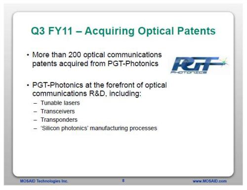

A few days ago, I asked the question, [Is Google Aiming at Building Faster Networks and Data Transmissions?](https://www.seobythesea.com/2012/01/google-building-faster-networks-data-transmissions/) Google had acquired some interesting patent applications that have the potential to increase the speed and quality of data transmissions. An even more recent intellectual property acquisition by Google points to a growing interest in networking technology.

Google is planning on bringing ultra high speed broadband access to [Kansas City](https://googleblog.blogspot.com/2011/03/ultra-high-speed-broadband-is-coming-to.html), with fiber optic cable connections between homes that Google [promised](https://www.wired.com/2011/03/google-fiber-kansas/) will deliver 1 gigabyte-per-second speeds, or a [speed](https://fiber.google.com/?utm_expid=.ELF1DbWeTiuApFupIebq5w.0&utm_referrer=https%3A%2F%2Ffiber.google.com%2F) that’s “20,000 times faster than dial-up and more than 100 times faster than a typical broadband connection!.” That’s pretty fast. According to the Official Google Blog post, Google may be in talks with other cities to bring them this kind of high speed internet access as well.

The [Google Fiber Blog](https://fiber.googleblog.com/) hasn’t been updated too frequently, but may be something to watch. If Google is successful in Kansas City, it’s quite possible that they will be installing fiber elsewhere.

So the question I have is where Google got the experience, the expertise, the knowledge, and the ability to embark on a project like this? I’m sure that they are hiring people specifically for the project, even more interestingly, it looks like they’ve taken some steps to make sure that they have the intellectual property in place to back up the project.

On February 1, 2012, the United States Patent and Trademark Office recorded the assignment of 49 granted and 42 pending patent applications from Mosaid Technologies Inc., to Google, in a transaction executed on January 27, 2012. These patent filings appear to have originally belonged to [Pirelli Cavi](https://www.prysmiangroup.com/en/company) (the company’s name was changed to PGT Photonics S.P.A., The Pirelli Group, and now Prysmian), and cover a range of technologies related to fiber optic networks.

In their third quarter, Fiscal 2011 Presentation, Mosaid Technologies announced the acquisition of 200+ optical communications patents from PGT-Photonics.

While Mosaid appears to have acquired more than 200 patent filings from Pirelli Cavi (PGT Photonics S.P.A.), the number of patent filings shown as assigned to Google in the assignment database at the USPTO total 91. Any patent filings that haven’t been published yet wouldn’t appear within that database, so there may be more involved as well. There are some very recently published pending patent applications and recently granted patents included in the transaction.

The terms of the acquisition aren’t included in the USPTO database, and I couldn’t locate a single report anywhere on the transaction to learn more.

Here are the patent filings involved:

**Granted patents**

- [Method and apparatus for polarization multiplexing and demultiplexing optical tributary signals](http://patft1.uspto.gov/netacgi/nph-Parser?patentnumber=6577413) (US Patent # 6577413)
- [Optical intensity modulation device and method](http://patft1.uspto.gov/netacgi/nph-Parser?patentnumber=6583917) (US Patent # 6583917)
- [Optical gating apparatus and methods](http://patft1.uspto.gov/netacgi/nph-Parser?patentnumber=6584261) (US Patent # 6584261)
- [Waveguide systems or structures or parts thereof, containing polycyanate copolymers prepared from polyfunctional cyanates and fluorinated monocyanates](http://patft1.uspto.gov/netacgi/nph-Parser?patentnumber=6716958) (US Patent # 6716958)
- [Optical threshold and comparison devices and methods](http://patft1.uspto.gov/netacgi/nph-Parser?patentnumber=6766072) (US Patent # 6766072)
- [Unit for compensating the chromatic dispersion in a reconfigurable manner](http://patft1.uspto.gov/netacgi/nph-Parser?patentnumber=6816659) (US Patent # 6816659)
- [Optical waveguides derived from a combination of poly(perfluorocyclobutanes) and polymeric cyanates](http://patft1.uspto.gov/netacgi/nph-Parser?patentnumber=6853790) (US Patent # 6853790)
- [Parametric device for wavelength conversion](http://patft1.uspto.gov/netacgi/nph-Parser?patentnumber=6867902) (US Patent # 6867902)
- [NLO polymers and optical waveguides based thereon](http://patft1.uspto.gov/netacgi/nph-Parser?patentnumber=6872794) (US Patent # 6872794)
- [Device for the compensation of chromatic dispersion](http://patft1.uspto.gov/netacgi/nph-Parser?patentnumber=6928221) (US Patent # 6928221)
- [Passive polarization stabilizer](http://patft1.uspto.gov/netacgi/nph-Parser?patentnumber=6941032) (US Patent # 6941032)
- [Hybrid buried/ridge planar waveguides](http://patft1.uspto.gov/netacgi/nph-Parser?patentnumber=7006744) (US Patent # 7006744)
- [Intensity modulation of optical signals](http://patft1.uspto.gov/netacgi/nph-Parser?patentnumber=7031047) (US Patent # 7031047)
- [Raman amplification using a microstructured fiber](http://patft1.uspto.gov/netacgi/nph-Parser?patentnumber=7116469) (US Patent # 7116469)
- [Optical multi/demultiplexer device, optical wavelength selective filter and method of making filter](http://patft1.uspto.gov/netacgi/nph-Parser?patentnumber=7123789) (US Patent # 7123789)
- [Device for bending an optical beam, in particular in an optical integrated circuit](http://patft1.uspto.gov/netacgi/nph-Parser?patentnumber=7133588) (US Patent # 7133588)
- [Multiple stage raman optical amplifier](http://patft1.uspto.gov/netacgi/nph-Parser?patentnumber=7145716) (US Patent # 7145716)
- [Optical fiber, optical fiber filter, and optical amplifier](http://patft1.uspto.gov/netacgi/nph-Parser?patentnumber=7177511) (US Patent # 7177511)
- [Wavelength division multiplexing optical transmission system using a spectral inversion device](http://patft1.uspto.gov/netacgi/nph-Parser?patentnumber=7187868) (US Patent # 7187868)
- [Optical space-switching matrix](http://patft1.uspto.gov/netacgi/nph-Parser?patentnumber=7209607) (US Patent # 7209607)
- [Photochromic optical waveguides and method for the preparation thereof](http://patft1.uspto.gov/netacgi/nph-Parser?patentnumber=7217377) (US Patent # 7217377)
- [Optical transmission system using an optical phase conjugation device](http://patft1.uspto.gov/netacgi/nph-Parser?patentnumber=7218807) (US Patent # 7218807)
- [Integrated optic polarization converter based on structural chirality](http://patft1.uspto.gov/netacgi/nph-Parser?patentnumber=7228015) (US Patent # 7228015)
- [Method for guiding an electromagnetic radiation, in particular in an integrated optical device](http://patft1.uspto.gov/netacgi/nph-Parser?patentnumber=7233729) (US Patent # 7233729)
- [Optical devices comprising series of birefringent waveplates](http://patft1.uspto.gov/netacgi/nph-Parser?patentnumber=7242517) (US Patent # 7242517)
- [Multi-stage raman amplifier](http://patft1.uspto.gov/netacgi/nph-Parser?patentnumber=7253944) (US Patent # 7253944)
- [Polyimide optical waveguides and method for the preparation thereof](http://patft1.uspto.gov/netacgi/nph-Parser?patentnumber=7274854) (US Patent # 7274854)
- [Tuneable grating assisted directional optical coupler](http://patft1.uspto.gov/netacgi/nph-Parser?patentnumber=7292752) (US Patent # 7292752)
- [Waveguide bends and devices including waveguide bends](http://patft1.uspto.gov/netacgi/nph-Parser?patentnumber=7302135) (US Patent # 7302135)
- [Polarization stabilization](http://patft1.uspto.gov/netacgi/nph-Parser?patentnumber=7307722) (US Patent # 7307722)
- [Four-wave-mixing based optical wavelength converter device](http://patft1.uspto.gov/netacgi/nph-Parser?patentnumber=7324267) (US Patent # 7324267)
- [Optical communication line with dispersion intrachannel nonlinearities management](http://patft1.uspto.gov/netacgi/nph-Parser?patentnumber=7324721) (US Patent # 7324721)
- [Device for crossing optical beams, in particular in an integrated optical circuit](http://patft1.uspto.gov/netacgi/nph-Parser?patentnumber=7346239) (US Patent # 7346239)
- [Integrated optical add/drop device having switching function](http://patft1.uspto.gov/netacgi/nph-Parser?patentnumber=7356219) (US Patent # 7356219)
- [Phase-control in an external-cavity tuneable laser](http://patft1.uspto.gov/netacgi/nph-Parser?patentnumber=7505490) (US Patent # 7505490)
- [Method and device for stabilizing the state of polarization of optical radiation](http://patft1.uspto.gov/netacgi/nph-Parser?patentnumber=7528360) (US Patent # 7528360)
- [Wavelength control of an external-cavity tuneable laser](http://patft1.uspto.gov/netacgi/nph-Parser?patentnumber=7573919) (US Patent # 7573919)
- [Multi-stage raman amplifier](http://patft1.uspto.gov/netacgi/nph-Parser?patentnumber=7813034) (US Patent # 7813034)
- [Optical band splitter/combiner and apparatus comprising the same](http://patft1.uspto.gov/netacgi/nph-Parser?patentnumber=7860359) (US Patent # 7860359)
- [Misalignment prevention in an external cavity laser having temperature stabilisation of the resonator and the gain medium](http://patft1.uspto.gov/netacgi/nph-Parser?patentnumber=7869475) (US Patent # 7869475)
- [Method to fabricate a redirecting mirror in optical waveguide devices](http://patft1.uspto.gov/netacgi/nph-Parser?patentnumber=7871760) (US Patent # 7871760)
- [Optical assembly connecting a laser with optical fibre](http://patft1.uspto.gov/netacgi/nph-Parser?patentnumber=7909518) (US Patent # 7909518)
- [Method and device for stabilizing the state of polarization of a polarization multiplexed optical radiation](http://patft1.uspto.gov/netacgi/nph-Parser?patentnumber=7917031) (US Patent # 7917031)
- [Method and apparatus for optical phase modulation](http://patft1.uspto.gov/netacgi/nph-Parser?patentnumber=8019232) (US Patent # 8019232)
- [Optical band splitter/combiner device comprising a three-arms interferometer](http://patft1.uspto.gov/netacgi/nph-Parser?patentnumber=8023822) (US Patent # 8023822)
- [Optical coupling device](http://patft1.uspto.gov/netacgi/nph-Parser?patentnumber=8064741) (US Patent # 8064741)
- [Method and system for hitless tunable optical processing](http://patft1.uspto.gov/netacgi/nph-Parser?patentnumber=8064769) (US Patent # 8064769)
- [Method and device for tunable optical filtering](http://patft1.uspto.gov/netacgi/nph-Parser?patentnumber=8095010) (US Patent # 8095010)
- [Wiring method and device](http://patft1.uspto.gov/netacgi/nph-Parser?patentnumber=8096463) (US Patent # 8096463)

**Pending Patent Applications**

- [Intensity modulation of optical signals](http://appft.uspto.gov/netacgi/nph-Parser?Sect1=PTO2&Sect2=HITOFF&u=%2Fnetahtml%2FPTO%2Fsearch-adv.html&r=1&p=1&f=G&l=50&d=PG01&S1=20020176152.PGNR.&OS=dn/20020176152&RS=DN/20020176152) (US Patent Application # 20020176152)
- [Optical transmission system comprising dispersion management system](http://appft.uspto.gov/netacgi/nph-Parser?Sect1=PTO2&Sect2=HITOFF&u=%2Fnetahtml%2FPTO%2Fsearch-adv.html&r=1&p=1&f=G&l=50&d=PG01&S1=20050018984.PGNR.&OS=dn/20050018984&RS=DN/20050018984) (US Patent Application # 20050018984)
- [Transmission of solitons on alternate sign dispersion optical fibres with phase conjugation](http://appft.uspto.gov/netacgi/nph-Parser?Sect1=PTO2&Sect2=HITOFF&u=%2Fnetahtml%2FPTO%2Fsearch-adv.html&r=1&p=1&f=G&l=50&d=PG01&S1=20050117862.PGNR.&OS=dn/20050117862&RS=DN/20050117862) (US Patent Application # 20050117862)
- [Optical transmission system using an optical phase conjugation device](http://appft.uspto.gov/netacgi/nph-Parser?Sect1=PTO2&Sect2=HITOFF&u=%2Fnetahtml%2FPTO%2Fsearch-adv.html&r=1&p=1&f=G&l=50&d=PG01&S1=20050169637.PGNR.&OS=dn/20050169637&RS=DN/20050169637) (US Patent Application # 20050169637)
- [Cascaded raman pump for raman amplification in optical systems](http://appft.uspto.gov/netacgi/nph-Parser?Sect1=PTO2&Sect2=HITOFF&u=%2Fnetahtml%2FPTO%2Fsearch-adv.html&r=1&p=1&f=G&l=50&d=PG01&S1=20050259315.PGNR.&OS=dn/20050259315&RS=DN/20050259315) (US Patent Application # 20050259315)
- [Optical fiber for raman amplification](http://appft.uspto.gov/netacgi/nph-Parser?Sect1=PTO2&Sect2=HITOFF&u=%2Fnetahtml%2FPTO%2Fsearch-adv.html&r=1&p=1&f=G&l=50&d=PG01&S1=20060033983.PGNR.&OS=dn/20060033983&RS=DN/20060033983) (US Patent Application # 20060033983)
- [Optical communication system](http://appft.uspto.gov/netacgi/nph-Parser?Sect1=PTO2&Sect2=HITOFF&u=%2Fnetahtml%2FPTO%2Fsearch-adv.html&r=1&p=1&f=G&l=50&d=PG01&S1=20060140636.PGNR.&OS=dn/20060140636&RS=DN/20060140636) (US Patent Application # 20060140636)
- [Optical transmission system using an optical phase conjugation device](http://appft.uspto.gov/netacgi/nph-Parser?Sect1=PTO2&Sect2=HITOFF&u=%2Fnetahtml%2FPTO%2Fsearch-adv.html&r=1&p=1&f=G&l=50&d=PG01&S1=20060250678.PGNR.&OS=dn/20060250678&RS=DN/20060250678) (US Patent Application # 20060250678)
- [Apparatus for mitigating the effects of polarization mode dispersion of a plurality of optical signals](http://appft.uspto.gov/netacgi/nph-Parser?Sect1=PTO2&Sect2=HITOFF&u=%2Fnetahtml%2FPTO%2Fsearch-adv.html&r=1&p=1&f=G&l=50&d=PG01&S1=20060263094.PGNR.&OS=dn/20060263094&RS=DN/20060263094) (US Patent Application # 20060263094)
- [Optical communication line and system with reduced polarization mode dispersion](http://appft.uspto.gov/netacgi/nph-Parser?Sect1=PTO2&Sect2=HITOFF&u=%2Fnetahtml%2FPTO%2Fsearch-adv.html&r=1&p=1&f=G&l=50&d=PG01&S1=20060268392.PGNR.&OS=dn/20060268392&RS=DN/20060268392) (US Patent Application # 20060268392)
- [Tunable resonant grating filters](http://appft.uspto.gov/netacgi/nph-Parser?Sect1=PTO2&Sect2=HITOFF&u=%2Fnetahtml%2FPTO%2Fsearch-adv.html&r=1&p=1&f=G&l=50&d=PG01&S1=20070071061.PGNR.&OS=dn/20070071061&RS=DN/20070071061) (US Patent Application # 20070071061)
- [Low loss microring resonator device](http://appft.uspto.gov/netacgi/nph-Parser?Sect1=PTO2&Sect2=HITOFF&u=%2Fnetahtml%2FPTO%2Fsearch-adv.html&r=1&p=1&f=G&l=50&d=PG01&S1=20070071394.PGNR.&OS=dn/20070071394&RS=DN/20070071394) (US Patent Application # 20070071394)
- [Electro-optic effect device](http://appft.uspto.gov/netacgi/nph-Parser?Sect1=PTO2&Sect2=HITOFF&u=%2Fnetahtml%2FPTO%2Fsearch-adv.html&r=1&p=1&f=G&l=50&d=PG01&S1=20070147725.PGNR.&OS=dn/20070147725&RS=DN/20070147725) (US Patent Application # 20070147725)
- [Integrated wavelength selective grating-based filter](http://appft.uspto.gov/netacgi/nph-Parser?Sect1=PTO2&Sect2=HITOFF&u=%2Fnetahtml%2FPTO%2Fsearch-adv.html&r=1&p=1&f=G&l=50&d=PG01&S1=20070189669.PGNR.&OS=dn/20070189669&RS=DN/20070189669) (US Patent Application # 20070189669)
- [Modular, easily configurable and expandible node structure for an optical communications network](http://appft.uspto.gov/netacgi/nph-Parser?Sect1=PTO2&Sect2=HITOFF&u=%2Fnetahtml%2FPTO%2Fsearch-adv.html&r=1&p=1&f=G&l=50&d=PG01&S1=20070258715.PGNR.&OS=dn/20070258715&RS=DN/20070258715) (US Patent Application # 20070258715)
- [Process for producing a composite material](http://appft.uspto.gov/netacgi/nph-Parser?Sect1=PTO2&Sect2=HITOFF&u=%2Fnetahtml%2FPTO%2Fsearch-adv.html&r=1&p=1&f=G&l=50&d=PG01&S1=20070292644.PGNR.&OS=dn/20070292644&RS=DN/20070292644) (US Patent Application # 20070292644)
- [Method of making grating structures having high aspect ratio](http://appft.uspto.gov/netacgi/nph-Parser?Sect1=PTO2&Sect2=HITOFF&u=%2Fnetahtml%2FPTO%2Fsearch-adv.html&r=1&p=1&f=G&l=50&d=PG01&S1=20080038660.PGNR.&OS=dn/20080038660&RS=DN/20080038660) (US Patent Application # 20080038660)
- [Integrated optical waveguide structure with low coupling losses to an external optical field](http://appft.uspto.gov/netacgi/nph-Parser?Sect1=PTO2&Sect2=HITOFF&u=%2Fnetahtml%2FPTO%2Fsearch-adv.html&r=1&p=1&f=G&l=50&d=PG01&S1=20080044126.PGNR.&OS=dn/20080044126&RS=DN/20080044126) (US Patent Application # 20080044126)
- [Opto-mechanical switching system](http://appft.uspto.gov/netacgi/nph-Parser?Sect1=PTO2&Sect2=HITOFF&u=%2Fnetahtml%2FPTO%2Fsearch-adv.html&r=1&p=1&f=G&l=50&d=PG01&S1=20080050063.PGNR.&OS=dn/20080050063&RS=DN/20080050063) (US Patent Application # 20080050063)
- [Photodetector in germanium on silicon](http://appft.uspto.gov/netacgi/nph-Parser?Sect1=PTO2&Sect2=HITOFF&u=%2Fnetahtml%2FPTO%2Fsearch-adv.html&r=1&p=1&f=G&l=50&d=PG01&S1=20080073744.PGNR.&OS=dn/20080073744&RS=DN/20080073744) (US Patent Application # 20080073744)
- [Integrated wavelength selective grating-based filter](http://appft.uspto.gov/netacgi/nph-Parser?Sect1=PTO2&Sect2=HITOFF&u=%2Fnetahtml%2FPTO%2Fsearch-adv.html&r=1&p=1&f=G&l=50&d=PG01&S1=20080128929.PGNR.&OS=dn/20080128929&RS=DN/20080128929) (US Patent Application # 20080128929)
- [Optical device including a buried grating with air filled voids and method for realising it](http://appft.uspto.gov/netacgi/nph-Parser?Sect1=PTO2&Sect2=HITOFF&u=%2Fnetahtml%2FPTO%2Fsearch-adv.html&r=1&p=1&f=G&l=50&d=PG01&S1=20080205838.PGNR.&OS=dn/20080205838&RS=DN/20080205838) (US Patent Application # 20080205838)
- [Optical device based on a three-arm mach-zehnder interferometer](http://appft.uspto.gov/netacgi/nph-Parser?Sect1=PTO2&Sect2=HITOFF&u=%2Fnetahtml%2FPTO%2Fsearch-adv.html&r=1&p=1&f=G&l=50&d=PG01&S1=20080266639.PGNR.&OS=dn/20080266639&RS=DN/20080266639) (US Patent Application # 20080266639)
- [Thermally controlled external cavity tuneable laser](http://appft.uspto.gov/netacgi/nph-Parser?Sect1=PTO2&Sect2=HITOFF&u=%2Fnetahtml%2FPTO%2Fsearch-adv.html&r=1&p=1&f=G&l=50&d=PG01&S1=20080298402.PGNR.&OS=dn/20080298402&RS=DN/20080298402) (US Patent Application # 20080298402)
- [Optical modulator](http://appft.uspto.gov/netacgi/nph-Parser?Sect1=PTO2&Sect2=HITOFF&u=%2Fnetahtml%2FPTO%2Fsearch-adv.html&r=1&p=1&f=G&l=50&d=PG01&S1=20090003841.PGNR.&OS=dn/20090003841&RS=DN/20090003841) (US Patent Application # 20090003841)
- [Method and system for tunable optical filtering](http://appft.uspto.gov/netacgi/nph-Parser?Sect1=PTO2&Sect2=HITOFF&u=%2Fnetahtml%2FPTO%2Fsearch-adv.html&r=1&p=1&f=G&l=50&d=PG01&S1=20090273842.PGNR.&OS=dn/20090273842&RS=DN/20090273842) (US Patent Application # 20090273842)
- [Phase control by active thermal adjustments in an external cavity laser](http://appft.uspto.gov/netacgi/nph-Parser?Sect1=PTO2&Sect2=HITOFF&u=%2Fnetahtml%2FPTO%2Fsearch-adv.html&r=1&p=1&f=G&l=50&d=PG01&S1=20100091804.PGNR.&OS=dn/20100091804&RS=DN/20100091804) (US Patent Application # 20100091804)
- [Passive phase control in an external cavity laser](http://appft.uspto.gov/netacgi/nph-Parser?Sect1=PTO2&Sect2=HITOFF&u=%2Fnetahtml%2FPTO%2Fsearch-adv.html&r=1&p=1&f=G&l=50&d=PG01&S1=20100177793.PGNR.&OS=dn/20100177793&RS=DN/20100177793) (US Patent Application # 20100177793)
- [Method and device for hitless tunable optical filtering](http://appft.uspto.gov/netacgi/nph-Parser?Sect1=PTO2&Sect2=HITOFF&u=%2Fnetahtml%2FPTO%2Fsearch-adv.html&r=1&p=1&f=G&l=50&d=PG01&S1=20100183312.PGNR.&OS=dn/20100183312&RS=DN/20100183312) (US Patent Application # 20100183312)
- [Method and device for hitless tunable optical filtering](http://appft.uspto.gov/netacgi/nph-Parser?Sect1=PTO2&Sect2=HITOFF&u=%2Fnetahtml%2FPTO%2Fsearch-adv.html&r=1&p=1&f=G&l=50&d=PG01&S1=20100189441.PGNR.&OS=dn/20100189441&RS=DN/20100189441) (US Patent Application # 20100189441)
- [Method and device for hitless tunable optical filtering](http://appft.uspto.gov/netacgi/nph-Parser?Sect1=PTO2&Sect2=HITOFF&u=%2Fnetahtml%2FPTO%2Fsearch-adv.html&r=1&p=1&f=G&l=50&d=PG01&S1=20100196014.PGNR.&OS=dn/20100196014&RS=DN/20100196014) (US Patent Application # 20100196014)
- [Optical transmission system with optical chromatic dispersion compensator](http://appft.uspto.gov/netacgi/nph-Parser?Sect1=PTO2&Sect2=HITOFF&u=%2Fnetahtml%2FPTO%2Fsearch-adv.html&r=1&p=1&f=G&l=50&d=PG01&S1=20100232802.PGNR.&OS=dn/20100232802&RS=DN/20100232802) (US Patent Application # 20100232802)
- [System and method for coherent detection of optical signals](http://appft.uspto.gov/netacgi/nph-Parser?Sect1=PTO2&Sect2=HITOFF&u=%2Fnetahtml%2FPTO%2Fsearch-adv.html&r=1&p=1&f=G&l=50&d=PG01&S1=20100266291.PGNR.&OS=dn/20100266291&RS=DN/20100266291) (US Patent Application # 20100266291)
- [Method and device for polarization of an optical radiation](http://appft.uspto.gov/netacgi/nph-Parser?Sect1=PTO2&Sect2=HITOFF&u=%2Fnetahtml%2FPTO%2Fsearch-adv.html&r=1&p=1&f=G&l=50&d=PG01&S1=20100277798.PGNR.&OS=dn/20100277798&RS=DN/20100277798) (US Patent Application # 20100277798)
- [Optical mode transformer, in particular for coupling an optical fiber and a high-index contrast waveguide](http://appft.uspto.gov/netacgi/nph-Parser?Sect1=PTO2&Sect2=HITOFF&u=%2Fnetahtml%2FPTO%2Fsearch-adv.html&r=1&p=1&f=G&l=50&d=PG01&S1=20110026880.PGNR.&OS=dn/20110026880&RS=DN/20110026880) (US Patent Application # 20110026880)
- [Multi-stage raman amplifier](http://appft.uspto.gov/netacgi/nph-Parser?Sect1=PTO2&Sect2=HITOFF&u=%2Fnetahtml%2FPTO%2Fsearch-adv.html&r=1&p=1&f=G&l=50&d=PG01&S1=20110080634.PGNR.&OS=dn/20110080634&RS=DN/20110080634) (US Patent Application # 20110080634)
- [Method and apparatus for reducing the amplitude modulation of optical signals in external cavity lasers](http://appft.uspto.gov/netacgi/nph-Parser?Sect1=PTO2&Sect2=HITOFF&u=%2Fnetahtml%2FPTO%2Fsearch-adv.html&r=1&p=1&f=G&l=50&d=PG01&S1=20110110388.PGNR.&OS=dn/20110110388&RS=DN/20110110388) (US Patent Application # 20110110388)
- [Optical mode transformer, in particular for coupling an optical fiber and a high-index contrast waveguide](http://appft.uspto.gov/netacgi/nph-Parser?Sect1=PTO2&Sect2=HITOFF&u=%2Fnetahtml%2FPTO%2Fsearch-adv.html&r=1&p=1&f=G&l=50&d=PG01&S1=20110116741.PGNR.&OS=dn/20110116741&RS=DN/20110116741) (US Patent Application # 20110116741)
- [Method to fabricate a redirecting mirror in optical waveguide devices](http://appft.uspto.gov/netacgi/nph-Parser?Sect1=PTO2&Sect2=HITOFF&u=%2Fnetahtml%2FPTO%2Fsearch-adv.html&r=1&p=1&f=G&l=50&d=PG01&S1=20110136063.PGNR.&OS=dn/20110136063&RS=DN/20110136063) (US Patent Application # 20110136063)
- [Method and device for stabilizing the state of polarization of a polarization multiplexed optical radiation](http://appft.uspto.gov/netacgi/nph-Parser?Sect1=PTO2&Sect2=HITOFF&u=%2Fnetahtml%2FPTO%2Fsearch-adv.html&r=1&p=1&f=G&l=50&d=PG01&S1=20110170870.PGNR.&OS=dn/20110170870&RS=DN/20110170870) (US Patent Application # 20110170870)
- [Method and apparatus for optical phase modulation](http://appft.uspto.gov/netacgi/nph-Parser?Sect1=PTO2&Sect2=HITOFF&u=%2Fnetahtml%2FPTO%2Fsearch-adv.html&r=1&p=1&f=G&l=50&d=PG01&S1=20110317238.PGNR.&OS=dn/20110317238&RS=DN/20110317238) (US Patent Application # 20110317238)
- [Optical band splitter/combiner device comprising a three-arms interferometer](http://appft.uspto.gov/netacgi/nph-Parser?Sect1=PTO2&Sect2=HITOFF&u=%2Fnetahtml%2FPTO%2Fsearch-adv.html&r=1&p=1&f=G&l=50&d=PG01&S1=20120002296.PGNR.&OS=dn/20120002296&RS=DN/20120002296) (US Patent Application # 20120002296)
