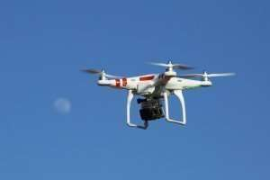

If you’ve been keeping an eye on the news, you may have seen a Reuters article about Google planning for the use of Drones titled [Google aims to begin drone package deliveries in 2017](https://www.reuters.com/article/us-usa-drones-alphabet-idUSKCN0SR20520151103) You may also have seen another article from Time Magazine that tells us it might be a while till we see drone delivery happening; [Here’s Why Drone Delivery Won’t Be Reality anytime Soon](https://time.com/4098369/amazon-google-drone-delivery/). The thing I’ve been wondering is how do you end up getting a package from a drone? Where would it drop it off?

_[Drone and Moon](https://www.flickr.com/photos/69214385@N04/8725078749/in/photolist-ei1iWe-6Rr8H2-nfN4ag-n3TU3P-t244Cq-nYQEZ2-rQM8Vk-oKnd9T-yTKaDR-fF81HV-dnWDiX-78giQL-zgmBCK-tPKBb7-66hhdZ-8Kge5V-dEA6uf-frN4T9-pv4mYS-ye8Ri4-e4geYN-ytCWy2-rRfZRN-vZHbFE-c4Xm2A-ovSfHi-oeDGSb-i1vx1N-s8TF8Q-fvxfUA-s7SFv9-azLToM-rcetiP-dQebzq-pKwKXk-rPTZpT-xwdtYm-oppYwW-dwJwrM-dQebTy-rn4NzB-xwiCLn-rmWBNr-rmWBL2-vUJubx-qTt8n8-fJxSL8-s82X4k-rcetMK-rPGWGR) [Don McCullough](https://www.flickr.com/photos/69214385@N04/) [Some rights reserved](https://creativecommons.org/licenses/by/2.0/)_

Google published a patent application this morning that gives us an idea of how they envision that taking place. The patent application is:

[Machine-Readable Delivery Platform for Automated Package Delivery](http://appft.uspto.gov/netacgi/nph-Parser?Sect1=PTO1&Sect2=HITOFF&d=PG01&p=1&u=%2Fnetahtml%2FPTO%2Fsrchnum.html&r=1&f=G&l=50&s1=%2220150317597%22.PGNR.&OS=DN/20150317597&RS=DN/20150317597)
Invented by: Brian Daniel Shucker, Brandon Kyle Trew
Assigned to Google
US Patent Application 20150317597
Published November 5, 2015
Filed: May 2, 2014

Abstract

A user requests a package delivery from a package delivery system.

> The package delivery system provides the user with a machine-readable code for display at the delivery location. An aerial delivery device receives, from the package delivery system computing device, information associated with the delivery location of the package. The information comprises information matching the information in the machine-readable code associated with the delivery location and a delivery address. The delivery device secures the package for transporting to the delivery location and transports the package to the delivery address. The delivery device locates the machine-readable code on a display at the delivery address and verifies that the information from the machine-readable code is associated with the package. The delivery device deposits the package on the display.

It appears that when you make an order for delivery by a drone, you are sent a barcode to be printed out to display in a particular location where the package should be deposited; you would then inform the delivery device of that location where you have left the printed “machine-readable code.” The application’s description refers to this location as a “landing pad” and seems to rely upon the person choosing that landing pad to select a place that might be safe when it comes to pets or passerby’s who might see it.

The delivery information you would send to have your package delivered would include GPS location information and an address associated with the location you want delivery to happen at; as well as for instructions for delivery.

The patent makes it clear that the device doing the delivery is a drone, and the “machine-readable code” to be used would be a QR code.

Upon delivery, the drone would send a confirmation that the package had been delivered.

The patent filing description points out some of the risks of drone delivery:

> Unmanned aerial delivery devices are problematic for delivery to users. For example, an aerial delivery device that is powered by a rotor or an impeller may be dangerous to pets, overhead power lines, ceiling fans, or other features or residents at a delivery location. Furthermore, the aerial delivery device may not recognize a safe place to deliver a package. For example, leaving the package on the front porch of a busy street address may make it more likely that the package is stolen. Detailed delivery instructions to an unmanned aerial delivery device may be difficult for the limited vision system of the aerial delivery device to interpret. Thus, conventional aerial delivery device methods do not allow for safe, secure delivery of packages to delivery locations.

The process described in the claims of the patent filing doesn’t seem all that unique, and I am left wondering if I would want a drone to deliver a package to me. I have an idea now how Google might attempt to drop packages off to people now, but I don’t know if many people will be able to set up their landing pads and barcodes at such a delivery site. I guess we want and see what Google ends up delivering to us.

*added – 11/9/2015 – I found news of an Amazon patent application that describes how their drone delivery system might work, in [Now we know how Amazon’s crazy drone delivery service will work](https://bgr.com/2015/05/08/amazon-prime-air-patent-drone-delivery/), which points to a patent application by the name of [Unmanned Aerial Vehicle Delivery System](http://appft.uspto.gov/netacgi/nph-Parser?Sect1=PTO1&Sect2=HITOFF&d=PG01&p=1&u=%2Fnetahtml%2FPTO%2Fsrchnum.html&r=1&f=G&l=50&s1=%2220150120094%22.PGNR.&OS=DN/20150120094&RS=DN/20150120094); the patent application describes a few different alternatives for delivery including on that would bring a package directly to the person who ordered it by targeting their mobile device.*
