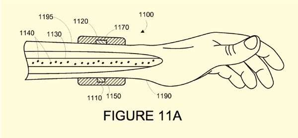

A Patent Application Published at WIPO today from Google, with the name [Nanoparticle Phoresis](https://patentscope.wipo.int/search/en/detail.jsf?docId=US130905048) by inventor Conrad Andrew Jason.

The patent’s description begins by telling us how this wearable device would work:

> A wearable device can automatically modify or destroy one or more targets in the blood that have an adverse health effect by transmitting energy into subsurface vasculature proximate to the wearable device. The targets could be any substances or objects that, when present in the blood, or present at a particular concentration or range of concentrations, may affect a medical condition or the health of the person wearing the device. For example, the targets could include enzymes, hormones, proteins, cells or other molecules. Modifying or destroying the targets could include causing any physical or chemical change in the targets such that the ability of the targets to cause the adverse health effect is reduced or eliminated.

Research Developed at Purdue University announced a couple of years ago describe how such an approach could target a malady such as cancer: [Nanoparticles, ‘pH phoresis’ could improve cancer drug delivery](https://www.purdue.edu/newsroom/releases/2013/Q3/nanoparticles,-ph-phoresis-could-improve-cancer-drug-delivery.html)

Dr. Jason is listed as a project Manager at Google X and the Wall Street Journal reported upon a nanotechnology approach to fighting cancer by Google X in late October in the article [Google’s Newest Search: Cancer Cells](https://www.wsj.com/articles/google-designing-nanoparticles-to-patrol-human-body-for-disease-1414515602) That article calls the nanotechnology likely to be more than five years away from being developed, yet the patent points to some good headway having been made upon it.

The patent provides a considerable amount of details on how this wearable device could be used to monitor health and be used in medical studies in conjunction with many wearers of such devices, and could be used to fight off targeted particles in a person’s blood stream.

This doesn’t have much to do with SEO or Search, but it does have a lot to do with the kind of Technology being developed at Google’s moonshot research facility Google X, which appears wide ranging.
