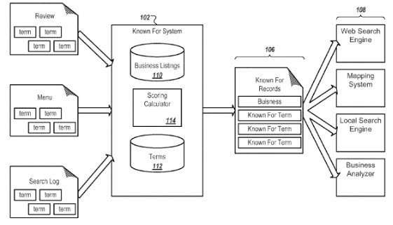
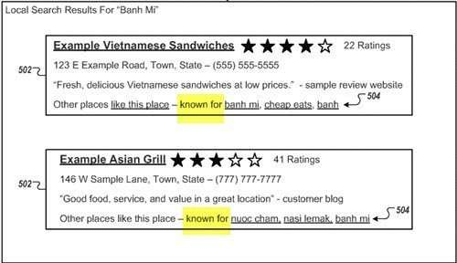
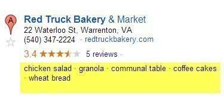

*Google finds terms and phrases to associate with entities that can be considered terms of interest for businesses, locations, and other entities. These terms can influence what shows up in search results and knowledge panels for those entities. Consider it part of a growing knowledge base of concepts, entities, attributes for entities, and keywords that shape the new Google after Hummingbird. Semantics play a role as things that specific entities are known for being identified.*

For example, the Warrenton, Virginia, Red Truck Bakery (local to me) is known for:

- Great tasting locally roasted coffee
- Baked goods that include locally grown produce
- A red truck parked in their lot that originally belonged to Tommy Hilfiger
- A CIA trained chef who owns the place and was a longtime Art Director for the Smithsonian
- A communal farmer’s table where townspeople customers share breakfast and lunch.

What are you known for? What are the things that you write about or sell online known for? Or the celebrities from inside of weekly tabloids. Or the figures that have shaped the timeline of our history. Or the businesses that fill the yellow pages of local phone books?

Google was granted a patent last week that describes how the search engine might process and extract patterns from data it finds on the Web. We’re told that it might make “observations about form, behavior, or the nature of concepts represented by data” that can be used to create useful intelligence about those concepts, and identify known for terms about entities.

Documents from a web page body can be analyzed to identify keywords or categories associated with those documents and entities on the Web. The patent focuses upon businesses at locations, but its teachings can be applied to other types of entities as well.

The patent shows known for terms in a screenshot of an example of local search results.

Actual local search results show them as well, without the “known for” language:

In addition to local search results, the patent tells us that these known for terms can be used in other ways, such as within search results as well. The patent is:

[Assigning terms of interest to an entity](http://patft.uspto.gov/netacgi/nph-Parser?Sect1=PTO2&Sect2=HITOFF&p=1&u=%2Fnetahtml%2FPTO%2Fsearch-adv.htm&r=1&f=G&l=50&d=PALL&S1=08589399&OS=PN/08589399&RS=PN/08589399)
Invented by Jason Lee, Tamara I. Stern, Gregory J. Donaker, and Sasha J. Blair-Goldensohn
Assigned to Google
United States Patent 8,589,399
Granted November 19, 2013
Filed: March 26, 2012

Abstract

> The subject matter of this specification can be embodied in, among other things, a method that includes identifying resources relating to an entity, where each resource includes multiple terms and is included in a corpus of resources relating to multiple entities.
>
> Candidate terms from the resources for associating the entity and a category associated with the entity are identified. A relative frequency of the candidate terms in the identified resources is compared to a frequency of the candidate terms associated with other entities. Each candidate term is weighted based on the source of the candidate term and the relative frequency of the candidate term.
>
> A weighted frequency of each candidate term is calculated based on the weights, and candidate terms are selected as representative terms for the entity based on the weighted frequency.

## How Known for Terms Associated with an Entity are Identified

Several web pages about a local business, or a person, or a place or other entity may have terms extracted from them that might potentially be associated with that entity. For instance, as we see in the local search result above for Red Truck Bakery, one of the terms associated with the bakery is “Granola.”

The next steps, according to the patent:

1. A category associated with the entity is determined (Red Truck Bakery is in the category of Bakeries, for example)

1. For each of the candidate terms, a frequency with which each candidate term appears in the pages is determined (Such as how frequently the term “granola” shows up in pages returned for “Red Truck Bakery).

1. The candidate terms are weighted based on the source the term is found in and a relative frequency of the candidate term, wherein the relative frequency is the frequency of the candidate term in the one or more resources (Appearances for “granola” in all pages returned for “Red Truck Bakery) relative to the frequency of the candidate term in a subset of the corpus of resources relating to entities associated with the determined category (Appearances for “granola” in Red Truck Bakery pages relative to Appearances for “granola” in all Bakery pages, with “Granola” showing up much more frequently for the Red Truck Bakery than for other bakeries).

1. A weighted frequency of each candidate term is calculated based on the assigned weights. One or more of the candidate terms are selected as being representative terms for the entity based on the weighted frequency. The selected representative terms are associated with the entity in a data repository. Since the Red Truck Bakery makes its own Granola, and it’s not a very common thing that most other Bakeries are known for, it’s considered a term that is “representative” of Red Truck Bakery.

Terms related for one of these associated terms might also then be identified. These terms could be:

- A term that is at least one of a plural of the first candidate term
- A substantially similar semantic variation of the first candidate term
- A synonym of the first candidate term, and/or
- A subphrase of the first candidate term

Some other terms might not be considered, such as stop words and words that fall into certain pre-defined categories. Those categories can include:

- Terms that refer to a location of the entity;
- Terms that are variations of a name of the entity;
- Contact information associated with the entity;
- Terms included in a list of stop words associated with a category associated with the entity;
- Terms that are common in documents associated with the determined category; or
- Temporal terms.

The patent details how certain terms might be identified or might be omitted as one of these known for terms that might differentiate entities that are in similar categories.

Quickly, a Thai restaurant might be in a category for Thai restaurants with other Thai restaurants, but might be known for a particular chef, or a special that is only served at that particular restaurant.

That chef or that menu special might be understood as terms associated with that particular restaurant (entity), could show up in local search results for that entity, might be seen as keywords specifically associated with an entity, and could potentially appear in a knowledge base result related to the entity as well.
