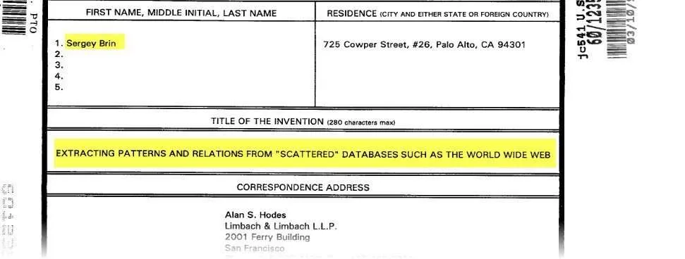

This is officially part of the story I’m telling in a presentation I prepared for [SMX East](https://marketinglandevents.com/smx/east/agenda/), in a couple of weeks in New York. The name of the session I’m in is “Hummingbird and the Entity Revolution,” which reminds me of a Prince song from the 1980s.

The story starts with a student given a tour by another student whom he gets into a fight with. They liked fighting with each other and ended up becoming close friends. They studied together, and when their supervising professor went away to Japan for a year, they stopped working on their advanced degrees and played on the internet instead. They created something they called Backrub. It later had its name changed to Google, and many people in the present day think it is the internet.

On March 10, 1999, Sergey Brin filed a “Miscellaneous Incoming Letter” (this is what it is described as in the USPTO’s PAIR database). It’s a provisional patent titled [Extracting Patterns and Relations from Scattered Databases Such as the World Wide Web (pdf)](https://www.seobythesea.com/Extracting-Patterns-and-Relations-from-Scattered-Databases-Such-as-the-World-Wide-Web.pdf) (Skip quickly past the first couple of pages. It becomes much more legible from the third page on.)

This provisional patent filed by Sergey is similar to a provisional patent (again, a “Miscellaneous Incoming Letter”) filed by Lawrence Page when he filed the original provisional PageRank patent, [Improved Text Searching in Hypertext Systems](https://www.seobythesea.com/improved-text-searching-in-hypertext-systems.pdf) (pdf), which was filed on March 28th, 1997.

Notice that it is named “PageRank” after Larry, as he tells us in the provisional patent. Why not include Brin’s name in it, too? I don’t know. (They were competitive students.) But, Sergey did get his patent in too.

Larry’s patent is about crawling, indexing, and displaying Web pages.

Sergey’s patent is about feeding some titles of books and their authors (5 books) into a database called the Web, and finding other web sites with those books, and learning about the different patterns of titles and authors where those are listed, and then scraping similar “tuples” or patterns of objects (books) and their facts (titles) and (authors) on all those pages and learning about other patterns. Then rinsing and repeating until done. Sergey named his invention DIPRE after “Dual Iterative Pattern Relation Expansion.” It was less about ranking and more about expanding and finding all the books.

Both provisional patents are much more human friendly and readable than most patents, mainly because they skip the legal language that it can take many lawyers years to perfect. The patent was turned into a paper attributed to Sergey Brin and published on the Stanford website with a slightly shorter name. The “scattered databases such as” from the title disappeared, which is a part I liked. :(

The patent ended up being rewritten, apparently with the assistance of someone with some patent law experience, and filed again as a non-provisional patent:

[Information extraction from a database](http://patft.uspto.gov/netacgi/nph-Parser?Sect1=PTO1&Sect2=HITOFF&d=PALL&p=1&u=%2Fnetahtml%2FPTO%2Fsrchnum.htm&r=1&f=G&l=50&s1=6,678,681.PN.&OS=PN/6,678,681&RS=PN/6,678,681)
Invented by Sergey Brin
Assigned to Google
US Patent 6,678,681
Granted January 13, 2004
Filed: March 9, 2000

Abstract

> Techniques for extracting information from a database are provided. A database such as the Web is searched for occurrences of tuples of information. The occurrences of the tuples of information that were found in the database are analyzed to identify a pattern in which the tuples of information were stored. Additional tuples of information can then be extracted from the database utilizing the pattern. This process can be repeated with the additional tuples of information, if desired.

In my post from a couple of days ago, [Lessons Learned from Using Google’s Tagging and Extraction Data Highlighter Tool](https://www.seobythesea.com/2014/09/googles-tagging-extraction-data-highlighter-tool/), I wrote about a tool that Google developed for webmasters to enable them to tag different facts on their pages in a way that tried to capture as many patterns those were presented in as possible. It’s almost 15 years later, and yet they are very similar in many ways.

If the Tagging and Extraction Data Highlighter Tool was offered back then, the first schema type it might have been set up for may have been booked.

Sergey has updated the claims section of this patent a couple of times, and the last version was granted last year. The description is likely almost the same, but the claims have likely changed.

[Information extraction from a database](http://patft.uspto.gov/netacgi/nph-Parser?Sect1=PTO1&Sect2=HITOFF&d=PALL&p=1&u=%2Fnetahtml%2FPTO%2Fsrchnum.htm&r=1&f=G&l=50&s1=8,589,387.PN.&OS=PN/8,589,387&RS=PN/8,589,387)
Invented by Sergey Brin;
Assigned to: Google Inc. & The Board of Trustees of the Leland Stanford Junior University
US Patent 8,589,387
Granted November 19, 2013
Filed September 14, 2012

Abstract

> Techniques for extracting information from a database are provided. A database such as the Web is searched for occurrences of tuples of information. The occurrences of the tuples of information that were found in the database are analyzed to identify a pattern in which the tuples of information were stored. Additional tuples of information can then be extracted from the database utilizing the pattern. This process can be repeated with the additional tuples of information, if desired.

Here are details about the patent for Google’s Data Mapping and Tagging program. It and Sergey Brin’s patents aren’t identical, but they share several things in common. Sergey’s patent describes the very first knowledge web invention patented by the company, originally filed in a provisional patent form almost 15 years earlier than this one for the data mapper and tagger.

[System and Methods for Generation Extraction Models](http://appft.uspto.gov/netacgi/nph-Parser?Sect1=PTO1&Sect2=HITOFF&d=PG01&p=1&u=%2Fnetahtml%2FPTO%2Fsrchnum.html&r=1&f=G&l=50&s1=%2220140075299%22.PGNR.&OS=DN/20140075299&RS=DN/20140075299)
Invented by Joshua Daniel Ain, Ryan Levering, and Justin Andrew Boyan
Assigned to Google
US Patent Application 20140075299
Published March 13, 2014
Filed: September 13, 2012

Abstract

> Disclosed systems and methods enable a user to train an extraction model by receiving a starting document and input from the user indicating tagged data from the starting document and creating an extraction model from the tagged data.
>
> Disclosed systems and methods also include identifying groups of additional documents based on a location of the starting document and displaying each of the groups to the user to receive a selection of at least one group from the user.
>
> Disclosed systems and methods also include applying the extraction model to the at least one group by evaluating the additional documents associated with the at least one group based on the extraction model to determine a confidence score for each of the additional documents, determining a document with a low confidence score, and displaying the particular document to the user to receive additional tagged data.
