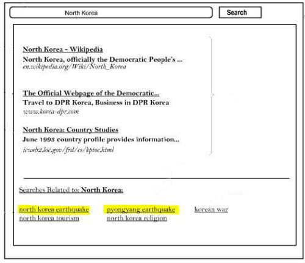

When you search at Google, in addition to search results, Google often returns a set of search suggestions that might be related to your query. Last month, I wrote about how some of those suggested query refinements might be created follow a method invented in part by Ori Allon, in the post [How Google is Generating Query Refinements the Orion Way](https://www.seobythesea.com/2013/03/google-query-refinements-orion/). But that’s probably not the only source of search suggestions. A Google patent granted this week looks at how Google could grab additional refinements from very recent sources.

For example, the following search for “North Korea” shows a couple of very recent earthquake listings:

Such suggestions aren’t just relevant to the query itself, but also relevent to news-type results that match the query as well. Those news-type results would be within a recent period of time, such as in the las week, or day, or even within a number of hours or minutes.

By “news-type results,” Google isn’t referring to just news articles, but also new blog posts, micro and mini blog posts (such as tweets and status updates), book-marking sites, new image results, new video results, and new web pages.

In addition to looking at how “new” those results might be, user-behavior such as click-through rates on search results responsive to queries might also be considered.

The patent does provide more details on how these fresh search suggestions might be ranked and chosen.

[Fresh related search suggestions](http://patft.uspto.gov/netacgi/nph-Parser?Sect1=PTO2&Sect2=HITOFF&p=1&u=%2Fnetahtml%2FPTO%2Fsearch-adv.htm&r=1&f=G&l=50&d=PALL&S1=08412699&OS=PN/08412699&RS=PN/08412699)
Invented by Rajat Mukherjee, Abhinandan S. Das, and Adam Westall
Assigned to Google
US Patent 8,412,699
Granted April 2, 2013
Filed June 12, 2009

Abstract

> Methods, systems, apparatus, including computer program products, for providing fresh related search suggestions in response to a user submitted query are presented. In one implementation, a plurality of prior queries are selected wherein each of the prior queries was submitted as a search query a number of times during a recent time period and satisfies a criterion.
>
> For each of the prior queries, the prior is selected as a candidate query based on one or more of: a determination that search results responsive to the prior query include a number of news results that satisfy a second threshold, and relevance data indicative of user behavior relative to the search results responsive to the prior query. In response to receiving a user query, one or more candidate queries are selected that match the user query.

## Take-Aways

A couple of years ago, Google was showing realtime search results, with an search interface addition that showed results from Twitter’s data hose, and some additional results. When Google Plus was released, [realtime search was suspended](https://searchengineland.com/google-realtime-search-goes-missing-84130), with Google promising that it would return once it was integrated with Google Plus. What went unsaid in that initial announcement from Google was that their deal with Twitter to use a data stream of tweets had expired.

Those realtime results included content from more sources than Twitter, and did a decent job of turning search results into a realtime monitoring system of terms you might search for.

I’ve tried a few searches that would probably have recent search suggestions if this approach from the patent was presently being used, and those searches didn’t return any recent suggestions.

I suspect that Google will bring back realtime results at some point, but the format might not be the realtime results Google displayed in the past, and may not even include the kind of “fresh” search suggestions described in this patent.

Then again, I’ve been waiting for realtime results for almost 2 years now.

I’m wondering if people are much less likely to use Google Plus like they have with Twitter, providing updates that focus upon recent events.
