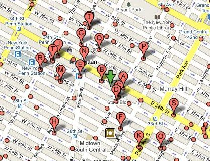
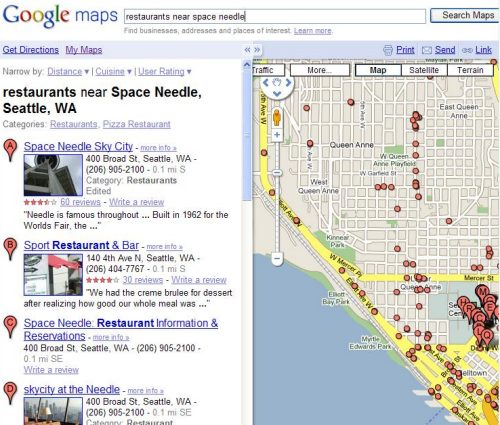
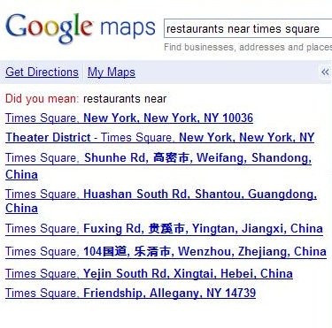

Have you ever done a search on Google Local Search like “pizza near empire state building,” where you enter a building or a landmark instead of a zip code, or a street, or city or state name?

*Pizza Near Empire State Building*

While many businesses, organizations, and points of interest (such as parks and schools) have particular address information associated with them in Google’s Local Search database, people do sometimes want to use landmarks and other more ambiguous locations in their searches, such as neighborhoods (like “pizza in Soho”).

A recent patent application from Google pinpoints some of the difficulties that Google’s Local Search may have with searches such as “restaurants near space needle,” where searchers may not be providing much actual geographic information in their searches. It also describes how the search engine might fill in its information about locations in its geographic database with user-submitted data.

People who use Google Maps can create their own [personalized maps](https://support.google.com/maps/answer/3045850?hl=en&rd=2) and share them with others, but I hadn’t seen anything from Google that stated that they might use information from those maps in Local Search results until this patent filing.

*Restaurants Near Space Needle*

In my Space Needle search, Google was confident enough about the Space Needle being located in Seattle, Washington, that it returned results directly. The patent application discusses how it might create confidence scores for the results of some searches to decide what it might show to searchers.

When the search engine is less confident about a location for a region or landmark, it might serve a choice of locations, such as the following for “restaurants near times square.”

*Restaurants Near Times Square*

If I click upon the top result for Times Square in New York City, Google enters the following information in the search box – “restaurants loc: Times Square, New York, New York, New York 10036,” which includes City, State, and Zip Code.

The patent application focuses upon how it might find well-structured and more complete location information for searches from its database and from trying to match geographic locations with limited information. The problem it is intended to address is described this way in the document:

> However, problems may arise if an address does not follow these conventions. In some countries, addresses typically include references to multiple features and are not hierarchical. For example, some features may include buildings, stores, or landmarks, and the address describes relative proximity to these features. Performing a table lookup is impractical since there is no defined order to the address. There may be a lack of information concerning typical address components, such as roads or street numbers, and a table cannot recognize a description of a spatial relationship between two or more objects.

[Geocoding Multi-Feature Addresses](http://appft.uspto.gov/netacgi/nph-Parser?Sect1=PTO2&Sect2=HITOFF&u=%2Fnetahtml%2FPTO%2Fsearch-adv.html&r=1&p=1&f=G&l=50&d=PG01&S1=20090177643.PGNR.&OS=dn/20090177643&RS=DN/20090177643)
Invented by Apurv Gupta and Tushar Khot
Assigned to Google
US Patent Application 20090177643
Published July 9, 2009
Filed: January 4, 2008

Abstract

> A system and method of parsing natural language descriptions of features to determine an approximate location. An embodiment includes splitting the natural language descriptions into components, geocoding each component, and returning the geocode with the highest confidence level. The geocode references a specific location, and this information may be determined by content from various sources. The system may use an assortment of techniques for determining the highest confidence level.

When you perform a search that includes geographic information, Google’s Local Search will try to understand more about the geographic region involved in the search, such as the name of a city.

It will look in its database and find a match for a location-based upon rows and rows and rows (lots of information) of streets and cities and states associated with standard formatted addresses. It might come back from a search like that with many results, like in my example above for Times Square. In my other example for the Space Needle, the search engine likely ranked that landmark very highly with a confidence score and returned only one result. In the Times Square example, the results shown were likely all possibly reasonable results and had decent confidence scores associated with them.

When a result is returned with one specific location, the listings may be shown using that landmark or location as a center point. At the top of my results for “restaurants near space needle” shown above is the line “narrow by Distance | Cuisine | User Rating,” so several options are available. Still, the results are centered around the space needle.

The patent filing also tells us that if Google doesn’t find much helpful geographic information in its database, taken from the many sources that it uses such as yellow page type telecom information and what it discovers on the Web, it may dip into information submitted from people who may have added to Google through their personalized maps.
