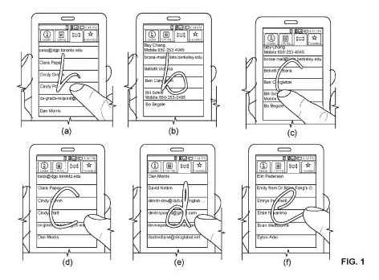
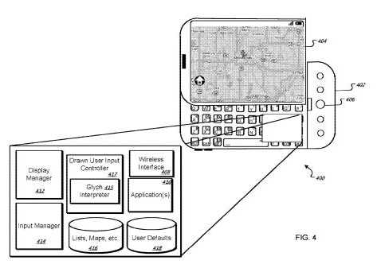

Last week, Google published a paper on a way of navigating on touch screens by tracing out alphanumeric characters. For instance, if you have a list of contacts on your screen, and want to move down to a name that begins with the letter L, you would trace an L on your screen. Looking for a song on your playlist, you might handwrite on your screen the first couple of letters from the song title.

The paper is [Gesture Search: A Tool for Fast Mobile Data Access](http://static.googleusercontent.com/media/research.google.com/en/us/pubs/archive/36911.pdf) (pdf), and it tells us that Gesture Search is presently in use by hundreds of thousands of users, with a mean rating of 4.5 out of 5 for more than 5,000 ratings.

A Google patent application published October 14th, [Glyph Entry on Computing Device](http://appft.uspto.gov/netacgi/nph-Parser?Sect1=PTO1&Sect2=HITOFF&d=PG01&p=1&u=%2Fnetahtml%2FPTO%2Fsrchnum.html&r=1&f=G&l=50&s1=%2220100262905%22.PGNR.&OS=DN/20100262905&RS=DN/20100262905), provides a number of details that the paper doesn’t, including a look at how this gesture navigation system might be used to navigate maps from Google Maps.

The Google Gesture Search page is presently part of Google Labs, and it can be used to search for contacts, bookmarks, applications, and music tracks.

How might it be used with Google Maps?

When you are viewing a map from Google Maps, in addition to downloading the map tiles, you may also be downloading meta data associated with the map, such as the names of streets, landmarks, towns, businesses, and other points of interest located within the boundaries of the map.

Imagine driving through a town, and showing a map of your location on your phone. Trying to find Main Street on the map, you trace the letter M on your screen.

The patent tells us that other places that begin with the letter M might appear on a list that you can select from, such as a number of McDowell’s restaurants (as signified by their Golden Arcs), or other places such as Maple Street, Marple Avenue, and the Metrodome.

The items that show up in the list might appear in an order based upon a combination of prominence and distance to the user.

Prominence, in this case couild mean that street names might be listed first when it appears that a user is moving at a high speed, or driving. Business names might be listed first when it appears that the user is walking, and might be looking for a particular business or store. Landmarks that are closer might be shown before landmarks that are further away.

This could be a helpful and interesting addition to Google Maps that could make it even easier to use, especially on a phone.

Keep an eye out. Gesture Search on Google Maps may be coming to a phone near you soon.
