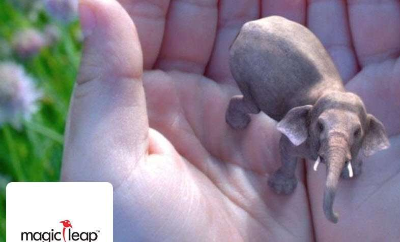
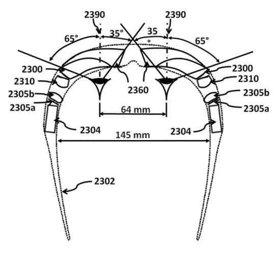
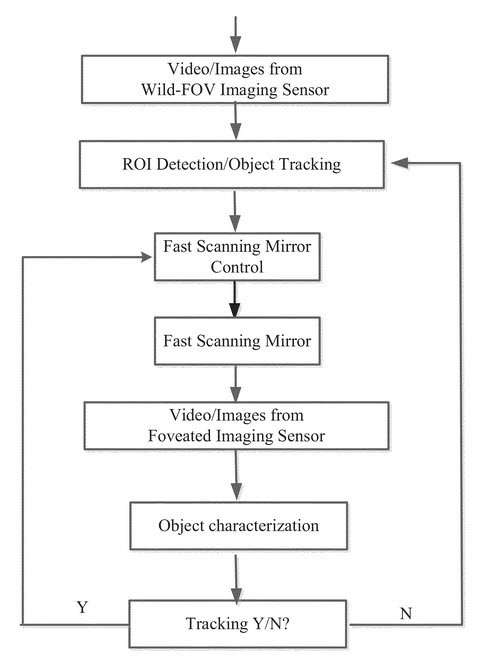
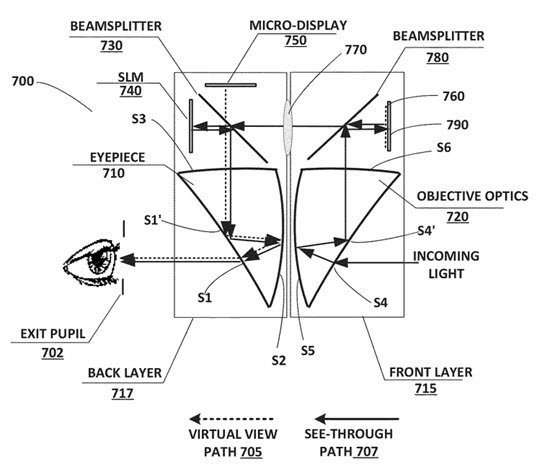

Hat tip to Barbara Starr (follow her on Google+ for interesting news on Semantic Search and new technology developments), who asked the title of this post (using slightly different words.)

The Verge reported this morning that [Google leads $542 million funding of mysterious augmented reality firm Magic Leap](https://www.theverge.com/2014/10/21/7026889/magic-leap-google-leads-542-million-investment-in-augmented-reality-startup)

You need to visit the Magic Leap website to get a sense of what they are capable of doing, and there are a few more details about this funding on their [press](http://web.archive.org/web/20170222120506/https://www.magicleap.com/) page, including this line from Google’s Sundar Pichai, SVP at Google:

> We are looking forward to Magic Leap’s next stage of growth, and seeing how it will shape the future of visual computing.

I like looking at documents such as patent filings to get a behind the scenes look at transactions like this one, and here are the patent applications about augmented reality that I saw assigned to Magic Leap when I looked at the United States Patent and Trademark Office website:

[Ergonomic Head Mounted Display Device And Optical System](https://patents.google.com/patent/US20120162549)
Invented by Chunyu Gao, Hong Hua, and Yuxiang Lin
US Patent Application 20120162549
Published June 28, 2012
Filed: December 22, 2011

Abstract

> This invention concerns an ergonomic optical see-through head-mounted display device with an eyeglass appearance. The see-through head-mounted display device consists of a transparent, freeform waveguide prism for viewing a displayed virtual image, a see-through compensation lens for enabling proper viewing of a real-world scene when combined with the prism, and a miniature image display unit for supplying display content.
>
> The freeform waveguide prism, containing multiple freeform refractive and reflective surfaces, guides light originated from the miniature display unit toward a user’s pupil and enabled a user to view a magnified image of the displayed content.
>
> A see-through compensation lens containing multiple freeform refractive surfaces enables proper viewing of the surrounding environment through the combined waveguide and lens.
>
> The waveguide prism and the see-through compensation lens are properly designed to ergonomically fit human heads, enabling a wraparound design of a lightweight, compact, and see-through display system.

[Wide-field of view (fov) imaging devices with active foveation capability](https://patents.google.com/patent/US20140218468)
Invented by Chunyu Gao and Hong Hua
Assigned to Augmented Vision Inc.
US Patent Application 20140218468
Published August 7, 2014
Filed: April 4, 2013

Abstract

> The present invention comprises a foveated imaging system capable of capturing a wide field of view image and a foveated image. The foveated image is a controllable region of interest of the wide field of view image.

[Apparatus for optical see-through head-mounted display with mutual occlusion and opaqueness control capability](https://patents.google.com/patent/US20140177023)
Invented by Chunyu Gao, Hong Hua, and Yuxiang Lin
Assigned to Augmented Vision Inc.
US Patent Application 20140177023
Published June 26, 2014
Filed: April 5, 2013

Abstract

> The present invention comprises a compact optical see-through head-mounted display capable of combining a see-through image path with a virtual image path such that the opaqueness of the see-through image path can be modulated and the virtual image occludes parts of the see-through image and vice versa.

I’ve seen many interesting patents describing technology that Google Glass might use, but this news adds somewhat of a magical potential to glass that wasn’t there before. Will Google and Magic Leap work together to bring us something interesting and new?

A couple more articles about augmented reality startup Magic Leap:

[Mako Surgical founder reveals more on Magic Leap](https://www.bizjournals.com/southflorida/blog/2014/02/mako-surgical-founder-reveals-more-on.html?page=all)
[What is the mysterious Magic Leap?](https://www.cnn.com/2014/10/17/tech/innovation/magic-leap/)
