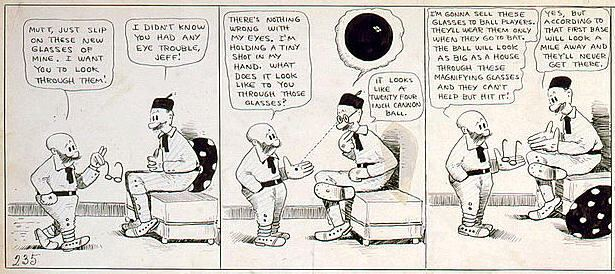
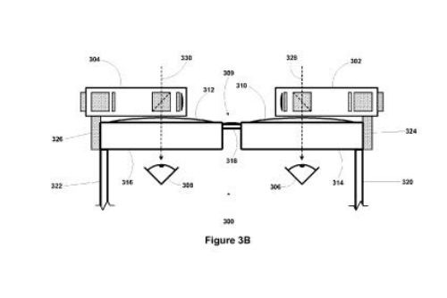
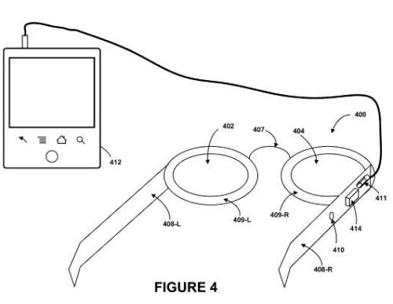
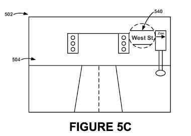
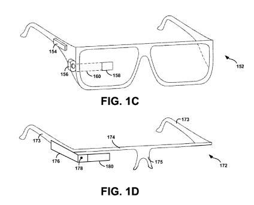
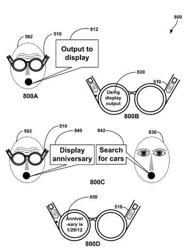

Google’s Project Glass has the potential to bring something completely new to consumers – wearable computing devices that could revolutionize how consumers interact with the Web. The augmented reality glasses aren’t yet available to consumers, and are a work in progress. Google is holding its [first developer workshops](http://allthingsd.com/20130115/google-glass-to-hold-developer-events-in-two-weeks/) this week, offering developers the chance to use the devices for the first time, so that they can start coming up with applications for use on the devices.

See the full 1919 [Mutt and Jeff comic](http://www.loc.gov/pictures/resource/cph.3g05623/)

Project Glass are heavily visually oriented and many of the demonstrations of the devices show off the ability for wearers to take both photographs and video while wearing the glasses. Chances are good that we see the different [visual queries](https://www.seobythesea.com/2011/02/the-future-of-googles-visual-phone-search/) that [Google Goggles](https://www.seobythesea.com/2011/02/the-future-of-googles-visual-phone-search/) offer, including object and facial recognition, barcode search, searches for landmarks and books and other types of things as well.

Google Glass also has the potential to work with local/mobile/social technology that Google has acquired through an assignment of [7 patents from deCarta](https://www.seobythesea.com/2012/08/google-scores-7-mobile-location-based-services-patents-decarta/), and alert type [virtual post-it notes](https://www.seobythesea.com/2011/03/google-acquires-virtual-post-it-notes-patents/) patented technology from Xybernaut Corporation. You’ll be able to find friends with Google Latitude as well.

We’re also seeing technology developed for Android devices like [Google Now](https://www.google.com/search/about/) and [Google Field Trip](https://web.archive.org/web/20190402183333/https://play.google.com/store/apps/details?id=com.nianticproject.scout&hl=en) that are likely to evolve and work well with something like Google Glass.

I’ve written about (and presented upon) some of the patents that Google either acquired or developed for a wearable heads-up display like Project Glass:

- April 13th, 2012 – [Google Acquires Glasses Patents](https://www.seobythesea.com/2012/04/google-acquires-glasses-patents/)
- May 15, 2012 – [Google Glasses Design Patents and Other Wearables](https://www.seobythesea.com/2012/05/google-glasses-design-patents-other-wearables/)
- May 22, 2012 – [More Google Glasses Patents: Beyond the Design](https://www.seobythesea.com/2012/05/more-google-glasses-patents-beyond-the-design/)
- June 1, 2012 – [Future SEO and Paid Ads with Google Glasses?](https://www.seobythesea.com/2012/06/future-seo-paid-ads-google-glasses/)
- October 2012 – [Google Will not go Gentle into that Google Night – Project Glass (presentation)](https://www.slideshare.net/billslawski/google-will-not-go-gentle-into-that-good-night-project-glass)
- January 12th, 2013 – [Google Acquires Patent for Eye Scan Security and Augmented Imagery](https://www.seobythesea.com/2013/01/eye-scan-security-augmented-imagery/)

Google’s published a good number of additional patent filings, including both granted and pending applications, and some followup continuation patents that update some of the original patents. Given the [Google Glass Foundry](https://mashable.com/2013/01/15/google-glass-developers/#qdJWHhdmMiqg) being held this week in both New York City, and San Francisco, I though it made sense to share a number of the other patent filings that have been published on Google Glass.

I’m going to share these over a number of posts as we get closer to the date that developers will get a chance to start working with the devices. Here’s the first batch.

**Optical Systems**

Many of the recent Google Glass patents give us insight into the hardware behind the Glasses. This first one, which was published on January 24th, 2013, describes two alternative optical systems that might be used to control the display of images on the glasses. The glasses shown in the patent actually have display devices for both the left and right eyes. The demo versions of glasses have only had a display device on onete.de.

[Compact See-Through Display System](http://appft.uspto.gov/netacgi/nph-Parser?Sect1=PTO1&Sect2=HITOFF&d=PG01&p=1&u=%2Fnetahtml%2FPTO%2Fsrchnum.html&r=1&f=G&l=50&s1=%2220130021658%22.PGNR.&OS=DN/20130021658&RS=DN/20130021658)
Invented by Xiaoyu Miao, Adrian Wong, and Babak Amirparviz
Assigned to Google
US Patent Application 20130021658
Published January 24, 2013
Filed July 20, 2011

Abstract

> An optical system includes a display panel, an image former, a viewing window, a proximal beam splitter, and a distal beam splitter. The display panel is configured to generate a light pattern. The image former is configured to form a virtual image from the light pattern generated by the display panel. The viewing window is configured to allow outside light in from outside of the optical system. The virtual image and the outside light are viewable along a viewing axis extending through the proximal beam splitter.
>
> The distal beam splitter is optically coupled to the display panel and the proximal beam splitter and has a beam-splitting interface in a plane that is parallel to the viewing axis. A camera may also be optically coupled to the distal beam splitter so as to be able to receive a portion of the outside light that is viewable along the viewing axis

**Audio Speakers**

Audio is essential to Project Glass, from voice command and voice searches, to use of the device as a phone, to the running of devices that might play music, and to different alerts that might be triggered. Instead of connecting a pair of speakers or headphones to the glasses, we’re given the following approach:

[Wearable Computing Device with Indirect Bone-Conduction Speaker](http://appft.uspto.gov/netacgi/nph-Parser?Sect1=PTO1&Sect2=HITOFF&d=PG01&p=1&u=%2Fnetahtml%2FPTO%2Fsrchnum.html&r=1&f=G&l=50&s1=%2220130022220%22.PGNR.&OS=DN/20130022220&RS=DN/20130022220)
Invented by Jianchun Dong, Liang-Yu Tom Chi, Mitchell Heinrich, and Leng Ooi
Assigned to Google
US Patent Application 20130022220
Published January 24, 2013
Filed: October 10, 2011

Abstract

> Exemplary wearable computing systems may include a head-mounted display that is configured to provide indirect bone-conduction audio. For example, an exemplary head-mounted display may include at least one vibration transducer that is configured to vibrate at least a portion of the head-mounted display based on the audio signal. The vibration transducer is configured such that when the head-mounted display is worn, the vibration transducer vibrates the head-mounted display without directly vibrating a wearer.
>
> However, the head-mounted display structure vibrationally couples to a bone structure of the wearer, such that vibrations from the vibration transducer may be indirectly transferred to the wearer’s bone structure.

**Real Time Visual Enhancement**

Imagine that you’re trying to read a street sign, but it’s just a little too far away. You make a gesture in front of your glasses, and they zoom in on a sign you’re trying to read.

[Manipulating And Displaying An Image On A Wearable Computing System](http://appft.uspto.gov/netacgi/nph-Parser?Sect1=PTO1&Sect2=HITOFF&d=PG01&p=1&u=%2Fnetahtml%2FPTO%2Fsrchnum.html&r=1&f=G&l=50&s1=%2220130021374%22.PGNR.&OS=DN/20130021374&RS=DN/20130021374)
Invented by Xiaoyu Miao and Mitchell Joseph Heinrich
Assigned to Google
US Patent Application 20130021374
Published January 24, 2013
Filed: November 8, 2011

Abstract

> Example methods and systems for manipulating and displaying a real-time image and/or photograph on a wearable computing system are disclosed. A wearable computing system may provide a view of a real-world environment of the wearable computing system. The wearable computing system may image at least a portion of the view of the real-world environment in real-time to obtain a real-time image.
>
> The wearable computing system may receive at least one input command that is associated with a desired manipulation of the real-time image. The at least one input command may be a hand gesture. Then, based on the at least one received input command, the wearable computing system may manipulate the real-time image in accordance with the desired manipulation. After manipulating the real-time image, the wearable computing system may display the manipulated real-time image in a display of the wearable computing system.

**Input Alternatives with Real Time Images**

A heads-up display might have a touchpad on a sidebar of the device, or might be connected with another computing device such as a phone or laptop, and use a touchpad connected to those devices to run programs through the heads up display. A video camera (as seen in the image below) may be used to capture real time images that could be “used to generate an augmented reality where computer generated images appear to interact with the real-world view perceived by the user.”

[Dynamic Control of an Active Input Region of a User Interface](http://appft.uspto.gov/netacgi/nph-Parser?Sect1=PTO1&Sect2=HITOFF&d=PG01&p=1&u=%2Fnetahtml%2FPTO%2Fsrchnum.html&r=1&f=G&l=50&s1=%2220130021269%22.PGNR.&OS=DN/20130021269&RS=DN/20130021269)
Invented by Michael P. Johnson, Thad Eugene Starner, Nirmal Patel, and Steve Lee
Assigned to Google
US Patent Application 20130021269
Published January 24, 2013
Filed: November 15, 2011

Abstract

> The systems and methods described herein may help to provide for more convenient, efficient, and/or intuitive operation of a user-interface. An example computer-implemented method may involve:
>
> - (i) providing a user-interface comprising an input region;
> - (ii) receiving data indicating a touch input at the user-interface;
> - (iii) determining an active-input-region setting based on (a) the touch input and (b) an active-input-region parameter; and
> - (iv) defining an active input region on the user-interface based on at least the determined active-input-region setting, wherein the active input region is a portion of the input region.

**Speech Input for Commands and Verbal Search Requests**

One approach to controlling what Google Glass will do is through verbal commands that could request information to be displayed, or schedule some event, or delete information or control some other action, including running queries on a search engine. Of course, one of the concerns about speech input for glasses is when someone not wearing Google Glass tries to perform commands or queries. As shown in the image below, their “utterances” can be ignored by the device.

[Systems and Methods for Speech Command Processing](http://appft.uspto.gov/netacgi/nph-Parser?Sect1=PTO1&Sect2=HITOFF&d=PG01&p=1&u=%2Fnetahtml%2FPTO%2Fsrchnum.html&r=1&f=G&l=50&s1=%2220130018659%22.PGNR.&OS=DN/20130018659&RS=DN/20130018659)
Invented by Liang-Yu (Tom) Chi
Assigned to Google
US Patent Application 20130018659
Granted January 17, 2013
Filed: November 8, 2011

Abstract

> Methods and apparatus related to processing speech input at a wearable computing device are disclosed. Speech input can be received at the wearable computing device. Speech-related text corresponding to the speech input can be generated. A context can be determined based on database(s) and/or a history of accessed documents. An action can be determined based on an evaluation of at least a portion of the speech-related text and the context. The action can be a command or a search request. If the action is a command, then the wearable computing device can generate output for the command.
>
> If the action is a search request, then the wearable computing device can: communicate the search request to a search engine, receive search results from the search engine, and generate output based on the search results. The output can be provided using output component(s) of the wearable computing device.

I’ll have some more of the Project Glass patent filings over the course of the week, including one from Google’s Hartmut Neven, who came to Google when they acquired his company [Neven Vision](https://www.seobythesea.com/2006/08/google-acquires-neven-vision-adding-object-and-facial-recognition-mobile-technology/), and is the engineering manager for Google Goggles.

[More Project Glass Patents, Part 2](https://www.seobythesea.com/2013/01/project-glass-patents/) covers 6 more patent filings from Google on Google Glasses.
