Google was granted three different design patents for augmented reality glasses today, showing slightly different looks from one to the other. The first one includes lenses, while the second and third show variations of the glasses without lenses. A fourth granted patent describes how augmented reality glasses could be used with IR reflective painted markers, on fingernails or gloves or other wearable items, to receive input through the glasses.

The first design patent, [Wearable Display Device](http://patft.uspto.gov/netacgi/nph-Parser?Sect1=PTO2&Sect2=HITOFF&p=1&u=%2Fnetahtml%2FPTO%2Fsearch-adv.htm&r=1&f=G&l=50&d=PALL&S1=D0659741&OS=PN/D0659741&RS=PN/D0659741) (US Patent D659,741) shows the following pair of glasses. As a design patent, its purpose is to protect the look and feel of the invention, without providing details of how it might work.

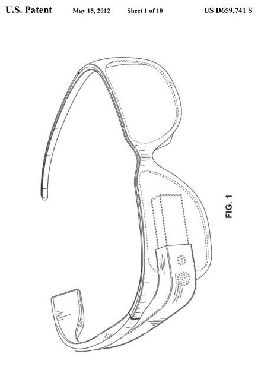
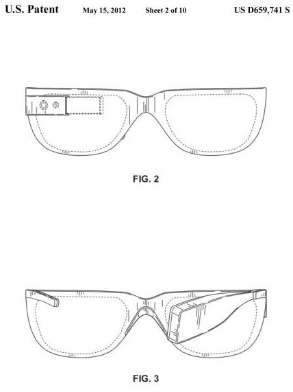
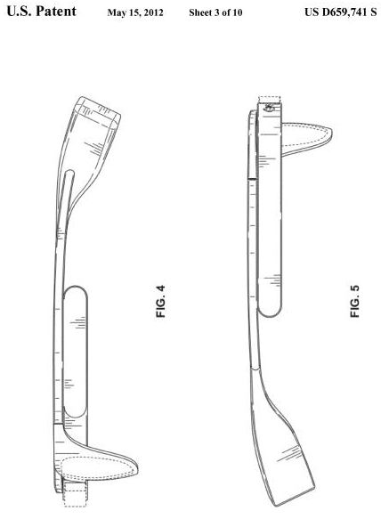

Last month I wrote about an [acquisition of a few glasses patents](https://www.seobythesea.com/2012/04/google-acquires-glasses-patents/) by Google from Motion Research Technologies, Inc., that provide some hints at how such technology might work. These design patents don’t delve into the tech behind the glasses, but they look much more like the demo models that some people from Google have been wearing in public.

The second design patent, [Wearable display device frame](http://patft.uspto.gov/netacgi/nph-Parser?Sect1=PTO2&Sect2=HITOFF&p=1&u=%2Fnetahtml%2FPTO%2Fsearch-adv.htm&r=1&f=G&l=50&d=PALL&S1=D0659740&OS=PN/D0659740&RS=PN/D0659740) (US Patent D659,740) shows a variation of the glasses without lenses. While these don’t include lenses, the ear piece on the right side looks somewhat too large to wear comfortably while also wearing glasses.

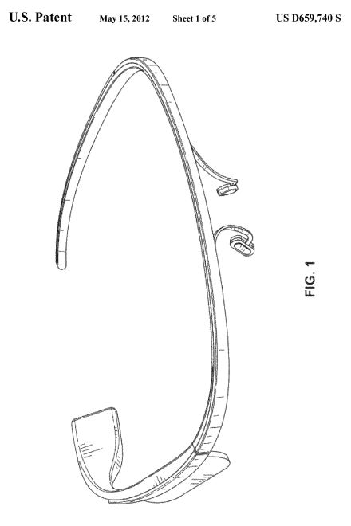
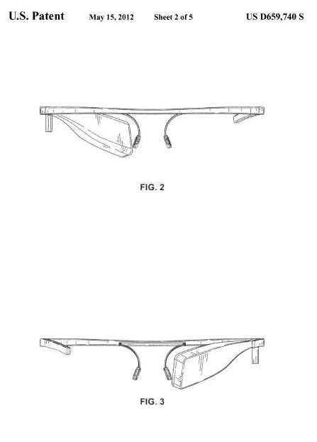
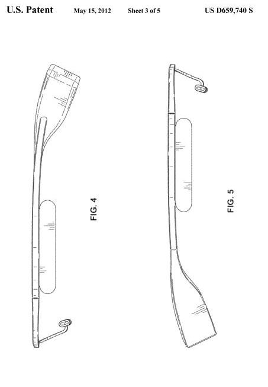
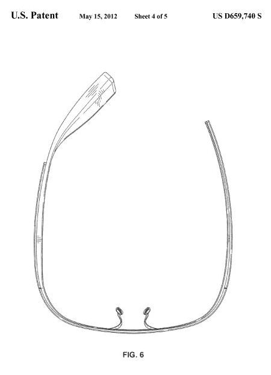

The third design patent, [Wearable display device](http://patft.uspto.gov/netacgi/nph-Parser?Sect1=PTO2&Sect2=HITOFF&p=1&u=%2Fnetahtml%2FPTO%2Fsearch-adv.htm&r=1&f=G&l=50&d=PALL&S1=D0659739&OS=PN/D0659739&RS=PN/D0659739) (US Patent D659,739) gives us a look at another variation, again without lenses.

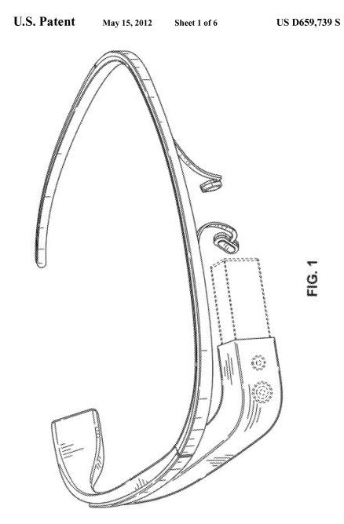
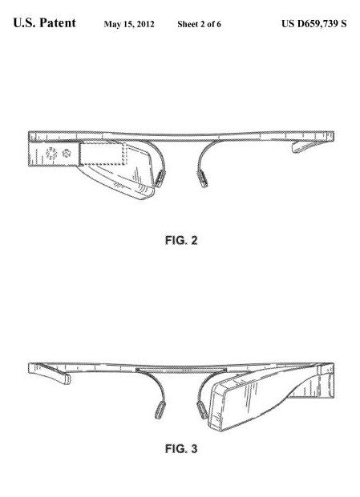
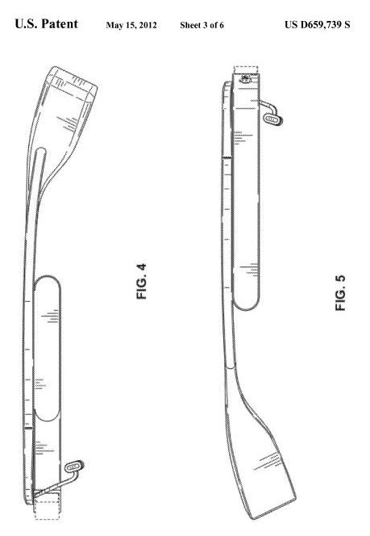
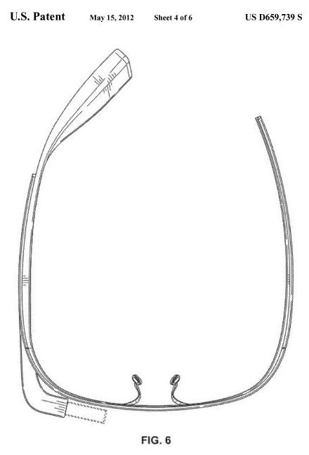

In a separate non-design patent filing, [Wearable marker for passive interaction](http://patft.uspto.gov/netacgi/nph-Parser?Sect1=PTO2&Sect2=HITOFF&p=1&u=%2Fnetahtml%2FPTO%2Fsearch-adv.htm&r=1&f=G&l=50&d=PALL&S1=08179604&OS=PN/08179604&RS=PN/08179604) (US Patent 8,179,604), Google describes how it might use a head-mounted display (HMD) equipped with an IR camera device to see the movements of fingernails or gloves or other wearable material that has been painted with an infra-red reflective coating.

This can enable the tracking of patterns and gestures which might be used as inputs for such a system. While a system might be useful for working virtual keyboards, it’s just as likely that it could be used to input information into a computing system based upon a library of gestures.

No telling if this invention was intended to be used in the Google Project Glass project, but it could be.

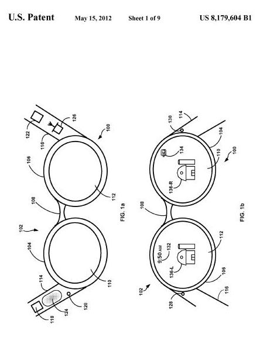
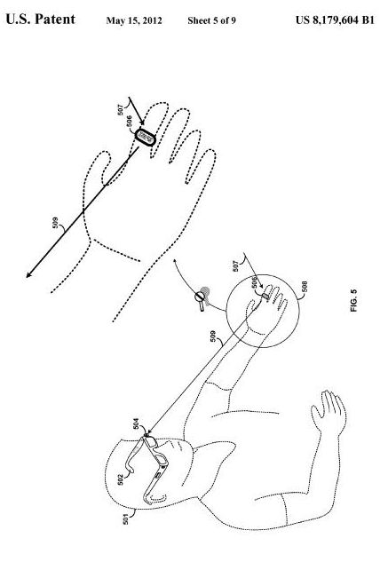
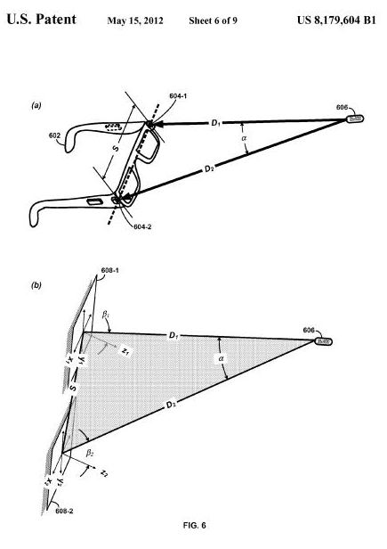
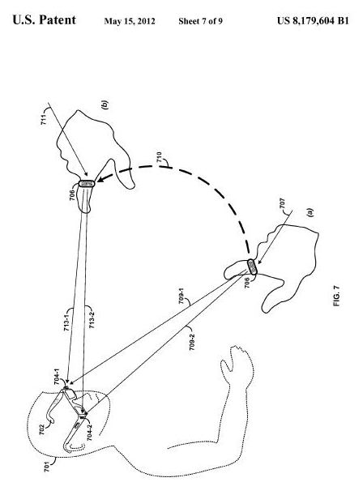

Google also acquired a number of patent filings [involving tracking locations of people indoors](https://www.seobythesea.com/2012/04/google-acquires-indooroutdoor-wireless-location-patents/), which would be very helpful to people wearing glasses like these, especially when giving them directions within large indoor spaces like shopping malls and airports.
