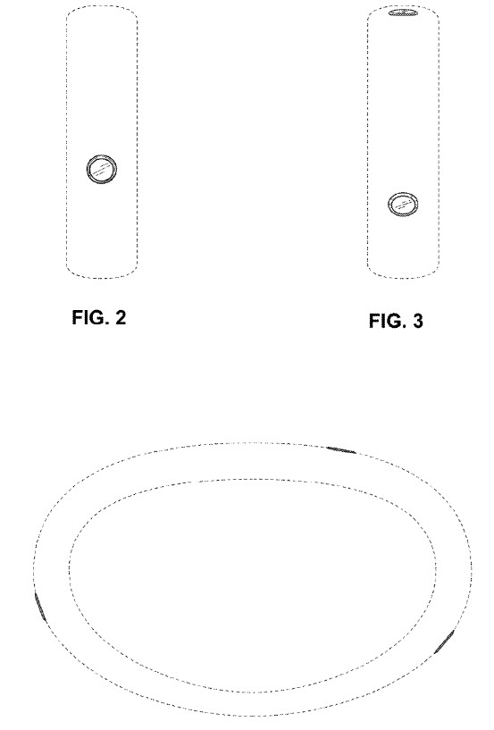

This design patent shows off a camera mounted on a bracelet. It doesn’t tell us anything about the camera beyond showing off the design of the camera. I looked for profiles of the inventors listed on the patent, and I think the ones I found maybe the ones involved in the creation of this design (though I can’t be completely certain). There does look like there is some hardware design involving cameras among the skills in the profiles I found. We will have to keep our eyes open for news of a camera like this potentially made by people building things like the cameras built for off-street views of Street Views. It’s possible that this camera could be a way of indexing the world, like street-view cameras, are, rather than a consumer product.

Among the named inventors is:

1. A Staff Optical Engineer at Google
2. An Engineering Leader and Former Google Principal Engineer now at Uber, who worked on Geographic Maps and indoor maps at Google
3. A System Design/Systems engineer who worked on Street View and Google Art Project
4. A Senior Industrial Designer at Google who has developed a photography app for iPhones named Pic and Click in 2013

[Camera bracelet](http://patft.uspto.gov/netacgi/nph-Parser?Sect1=PTO1&Sect2=HITOFF&d=PALL&p=1&u=%2Fnetahtml%2FPTO%2Fsrchnum.htm&r=1&f=G&l=50&s1=D764,339.PN.&OS=PN/D764,339&RS=PN/D764,339)
Inventors: Rachael Elizabeth Roberts, Mohammed Waleed Kadous, Romain Clement, and Xi Chen
Assigned to: Google Inc.
US Patent D764,339
Granted August 23, 2016
Filed: September 8, 2014

_Picture from Google Patent_
