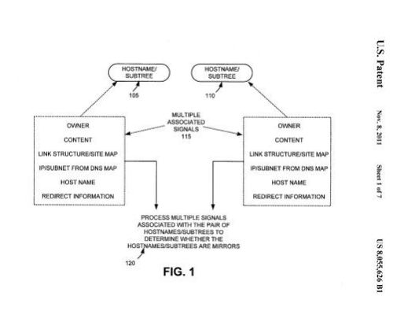

*For years the New York Times website was a great example I could point people to of a very high profile site doing one of the basics of SEO very very wrong.*

If you visited the site at “http://newyorktimes.com/” you would see a toolbar pagerank of 7 for its homepage. If instead you visited the site at “http://www.newyorktimes.com/” you would see a toolbar PageRank of 9 for the site. The New York Times pages resolved at both sets of URLs, with and without the www hostname. Because all indexed pages of the site were accessible with and without the “www”, those pages weren’t getting all the PageRank that they should have been, splitting PageRank between the two versions of the site, and that probably cost them in rankings at Google, and in traffic from the Web. Google likely also wasted their own bandwidth and the *Times* returning to crawl both versions of the site instead of just one of them.

A few years ago, someone with at least a basic knowledge of SEO came along and fixed the New York Times site so that if you followed a link to a page on the site without the “www”, you would be sent to the “www” version with the use of a status code 301 redirect. The change ruined the example that I loved showing people, primarily because even very well known websites make mistakes and ignore the basics. It’s one of the things that makes the Web a place where small businesses can compete against much larger companies with much higher budgets.

Many SEO basics don’t have written documentation from the search engines that they work one way or another, or a [video](https://www.youtube.com/user/GoogleWebmasterHelp) from Google’s head of webspam Matt Cutts, weighing in on the issue. But I love it when a patent comes out and gives us a glimpse of problems like that from the search engine’s perspective. And I love it when they give me a reference that I can point to when people want to question something that so many within the SEO industry take for granted.

Yesterday, Google was granted a patent on [Detecting mirrors on the web](http://patft.uspto.gov/netacgi/nph-Parser?Sect1=PTO2&Sect2=HITOFF&p=1&u=%2Fnetahtml%2FPTO%2Fsearch-adv.htm&r=1&f=G&l=50&d=PALL&S1=08055626&OS=PN/08055626&RS=PN/08055626) (US Patent 8,055,626), invented by Arvind Jain, which was originally filed on August 9, 2005. The patent describes the problem with having a site accessible under two different host names and the issues that causes.

The patent doesn’t have the visual and visceral impact of pointing to a site that seems to be doing everything right on the surface and yet is making a surprisingly simple and easily fixable error that probably cost them a great amount of search traffic over a few years.

But it’s nice being able to point to some statements like the following from the search engine itself, which defines the problem.

> When multiple hostnames refer to the same content (i.e., the multiple hostnames are “mirrors” of one another), problems can be created for search engines that “crawl” and index content associated with the multiple hostnames.
>
> If, for example, a search engine does not recognize two hostnames, that refer to the same content, as being the same, the search engine will crawl and index pages from both hostnames. This wastes crawl bandwidth and index space, and puts twice the crawl load on the website with the two hostnames. Also, multiple hostnames that refer to the same content can create problems in ranking search results.
>
> Using existing ranking techniques, a given web page will be more highly ranked among other search results if it is pointed to by a large number of other pages. **Therefore, if two hostnames, that refer to the same content, are treated separately for the purpose of ranking, the ranking of each hostname may only actually be about half what it would be if the hostnames were ranked together.** (my emphasis)

While the patent describes a way it might use to help solve this problem, Google’s had questionable success in determining when this kind of mirroring takes place. The best approach to fixing a problem like this is to not rely upon the search engine getting it right, but to take action so that it doesn’t have to. This hostname mirroring is usually easily solved by setting up a server based permanent (301) redirect so that either the version with the “www” or the version without the “www” is chosen and is accessible by visitors.

Google has included information about this problem in a few places within their help pages and a way to make Google understand which version you prefer to be shown through Google Webmaster Tools when your site is showing up with and without a “www” on the page, [Preferred domain (www or non-www)](https://web.archive.org/web/20190621132912/https://support.google.com/webmasters/answer/44231?hl=en).

At the bottom of that page, Google does provide the following helpful hint:

> Note: Once you’ve set your preferred domain, you may want to use a [301 redirect](https://support.google.com/webmasters/answer/93633?hl=en) to redirect traffic from your non-preferred domain, so that other search engines and visitors know which version you prefer.

The search engine also addresses this problem on a page titled [Canonicalization](https://support.google.com/webmasters/answer/139066?hl=en).

Around a week ago, Google also told us that they would be sending out messages to people who had a problem like this, and related problems, when it made a difference in which pages that people might select in search results, in the Google Webmaster Central blog post, [Raising awareness of cross-domain URL selections](https://webmasters.googleblog.com/2011/10/raising-awareness-of-cross-domain-url.html).

Of course, the best solution is not relying on Google being able to understand when this problem of having the same site appear with and without a “www” exists, and fixing it with a 301 redirect. Sometimes Google gets it right, but I do see examples of where they don’t.

I no longer have the New York Times website as an example of a site handling this problem the wrong way, but I’m happy that they did fix the problem. Don’t make the same mistake, and don’t rely upon Google fixing it for you. This patent was filed almost 7 years ago, and Google wasn’t doing well at fixing the problem for the *New York Times*. Fortunately for them, they fixed it for themselves…
