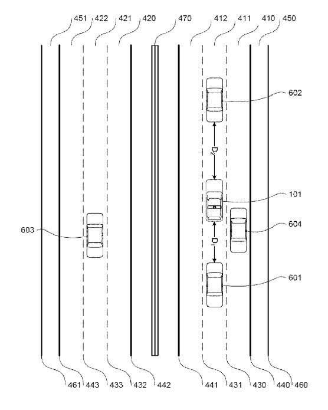

Google’s self-driving cars have covered over a million miles of roadway, and recently, one of them crashed into a slow-moving bus. Details about the accident can be found in [Google’s bus crash is changing the conversation around self-driving cars](https://www.theverge.com/2016/3/15/11239008/sxsw-2016-google-self-driving-car-program-goals-austin). Oddly timed, but appropriate, Google seems to have been working on the issue that caused that problem, as we are told in this article: [A Month After Google’s Car Hit a Bus, Google Got a Patent for Robot Cars to Detect Buses](https://www.vox.com/2016/3/14/11586952/a-month-after-googles-car-hit-a-bus-google-filed-a-patent-for-robot).

Because of the timing of that patent, I’m not surprised by another one being granted today involving self-driving cars on how they might respond to tailgaters. That patent is:

[Detecting and responding to tailgaters](http://patft.uspto.gov/netacgi/nph-Parser?Sect1=PTO1&Sect2=HITOFF&d=PALL&p=1&u=%2Fnetahtml%2FPTO%2Fsrchnum.htm&r=1&f=G&l=50&s1=9,290,181.PN.&OS=PN/9,290,181&RS=PN/9,290,181)
Inventors: Dmitri A. Dolgov, Philip Nemec, Anne Kristiina Aula
Assigned to: Google
US Patent: 9,290,181
Granted March 22, 2016
Filed: May 4, 2015

Abstract:

> An autonomous vehicle detects a tailgating vehicle and uses various response mechanisms. A vehicle is identified as a tailgater based on whether its characteristics meet a variable threshold. When the autonomous vehicle is traveling at slower speeds, the threshold is defined as distance. When the autonomous vehicle is traveling at faster speeds, the threshold is defined in time. The autonomous vehicle responds to the tailgater by modifying its driving behavior. In one example, the autonomous vehicle adjusts a headway buffer (defined in time) from another vehicle in front of the autonomous vehicle. In this regard, if the tailgater is T seconds too close to the autonomous vehicle, the autonomous vehicle increases the headway buffer to the vehicle in front of it by some amount relative to T.

The patent tells us about the many different types of sensors installed in self-driving cars and how they might respond to tailgating. In addition, it’s interesting seeing information about how Google is planning upon addressing potential problems that might spring up with autonomous vehicles.

The carefulness of such planning might make their self-driving cars program a success.
