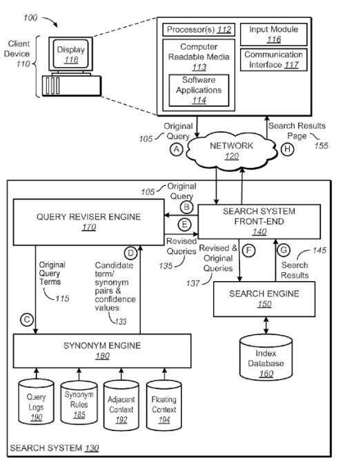
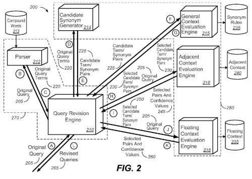
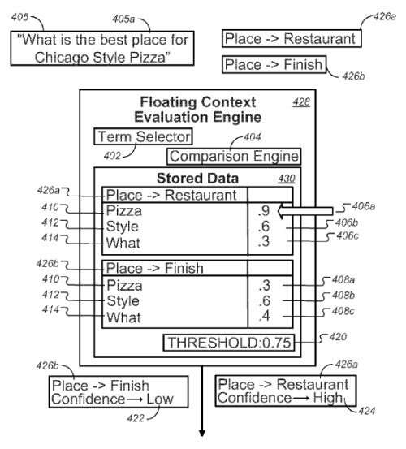

*Added 3/4/2022 – When the Hummingbird patent came out on Google’s 15th Birthday, it was like an overhaul of Google’s infrastructure, such as the Caffeine update, in the way that Googles index worked. One of the pieces of information about this Hummingbird infrastructure change was that Google used it to make the search engine better about to respond to conversational searches and queries.*

The 2009 live Searchology Event provided some examples but no information about how that part of the Hummingbird update was working. One thing that we were told was that the process behind Hummingbird was to rewrite queries more intelligently. I have since seen how query expansion can be used to rewrite queries to do things such as answer secondary queries that include coreferents (otherwise known in Natural Language Processing as Pronouns.) I wrote about how tagging might be used in such instances to identify spouses in 2019 by tagging earlier queries to understand better when an entity referred to in an earlier query was referred to in a later query using a pronoun.

That post is at: [How Might Google Extract Entity Relationship Information from Q&A Pages?](https://gofishdigital.com/blog/entity-relationship-information/) This approach to tagging enables Google to become much better at conversations search, because it will also work with such things as the emphasis in spoken queries, in addition to pronouns.

This is still just a matter of query parsing or query rewriting that adds an element to how Google works that can be used in many instances, so as an infrastructure update, it is a serious one.

I came across this patent a couple of weeks before the 15-anniversary Searchology event. I saw an almost identical query to the one from the patent – “What is the Best Place for Chicago Style Pizza? This Query rewriting means that the word “place” is substituted for “restaurant” as modified by including that change could get “Chicago Style Pizza” there. And Query rewriting means that Google has gotten much better at conversational queries.

## The Annoucement Behind the Google Hummingbird Update

Google introduced the Hummingbird Update to the world today at the garage where Google started as a business, during a celebration of [Google’s 15th Birthday](https://search.googleblog.com/2013/09/fifteen-years-onand-were-just-getting.html). Google doesn’t appear to have replaced previous signals such as PageRank or many of the other signs that they use to rank pages. The announcement of the new algorithm told us that Google actually started using Hummingbird several weeks ago and that it potentially impacts around 90% of all searches.

## Just What is the Hummingbird Update?

It’s being presented as a query expansion or broadening approach that can better understand longer natural language queries, like the ones that people might speak, instead of shorter keyword matching queries that someone might type into a search box.

For example, the kind of query where it might potentially work best upon could be something like [What is the best place to find and eat Chicago deep-dish style pizza?], where Google might use synonym and substitute query rules in combination with analyzing other non-skip words within the query itself to understand the context of a query term and a potential replacement for that query to reformulate (or replace) the phrases being searched upon and provide potentially better results.

Google might look at the query [What is the best place to find and eat Chicago deep-dish style pizza?] and understand that a searcher looking for results for that query would likely be more satisfied with the use of “restaurant” instead. Of “place.”

The use of “restaurant” instead of “place” might be considered as a potential synonym or substitute based upon [substitution rules](https://www.seobythesea.com/2013/08/google-substitute-query-terms-co-occurrence/) which focus upon co-occurring terms that might show up in search results when those terms are searched upon, or [co-occurring terms in query sessions](https://www.seobythesea.com/2013/09/google-reform-queries-based-co-occurrence-query-sessions/).

Google’s analysis of different [search entities](https://www.seobythesea.com/2013/08/relationships-search-entities/) such as the relationships between queries might be identified in some cases as improving searcher satisfaction for search results based upon things such as how long someone might dwell on a page when they select it in a set of search results.

## A Hummingbird Patent Behind the Hummingbird Update?

Google published a patent this week that builds upon the three patents I mentioned in the seobythesea.com links above to recent posts I’ve written that describe a process that seems like a perfect match for the Google Hummingbird Update announced today. I’ve taken to calling it the Hummingbird Patent:

[Synonym identification based on co-occurring terms](http://patft.uspto.gov/netacgi/nph-Parser?Sect1=PTO2&Sect2=HITOFF&p=1&u=%2Fnetahtml%2FPTO%2Fsearch-adv.htm&r=1&f=G&l=50&d=PALL&S1=08538984&OS=PN/08538984&RS=PN/08538984)
Invented by Abhijit A. Mahabal, Takahiro Nakajima, Zachary A. Garrett, and Kenji Inoue
Assigned to Google
US Patent 8,538,984
Granted September 17, 2013
Filed: April 3, 2012

Abstract

> Methods, systems, and apparatus, including computer programs encoded on a computer storage medium, for:
>
> - Identifying a particular query term of an original search query,
> - Identifying a candidate synonym for the particular query term in context with another non-adjacent query term of the original search query that is not adjacent to the particular query term in the original search query,
> - Accessing stored data that specifies, for a pair of terms that includes the particular query term and the candidate synonym of the particular query term, a respective confidence value for the other non-adjacent query term,
> - Determining that, in the stored data, the confidence value for the other non-adjacent query term satisfies a threshold, and
> - Determining to revise the original search query to include the candidate synonym of the particular query term, based on determining that the confidence value of the other non-adjacent query term satisfies the threshold.

The hummingbird Patent tells us that a co-occurrence measure is used to evaluate candidate terms/synonyms pairs based upon how frequently those terms (or compound words or phrases) appear together or in related user queries (for example, in consecutive queries within a query session) or that tend to appear together in related query results.

Google might consider many synonyms from a synonym database to see how well those fit within the context of the whole query. For example, the terms “car” and “auto” are often considered synonyms, especially when they may appear in queries such as [car mechanic] or [auto mechanic]. Still, they might not be regarded as synonyms within the context of a question such as [railroad car] and [railroad auto].

It’s unlikely that someone searching for [railroad car] would want to have [railroad auto] results added to those results or even replaced by them. In my post linked to above about “substitute rules” for queries, similar rules for synonyms can also be created, and both can be used to create that synonym or substitute database. That database can contain data about the level of confidence that terms might be synonyms or substitutes based upon things like co-occurrence data and whether or not they might be synonyms or substitutes based upon rules involving other terms that might be within the same query.

A patent filed by Google in 2005 covers a lot of the same ground. It is cited by the patent examiner as a related patent – [Determining query term synonyms within query context](http://patft.uspto.gov/netacgi/nph-Parser?Sect2=PTO1&Sect2=HITOFF&p=1&u=%2Fnetahtml%2FPTO%2Fsearch-bool.html&r=1&f=G&l=50&d=PALL&RefSrch=yes&Query=PN%2F7636714). I wrote a post about it after it was granted, [How Google May Expand Searches Using Synonyms for Words in Queries](https://www.seobythesea.com/2009/12/how-google-may-expand-searches-using-synonyms-for-words-in-queries/). So the basic ideas behind this kind of query expansion have been floating around Google for some years.

## Why Google Hummingbird?

While people seem satisfied with typing keywords into a search box, it appears that it’s more common for people to abandon their focus on just matching keywords when they perform a spoken query. We’re more likely to see someone typing [chicago style pizza restaurant] into a search box and someone speaking the query [What is the best place to find and eat Chicago deep-dish style pizza?] into their phone.

The Google Hummingbird patent provides many additional examples of how the words with a query might be used contextually to understand better other terms that might be replaced within that query with synonyms or substitutes.

The Google Hummingbird Update may work somewhat differently than what is described in the claims and description of this hummingbird patent, but they seem to be a pretty good match. Is this the Google Hummingbird patent? What do you think?

Last Updated March 4, 2022
