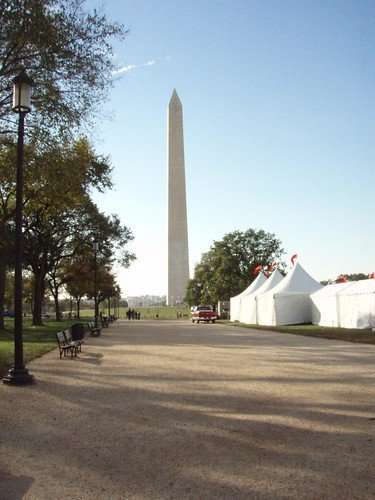
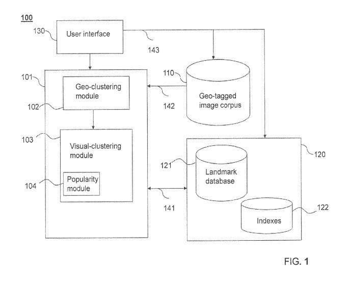

## Image Classification in the past

Back in 2008, I was writing about how a search engine might learn from photo databases like Flickr, and how people label images in a post I wrote called, [Community Tagging and Ranking in Images of Landmarks](https://www.seobythesea.com/2008/05/community-tagging-and-ranking-in-images-of-landmarks/)

In another post that covers the Flickr image classification Landmark work, [Faces and Landmarks: Two Steps Towards Smarter Image Searches](http://www.semclubhouse.com/faces-and-landmarks-two-steps-towards-smarter-image-searches/), I mentioned part of what the Yahoo study uncovered:

> Using automatically generated location data and software that can cluster together similar images to learn about images again goes beyond just looking at the words associated with pictures to learn what they are about.

That is using metadata from images in an image collection, which is a very different image classification approach from what Google is doing in this post about identifying landmarks in the post, [How Google May Interpret Queries Based on Locations and Entities (Tested)](https://gofishdigital.com/google-interpret-queries-based-on-locations/), where it might identify landmarks based upon a knowledge of their actual location.

## More Recent Image Classification of Landmarks

I mention those earlier posts because I wanted to share what I had written about landmarks before pointing to more recent studies from Google about how they might recognize landmarks a year apart from each other, with one being a follow-up to the other.

The first of these papers, [Google-Landmarks: A New Dataset and Challenge for Landmark Recognition](https://ai.googleblog.com/2018/03/google-landmarks-new-dataset-and.html), start by telling us about a problem that needs solving:

> Image classification technology has shown remarkable improvement over the past few years, exemplified in part by the Imagenet classification challenge, where error rates continue to drop substantially every year. Many researchers are now focusing on fine-grained and instance-level recognition problems to continue advancing state of the art in computer vision. Instead of recognizing general entities such as buildings, mountains, and (of course) cats, many are designing machine learning algorithms capable of identifying the Eiffel Tower, Mount Fuji, or Persian cats. However, a significant obstacle for research in this area has been the lack of large annotated datasets.

A year later, Google worked to improve the dataset that was being used for image classification when identifying landmarks and updated the dataset that they had created the year before, as they tell us in,[Announcing Google-Landmarks-v2: An Improved Dataset for Landmark Recognition & Retrieval](https://ai.googleblog.com/2019/05/announcing-google-landmarks-v2-improved.html) Part of the effort behind that work came from getting a lot of help as described in the blog post announcing it:

> A particular problem in preparing Google-Landmarks-v2 was the generation of instance labels for the landmarks represented since annotators can’t recognize all of the hundreds of thousands of landmarks that could potentially be present in a given photo. Our solution to this problem was to crowdsource the landmark labeling through the efforts of a world-spanning community of hobby photographers, each familiar with the landmarks in their region.

## Google Patent for Image Classification when Identifying Landmarks in Image Collections

Google was recently granted a patent that focuses on identifying popular landmarks in large digital image collections. Considering Google operates Google photos, which makes a lot of sense. The landmark identification efforts at Flickr sound a little similar to this effort on Google’s part. The patent does target a specific problem which it tells us is:

> However, no known system can automatically extract information such as the most popular tourist destinations from these large collections. As numerous new photographs are added to these digital image collections, it may not be feasible for users to manually label the photographs to increase the usefulness of those digital image collections. Therefore, what is needed are systems and methods that can automatically identify and label popular landmarks in large digital image collections.

Some of it does sound similar to the Flickr efforts where it talks about working to populate and update “a database of images of landmarks including geo-clustering geo-tagged images according to geographic proximity to generate one or more geo-clusters, and visual-clustering the one or more geo-clusters according to image similarity to generate one or more visual clusters.”

## How might this play into image classification and search involving landmarks?

The patent describes how it could fit into searches, with the following steps:

- Enhancing user queries to retrieve images of landmarks, including the stages of receiving a user query
- Identifying one or more trigger words in the user query
- Selecting one or more corresponding tags from a landmark database corresponding to the one or more trigger words
- Supplementing the user query with the one or more corresponding tags, generating a supplemented user query

Trigger words appearing in queries are interesting.

The image classification patent also tells us that it could also involve a method of automatically tagging a new digital image, which would also cover:

- Comparing the new digital image to images in a landmark image database, wherein the landmark image database comprises visual clusters of images of one or more landmarks
- tagging the new digital image with at least one tag based on at least one of said visual clusters

The patent is:

[Automatic discovery of popular landmarks](http://patft.uspto.gov/netacgi/nph-Parser?Sect1=PTO1&Sect2=HITOFF&d=PALL&p=1&u=%2Fnetahtml%2FPTO%2Fsrchnum.htm&r=1&f=G&l=50&s1=10,289,643.PN.&OS=PN/10,289,643&RS=PN/10,289,643)
Inventors: Fernando A. Brucher, Ulrich Buddemeier, Hartwig Adam and Hartmut Neven
Assignee: Google LLC
US Patent: 10,289,643
Granted: May 14, 2019
Filed: October 3, 2016

Abstract

> In one embodiment, the present invention is a method for populating and updating a database of images of landmarks, including geo-clustering geo-tagged images according to geographic proximity to generate one or more geo-clusters and visual-clustering the one or more geo-clusters according to image similarity to generate one or more visual clusters. In another embodiment, the present invention is a system for identifying landmarks from digital images, including the following components: a database of geo-tagged images, a landmark database; a geo-clustering module; and a visual clustering module. In other embodiments, the present invention may enhance user queries to retrieve images of landmarks or a method of automatically tagging a new digital image with text labels.

## Even Smarter Image Classification of Landmarks?

This system appears to be capable of finding trendy landmarks in photo collections across the web and storing those in a landmark database, where it might be geo-cluster those. It’s interesting to think about this effort. If Google might use those landmark images in Image Search Results, it may not stop image classification at that point.

I recently wrote about [Google Image Search Labels Becoming More Semantic?](https://www.searchenginejournal.com/google-image-search-labels-becoming-more-semantic/305157/) where we were told in an updated Google Patent that images were being labeled based upon an ontology related to the topics of those imageSo, forFor example, a Google image search for a landmark like The Washington Monument shows several image classification labels at the top of the results that can be clicked on if you want to narrow down the results to specific aspects of those monuments.

So, image classification may include specific monuments, and then even more narrow classifications, like having the following labels applied to the Washington Monument:

Reflecting Pool
Lincoln Memorial
Washington DC
Elevator
Inside
Trump
Construction
Top
Baltimore
Earthquake
Building
interior
Capstone
original
sunrise
Observation deck
National Mall

So, Google may have smarter image classification when it comes to landmarks, but it is labeling them so that they are more meaningful, too.

Last Updated May 28, 2019
