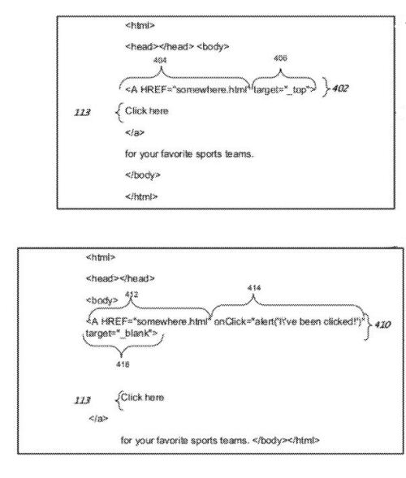
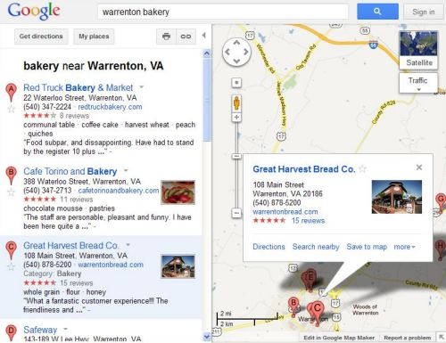

## Looking at Link Behavior Information

Under a conventional approach to indexing links by a search engine, information about the targeted address that a link is pointed towards might be included in a search engine’s index and the anchor text displayed within the links, and possibly even some text near the link itself. For example, the Google [Reasonable Surfer model](https://www.seobythesea.com/2010/05/googles-reasonable-surfer-how-the-value-of-a-link-may-differ-based-upon-link-and-document-features-and-user-data/) points to the possibility of other information being collected about a link as well, which could be taken together as a whole to calculate how much value or weight might be passed along by the link to another page under a PageRank link analysis model or even in determining how much weight the anchor text used to point to a link might carry.

The question, [Just How Smart Are Search Engine Robots](https://moz.com/blog/just-how-smart-are-search-robots) has been asked with more frequency lately, and a pending patent application published by Google shows how the search engine might be collecting a whole different type of link behavior information about links that are found on the Web. Given Google’s move towards building their own Chrome Browser and providing access to web pages via alternative screens such as those on smartphones and other handheld devices and television screens, it makes sense for the search engine to capture this kind of information well. The image from the patent filing below shows sections of links, including target and onclick attributes that the search engine might now be indexing.

When we think about how search engines index content on the Web, it’s usually in the form of a search engine program crawling and collecting information about pages that seem somewhat static, and not the kinds of changes that might happen on those pages and when links are clicked upon.

Link behavior information can include such things as:

- How a link is displayed
- The location of the link on the page, as a “link placeholder”
- Whether the selection of a link might launch a new application and/or a new browser window
- Whether alert messages are generated upon selection of a link
- Whether a web page (or additional information) associated with a link is opened in an existing browser window by that content into a section or a tab of the browser window, rather than in multiple browser windows

The type of link behaviors supported by a mobile device might differ from the type of link behaviors support by a laptop computer. For example, if you perform a search using a laptop at Google Maps for a particular type of business, and you have a map displayed on the right, with choices of businesses to click upon on the left, clicking on one of the links to businesses on the left might result in an information box displayed over the map showing more information about the businesses, including location, address, and a link to the home page of the business. A phone might not be able to display that information box.

This link behavior information might be collected in a real time manner as well, capturing context information associated with links, such as:

- Type of computing device that requested the web page
- A target address associated with at least one of the one or more link placeholders
- A placement of at least one of the one or more link placeholders in a graphical user interface associated with the web page
- A display mode associated with the web page
- Parsing of the request to generate the context information associated with the computing device

The patent doesn’t tell us if this real-time collection of link behavior information is captured through something like a browser or browser add-on, but it might be.

So the purpose of collecting this kind of link behavior information is for Google to understand: how a link should be displayed, how the content targeted by a link should be displayed, and what kinds of events might be associated with a link.

The patent application is:

[Generating Behavior Information For a Link](http://appft.uspto.gov/netacgi/nph-Parser?Sect1=PTO1&Sect2=HITOFF&d=PG01&p=1&u=%2Fnetahtml%2FPTO%2Fsrchnum.html&r=1&f=G&l=50&s1=%2220120084630%22.PGNR.&OS=DN/20120084630&RS=DN/20120084630)
Invented by Lori D. Meiskey and Jana S. Urban
US Patent Application 20120084630
Published April 5, 2012
Filed: September 30, 2010

Abstract

> A computer-implemented method includes receiving a request for a web page; retrieving information associated with the web page, wherein the information comprises a link and one or more link placeholders associated with the link; determining context information associated with the computing device; generating, based on the context information, behavior information for the link; and populating at least one of the one or more link placeholders with the behavior information.

When you click upon a link, sometimes the result is that you see a popup containing some additional information on that page, or some text being highlighted, or geographical information might be displayed. The patent filing tells us that Google might capture behavior information that “includes javascript instructions that are executed upon a selection of a link.”

**Takeaways**

The inventors on this patent appear to have been members of the Google Place Page Team from a post they were co-authors on [Make Google Place Pages Your Business Megaphone](https://maps.googleblog.com/2010/01/make-google-place-pages-your-business.html), and the patent filing includes a few different screenshots from Google Maps, including a Google Place page. So it appears that they might have been tasked with trying to find a way to show Google Map enhancements differently based upon the kind of display device used to show them, whether a desktop computer with one type of browser or a smartphone with a different version of a browser that might have a more limited means of displaying the results of clicking upon a link.

The approach they came up with may have been put into place to understand link behaviors on sites outside of Google and possibly help adjust how Google browsers might display information from links on devices that might not otherwise support and display such information.

The [Google Webmaster Guidelines](https://support.google.com/webmasters/answer/35769?hl=en) have long included at least one section warning webmasters about the difficulties that the search engine might have in crawling links other than HTML text-based links, including javascript-based links, like the most recent version from those guidelines:

> Use a text browser such as Lynx to examine your site because most search engine spiders see your site much as Lynx would. If fancy features such as JavaScript, cookies, session IDs, frames, DHTML, or Flash keep you from seeing all of your site in a text browser, then search engine spiders may have trouble crawling your site.

There’s been some discussion over the years from Google and other sources about the search engine being able to find and crawl some javascript links, and even [surface content that’s behind AJAX](https://webmasters.googleblog.com/2009/10/proposal-for-making-ajax-crawlable.html) links as well, but this is the first patent filing from Google that I can recall seeing where they explicitly indicate that they might be tracking and indexing this type of behavior for links on pages.

As I noted at the start of this post, given Google’s movement into providing a browser and increasingly working upon providing mobile access to the Web, it makes sense for them to pay more attention to the linking behaviors that they see upon webpages, and understand how those links might be displayed, especially in services that they offer, such as the information overlays on Maps in Google Maps search.

It’s not completely clear how this more sophisticated analysis of links might impact search rankings and results, except possibly to make Google’s index more aware of information that might surface upon a page only when a link is clicked. Still, I think it helps to be aware of this deeper approach from Google of understanding how links work and the behaviors associated with them.
