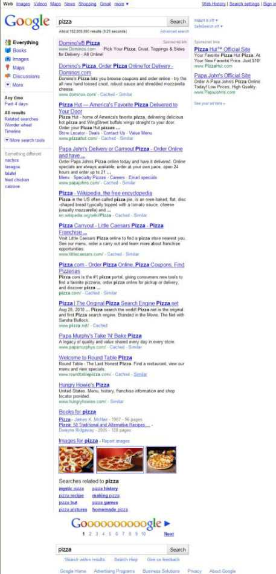
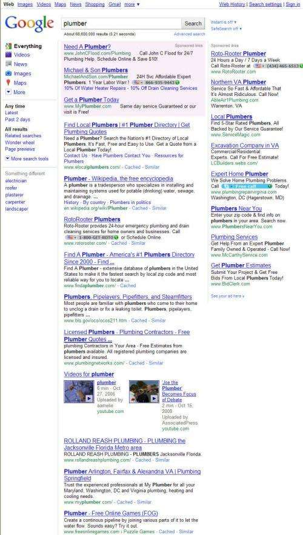

*[Added 10:53 pm (EDT) – Make sure to check the comments for somewhat of an amendment on the observation that starts this post… Now you may have to save a location with Google (via the “remember this location” or “change location”) like you also see when checking movie times or weather, to see local map results in a query which doesn’t include a geographic location… I don’t believe that was true before Google Instant was turned on.]*

*Not long ago, when you typed “pizza” into Google, you would see a map and many local pizza places listed in your search results. Have you noticed that no local maps show up anymore when you type “pizza” or “plumber” or “toy store” into Google these days? Those maps may be a victim of the caching needed to save bandwidth for Google Instant…*

Last week, Google made a change to its search interface that has drawn a lot of attention and discussion across the Web. Google refers to the change as Google Instant, and the impact of the change is that when you type into Google’s search box, in addition to seeing a dropdown box offering query suggestions, the search results that you see update as you type. Those instant results were described in a patent filing from Google more than five years ago – see my 2005 post: [Can Google Read Your Mind? Processing Predictive Queries](https://www.seobythesea.com/2005/12/can-google-read-your-mind-processing-predictive-queries/).

In the patent filing described in that post, [Anticipated query generation and processing in a search engine](http://appft1.uspto.gov/netacgi/nph-Parser?Sect1=PTO1&Sect2=HITOFF&d=PG01&p=1&u=%2Fnetahtml%2FPTO%2Fsrchnum.html&r=1&f=G&l=50&s1=%2220050283468%22.PGNR.&OS=DN/20050283468&RS=DN/20050283468), the results that might have been shown to searchers as they typed would have been based upon one of the predicted results in the dropdown rather than the characters typed so far in the search box.

Here’s the claim from the patent filing that describes those instant results:

> A computer-implemented method for processing a search query, comprising:
>
> - creating a dictionary from a community of users;
> - receiving a portion of the search query from a search requester;
> - identifying entries in the dictionary which match the portion of the search query;
> - selecting one or more of the matching entries in the dictionary;
> - ordering the one or more matching entries to create a set of predicted queries;
> - transmitting the set of predicted queries to the search requestor;
> - **obtaining search results for at least one of the predicted queries***;
> - caching the search results; and
> - transmitting at least a portion of the search results to the search requestor.

*Emphasis added

I’ve been wondering over the past 5 years if and when we might see immediate search results like that. I think there would have been a serious uproar from searchers if the instant search results reflected one of the dropdown query suggestions rather than just the letters typed into the search box.

**Google Suggest**

I’m also wondering how many people are looking at the predictive dropdown query suggestions as if they’ve just sprung out of nowhere, or are part of Google Instant.

More than one person has recently contacted me concerning those query suggestions, asking about how to change them for one reason or another. A number of those questioners had been in touch with large and small marketing companies and digital agencies and were told that the predictive suggestions were less than a year old and that they didn’t know how Google determined what to show as dropdown queries.

The Google predictive queries first became available on the [Google home page](https://googleblog.blogspot.com/2008/08/at-loss-for-words.html) in August of 2008.

But Google has been showing predictive queries much longer, displaying dropdown suggested queries at least 5 years ago, with the introduction of Google Suggest. The term AJAX was [coined by Jesse James Garrett](https://web.archive.org/web/20190507051447/https://adaptivepath.org/ideas/ajax-new-approach-web-applications/) in February of 2005 to describe the use of javascript and XML to update query suggestions in Google Suggest and to zoom in and out and move around on maps in Google Maps without refreshing a web page.

Google Suggest wasn’t initially available on the Google homepage, but Google did have a separate page where people could try it out. Google also started showing predictive query suggestions with the Firefox version of the [Google Toolbar](https://www.seobythesea.com/2007/07/google-toolbar-history/) when that version was [first released](https://googleblog.blogspot.com/2005/09/new-improved-and-out-of-beta_22.html) on September 22, 2005.

Google had filed at least a couple of patents in 2004, which provide some ideas of how they might identify suggestions to show to searchers. There’s the one that I mentioned above, which hasn’t been granted (yet), and another filed in November of 2004, which has been granted – [Method and system for autocompletion using ranked results](http://patft.uspto.gov/netacgi/nph-Parser?Sect1=PTO2&Sect2=HITOFF&u=%2Fnetahtml%2FPTO%2Fsearch-adv.htm&r=1&p=1&f=G&l=50&d=PTXT&S1=7,487,145.PN.&OS=pn/7,487,145&RS=PN/7,487,145)

Google also started showing predictive query suggestions to web-enabled phone users a few years ago as well, because they believed that it would be easier for people who used stylizes or phone keyboards. They released a usability study in 2008 on the topic – [Query Suggestions for Mobile Search: Understanding Usage Patterns](http://www.esprockets.com/papers/chi2008.pdf) (pdf).

I’ve written a few blog posts on Google suggest in the past five years, including one in May of 2009, which focused upon some of the [sources where Google](https://www.seobythesea.com/2009/05/predictive-search-query-suggestions/) might take suggestions from to show to searchers. Google also has a page that provides more details on how Google Suggest works, which they seem to have changed recently to describe how their [auto complete](https://support.google.com/websearch/answer/106230?hl=en) algorithm works.

Google has also added more “local search” type features and “universal search” type features to Google suggest in the past year as well, showing things like maps and weather results in the dropdowns.

**Google on Google Instant**

Google help forums are filled with opinions, suggestions, and bugs associated with the new interface. At least one computer department received multiple reports of spyware/viruses/computer malfunctions from the users they supported in response to the launch of Google Instant. Pages from Google sprung up immediately after the launch providing more details on Google Instant and its impact on search, advertising, and analytics.

- [Search: now faster than the speed of type](https://googleblog.blogspot.com/2010/09/search-now-faster-than-speed-of-type.html) (9/8/2010)
- Adwords Help > What is Google Instant?
- [Matt Cutts > Thoughts on Google Instant](https://www.mattcutts.com/blog/thoughts-on-google-instant/) (9/8/2010)
- [Google Analytics Blog > Google Instant and Google Analytics](https://analytics.googleblog.com/2010/09/google-instant-and-google-analytics.html) (9/8/2010)
- [Google Analytics Blog > More On Instant Search](https://analytics.googleblog.com/2010/09/more-on-instant-search.html) (9/10/2010)
- [Google search basics: Google Instant](https://support.google.com/websearch/?visit_id=1-636670496654860642-3793876582&hl=en&rd=3#topic=3378866)

**What Tradeoffs Did Google Instant Bring?**

In the first of those Google blog posts and articles, we’re told the following:

> To bring Google Instant to life, we needed a host of new technologies including new caching systems, the ability to adaptively control the rate at which we show results pages and optimization of page-rendering JavaScript to help web browsers keep up with the rest of the system.

So why did Google decide to do all this work, and move forward with Google Instant?

The *Anticipated query generation* patent application I linked to above provides a hint at why Google might have started showing updated search results as someone types:

> [0022] If it is desired that the search results be returned to the user, then results are transmitted to the client system 120 (stage 260) and may be presented to the user while the user is still entering the complete query. It may be that one of the search results for the predicted query satisfies the user’s intended query. If so, the search engine 130 has, in effect, reduced the latency of a search from a user’s perspective to zero.

It seems to boil down to creating the perception in a searcher that the amount of time to process a query has been reduced significantly.

I’ve heard mixed opinions regarding Google Instant, and one that I’ve heard often is that Google Instant is too responsive. It’s a little like having a conversation with someone where they keep interrupting and finishing your sentences for you. But, have other things changed in how Google ranks and displays results?

The bandwidth involved in presenting instant search results has been addressed by doing things like only showing “10” results per page. If you have your Google search preferences set at 100 results, and you perform a Google Instant search, you only see 10 results (plus ads, and some inserted universal results). If you turn Google Instant off, you can reset your search preferences to 100 results, and see 100 results.

A bigger difference seems to involve how Google may infer a local intent regarding some queries. If the Google Instant results are cached to save bandwidth, then We may not be seeing some of the same kind of results that we were seeing before because of those cached pages.

In recent years, if you searched for “pizza” from the home page of Google, chances were good that you might see one box or a seven box result with a map showing local pizza places. If you searched for something like “Toy Store” or “car Dealers” or “Plumber,” you might see a similar local search result even though you didn’t include a zipcode or town name or other geographic information in your query. That seems to have been turned off with Google Instant.

Now when I search for Pizza at Google, regardless of whether Google Instant is on or off, I see big brand pizza results, Wikipedia entry, news about pizza, and books about pizza. But I don’t see a map with local pizza places – Google no longer seems to infer that when I search for pizza without a geographic term in my query that I am looking for a place to eat lunch.

I’m also not seeing a map result on a search for “plumber” like I used to in the past:

Google will sometimes also customize search results based upon things like where it believes that you were located, and I’ve been seeing many search results over at least the past couple of years where the fourth result of a set of search results for some terms might involve a nearby location. Those local results in the fourth result slot have also seemed to have gone AWOL.

**Conclusion**

There have been several blog posts and news articles claiming that Google Instant is a milestone in the evolution of search engines, that it has singlehandedly destroyed search engine optimization, that it has heavily impacted the length of queries and halted searchers from finishing typing long-tail queries they may have been typing, and that amongst other things, that it significantly reduces the amount of time it takes for someone to type in a query.

A few of those changes could be attributed to Google Suggest – the dropdown suggestions that have been around for more than five years, aiming to autocomplete people’s queries for them and reduce the amount of time that it takes to search for something.

By showing search results immediately during searches, people searching are presented with a set of search results that may have very little to do with the intent behind their search at least for the first few letters of their queries.

Recent news articles, advertisements, and search results may cause searchers to sometimes take a detour to what they originally intended to search for, but many searchers may set off searching with a specific informational or transactional task in mind as they began their queries, and most of them will likely return to their search.

For a good number of searchers, the dropdown suggestions and the display of instant search results may lead those searchers to information that is relevant to what they are looking for before they complete typing in their intended queries.

But there have been some tradeoffs in what Google displays with the launch of Google Instant, like the loss of the display of maps and some customized local results when a local intent might be inferred from a query which doesn’t include a geographic reference of some type.

Have you noticed any other possible trade-offs?
