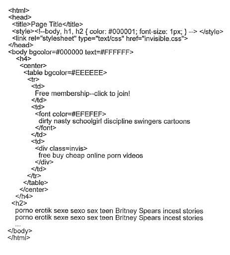

## Hidden Text and Hidden Links

As long as there have been search engines, there have been people trying to take advantage of them to try to get pages to rank higher in search engines. It’s not unusual to see within many SEO [site audits](https://www.seobythesea.com/services-from-seo-by-the-sea/seo-site-audit-and-recommendations/#more-14166) a section on negative practices that a search engine might frown upon, and Google lists many those practices in their [Webmaster Guidelines](https://support.google.com/webmasters/answer/35769?hl=en). Linked from the Guidelines is a Google page on [Hidden Text and Links](https://support.google.com/webmasters/answer/66353?hl=en), where Google tells us to wary about doing things such as:

- Using white text on a white background
- Locating text behind an image
- Using CSS to position text off-screen
- Setting the font size to 0
- Hiding a link by only linking one small character—for example, a hyphen in the middle of a paragraph

Those are some of the same examples described in a patent granted to Google today about hidden text and links:

[Systems and methods for detecting hidden text and hidden links](http://patft.uspto.gov/netacgi/nph-Parser?Sect1=PTO2&Sect2=HITOFF&p=1&u=%2Fnetahtml%2FPTO%2Fsearch-adv.htm&r=1&f=G&l=50&d=PALL&S1=08392823&OS=PN/08392823&RS=PN/08392823)
Invented by Fritz Schneider and Matt Cutts
Assigned to Google
US Patent 8,392,823
Granted March 5, 2013
Filed: August 25, 2009

Abstract

> A system detects hidden elements in a document that includes a group of elements. The system may identify each of the elements in the document and create a structural representation of the document.
>
> The structural representation may provide an interconnection of the group of elements in the document. The system may also determine whether elements of the group of elements get hidden based at least in part on locations or other attributes or properties of the one or more elements in the structural representation.

One of the co-inventors behind the patent is Google distinguished engineer Matt Cutts, who has spent a good part of his long career at Google exploring the many different ways that people might try to spam the search engine and find some solutions.

I enjoy seeing patents like this one, which may not tell us something new but provide a reference resource that other people, including clients, can get pointed towards. They sometimes fill in some gaps on how a search engine might do something and provide some history.

For example, this patent gets based on an earlier one that was first filed in 2003. It’s not hard to imagine people at the Google of that time trying to figure out how to automate a way to identify hidden text and links, hidden by being the same color as the background they appear upon, or becoming obfuscated by cascading style sheets, or written in lettering so small that it appears to be a line rather than actual text.

The Guidelines above mention using a single small character in a paragraph getting used as a link, and the patent mentions that small (1 pixel X 1 pixel) images have also gotten used as hidden links on pages.

As the patent also notes, CSS allows web admins to mark a text block as hidden or position it outside of visible areas of a page. Javascript can also get used to hiding text and change documents to replace text.

Part of the process behind identifying hidden text or links on a page may involve analyzing the HTML structure of a page and its elements, such as divisions or sections, headings, paragraphs, images, lists, and others. It looks at a Document Object Model (DOM) of pages to learn about those different elements, their sizes, positions, layer orders, colors, visibility, and more.

The patent provides a few different examples of when hidden text might get found on a page, such as in the following:

> In this example, server may detect that the webmaster has overridden the value of the <h2> tag. Normally, the “h2” tag is a heading size, in which H1 is very large, H2 is a little smaller, H3 is still smaller, etc. Here, the webmaster has used CSS to override the value of h2 to mean “for all text in the H2 section, make the text color almost completely black, and make the height of the font be about one pixel high.”
>
> A viewer of this document would not see the text because it is so small, but a search engine may determine that the text is relatively important because of the H2 heading label. In this situation, a server may determine that the text in the H2 section is tiny, indicating that the webmaster is attempting to hide the text in this section.

**Conclusion**

There are some times when designers [use hidden text](http://www.zeldman.com/2012/03/01/replacing-the-9999px-hack-new-image-replacement/) because they want to use a font on a page that isn’t a standard system font that might come with Windows or Apple or Linux computers, and the page won’t render the way they want. Google’s John Mueller has noted in the past on Google’s Webmaster Help Forum that is [probably not a problem](http://productforums.google.com/forum/#!topic/webmasters/xK9XugFCL0M):

> Hi Eric
>
> If you are using image replacement techniques and replacing the text with an equivalent image (with the same text in approximately the same visibility), that is generally fine. This provides a nice user experience and still lets those who cannot access the images (e.g., crawlers or vision-impaired users) use your website.
>
> I hope it helps!
>
> John

As I noted above, I appreciate this patent because it provides another place to point people to when discussing things like hidden text and links other than just Google’s help pages on the topic. It also puts the problem in the framework of a business trying to address a challenge rather than a web institution laying out a guideline that it expects people to follow.
