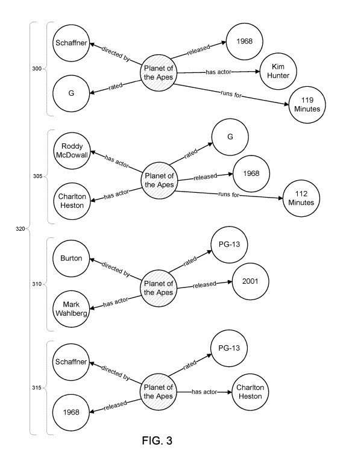
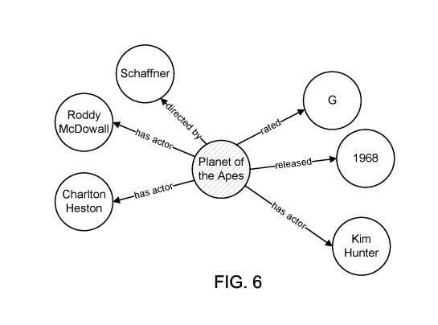
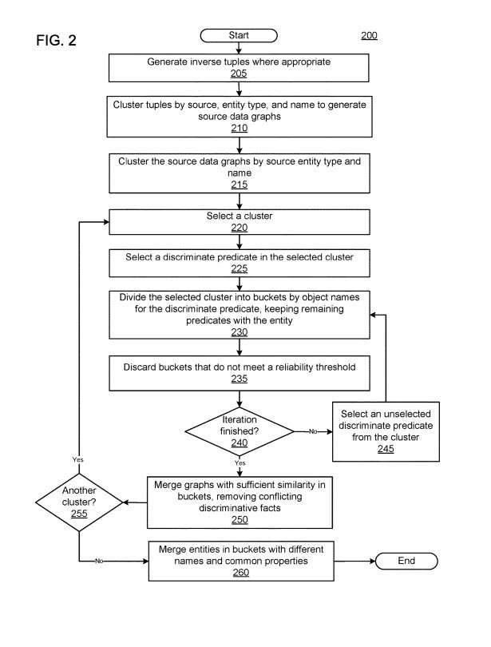

## Google May Use Data in the Knowledge Graph to Make it Better

Exploring how the Google Knowledge Graph works provide insights into growing and improving and may influence what we see on the web. For example, a recent Google patent from last month is about how Google improves the amount of data the Google Knowledge Graph contains.

The process in that patent differs from the patent I wrote about in [How the Google Knowledge Graph Updates Itself by Answering Questions](https://www.seobythesea.com/2018/10/how-googles-knowledge-graph-updates-itself-by-answering-questions/). Taken together, they tell us about how the knowledge graph is growing and improving. Part of the process involves entity extraction which I covered in [Entity Extractions for Knowledge Graphs at Google](https://gofishdigital.com/entity-extractions-knowledge-graphs/).

This new patent tells us that information making its way into the knowledge graph is not limited to content from the Web. It can also “originate from another document corpus, such as internal documents not available over the Internet or another private corpus, from a library, from books, from a corpus of scientific data, or some other large corpus.

## What Google Knowledge Graph Reconciliation is?

The patent tells us how a knowledge graph may update and improve itself.

The site WordLift shows us some [definitions related to Entities and the Semantic Web](https://docs.wordlift.io/en/latest/key-concepts.html). Their definition for **reconciling entities** means “providing computers with unambiguous identifications of the entities we talk about.” Google’s patent covers a broader use of the word “Reconciliation.” It shows us how that applies to knowledge graphs to ensure that a knowledge graph uses all of the information from the web about those entities.

This may involve finding missing entities and missing facts about entities from a knowledge graph using web-based sources to add information to a knowledge graph.

## Problems with Knowledge Graphs

Large data graphs such as the Google Knowledge Graph store data and follow rules that describe knowledge about the data. This allows the information they provide to be built on. A patent granted to Google tells us how Google may build upon that data within a knowledge graph to allow it to contain more information. The patent isn’t limited to information from within the knowledge graph itself but can look to sources such as online news.

## Tuples as Units of Knowledge Graphs

The patent presents some definitions that are worth learning. One of those is about facts involving entities:

> A fact for an entity is an object related to the entity by a predicate. A fact for a particular entity may thus be a predicate/object pair.

The relationship between an Entity (a subject) and a fact about that entity (a predicate/object pair) is a tuple.

In the Google Knowledge Graph, entities, such as people, places, things, concepts, etc., are nodes, and the connecting edges between those nodes show the relationship between the nodes.

For example, the nodes “Maryland” and “United States” have the edges of “in-country” and/or “has stated.”

A basic unit of a data graph can be a tuple, including two entities, a subject entity and an object entity, and a relationship between the entities.

Tuples often represent real-world facts, such as “Maryland is a state in the United States.” (A Subject, A Verb, and an Object.)

A tuple may also include information, such as:

- Context information
- Statistical information
- Audit information
- Metadata about the edges
- etc.

When a knowledge graph knows a tuple, it may also know about the tuple source. It can include a score for the originating source of the tuple.

A knowledge graph may lack information about some entities. Those entities are from sources such as web pages, but a manual addition of that entity information can be slow and does not scale.

This is a common problem for knowledge graphs – missing entities and missing relationships to other entities reduce the usefulness of querying the data graph. Knowledge graph reconciliation can make a knowledge graph richer and stronger.

## This Patent Introduces Reverse Tuples to Populate the Knowledge Graph

The patent also tells us about inverse tuples, which reverse subject and object entities.

> For example, if the potential tuples include the tuple the system may generate an inverse tuple of .

Sometimes inverse tuples may exist for some predicates but not for others. For example, tuples with a date or measurement as the object may not be good candidates for inverse occurrences and may not have many inverse occurrences.

> For example, the tuple is not likely to have an inverse occurrence of <2001, is the year of release, Planet of the Apes> in the target data graph.

Clustering of tuples is also discussed in the patent. The system may then cluster the potential tuples by:

- source
- provenance
- subject entity type
- subject entity name

This kind of clustering takes place to generate source data graphs.

## The Process Behind the Google Knowledge Graph Reconciliation Patent:

1. Potential entities may be from facts generated from web-based sources
2. Those Facts can be analyzed and cleaned, generating a small source data graph that includes entities and facts from those sources
3. The source graph may be from a potential source entity that does not have a matching entity in the target data graph
4. The system may repeat the analysis and generation of source data graphs for many source documents, generating many source graphs, each for a particular source document
5. The system may cluster the source data graphs together by type of source entity and source entity name
6. The entity name may be a string extracted from the text of the source
7. Thus, the system generates clusters of source data graphs of the same source entity name and type
8. The system may split a cluster of source graphs into buckets based on the object entity of one of the relationships or predicates
9. The system may use a predicate that is determinative for splitting the cluster
10. A determinative predicate generally has a unique value, e.g., object entity, for a particular entity
11. The system may repeat dividing a predetermined number of times, for example, using two or three different determinative predicates, splitting the buckets into smaller buckets. When the iteration is complete, graphs in the same bucket share two or three common facts
12. The system may discard buckets without enough reliability and discard any conflicting facts from graphs in the same bucket
13. The system may merge the graphs in the remaining buckets and use the merged graphs to suggest new entities and new facts for the entities for inclusion in a target data graph

## How Googlebot may be Crawling Facts to Build the Google Knowledge Graph

This is where some clustering comes into play. Imagine that the web sources are about science fiction movies. They contain information about movies involving the “Planet of the Apes.” series, which has been remade at least once. There are several related movies in the series and movies with the same names. The information about those movies may be from sources on the Web, and clustered together, and go through a reconciliation process because of the similarities. Relationships between the many entities involved may be determined and captured. These are the steps:

1. Each source data graph come from a source document, includes a source entity with an entity type that exists in the target data graph, and includes fact tuples
2. The fact tuples identify a subject entity, a relationship connecting the subject entity to an object entity, and the object entity
3. The relationship is associated with the entity type of the subject entity in the target data graph
4. The computer system also includes instructions that, when executed by at least one processor, cause the computer system to perform operations that include generating a cluster of source data graphs, the cluster including source data graphs associated with a first source entity of a first source entity type that share at least two fact tuples that have the first source entity as the subject entity and a determinative relationship as the relationship connecting the subject entity to the object entity
5. The operations also include generating a reconciled graph by merging the source data graphs in the cluster when the source data graphs meet a similarity threshold and generating a suggested new entity and entity relationships for the target data graph based on the reconciled graph

## More Features to Google Knowledge Graph Reconciliation

There are 9 movies in the Planet of the Apes Series and the rebooted series. The first “Planet of the Apes” was from 1968, and the second “Planet of the Apes” was from 2001. Since they have the same name, it could get confusing if they weren’t separated from each other. They use facts from those movies to break the cluster about “Planet of the Apes” down into buckets based upon facts that tell us that there was an original series. And also a rebooted series involving the “Planet of the Apes.”

I’ve provided details of an example that Google pointed out, but here is how they describe this breaking a cluster down into buckets based on facts:

> For example, generating the cluster can include generating the first bucket for source data graphs associated with the first source entities and the first source entity type, splitting the first bucket into second buckets based on a first fact tuple, the first fact tuple having the first source entity as the subject entity and a first determinative relationship, so that source data graphs sharing the first fact tuple are in a same second bucket; and generating final buckets by repeating the splitting many times, each iteration using another fact tuple for the first source entity that represents a distinct determinative relationship, so that source data graphs sharing the first fact tuple and the other fact tuples are in the same final bucket, wherein the cluster is one of the final buckets.

So this aspect of knowledge graph reconciliation involves understanding related entities. It includes some entities that may share the same name. And it involves removing ambiguity from how they might be in a knowledge graph.

## Merging Data Is Another Aspect of Knowledge Graph Reconciliation

Another aspect of knowledge graph reconciliation may involve merging data. This could involve seeing when one of the versions of the movie “Planet of the Apes” has more than one actor in the movie. That can involve merging that information to make the knowledge graph more complete. The image below from the patent shows how they could do that:

The patent also tells us that discarding fact tuples representing conflicting facts from a particular data source may also occur. For example, some types of facts about entities have only one answer: a person’s birthdate or the movie’s launch date. If more than one of those appears, they will see if one is wrong and remove it. It is also possible that this may happen with inverse tuples, which the patent also tells us about.

## Inverse Tuples Generated and Discarded

When a tuple is a subject-verb-object, an inverse tuple may be generated. For example, if we have fact tuples such as “Maryland is a state in the United States of America,” and “California is a state in the United States of America.” From those we may generate inverse tuples such as “The United States of America has a state named Maryland,” and “The United States of America has a state named California.”

Sometimes tuples may be from one source. They can conflict when they are from another source. An example might be the recent trade deadline in Major League Baseball, where the right fielder Yasul Puig was traded from the Cincinnati Reds to the Cleveland Indians. The tuple “Yasul Puig plays for the Cincinnati Reds” conflicts with the tuple “The Cleveland Indians have a player named Yasul Puig.” One of those tuples may be discarded during the knowledge graph reconciliation.

There is a reliability threshold for tuples. Tuples that don’t meet the threshold may be discarded as having insufficient evidence. For instance, a tuple from one source may not be reliable and may be discarded. Likewise, if there are three sources for a tuple from the same domain, that may also be insufficient evidence. If so, that tuple may be discarded.

## Advantages of the Google Knowledge Graph Reconciliation Patent Process

1. A data graph may be extended more quickly by identifying entities in documents and facts about the entities
2. The entities and facts may be of a high quality due to the corroborative nature of the graph reconciliation process
3. The identified entities may be from news sources to more identify new entities to add them to the data graph
4. Potential new entities and their facts may be from thousands or hundreds of thousands of sources, providing potential entities on a scale that is not possible with a manual evaluation of documents
5. Entities and facts added to the data graph can provide more complete or accurate search results

The Knowledge Graph Reconciliation Patent is here:

[Automatic discovery of new entities using graph reconciliation](http://patft.uspto.gov/netacgi/nph-Parser?Sect1=PTO1&Sect2=HITOFF&d=PALL&p=1&u=%2Fnetahtml%2FPTO%2Fsrchnum.htm&r=1&f=G&l=50&s1=10,331,706.PN.&OS=PN/10,331,706&RS=PN/10,331,706)
Inventors: Oksana Yakhnenko and Norases Vesdapunt
Assignee: GOOGLE LLC
US Patent: 10,331,706
Granted: June 25, 2019
Filed: October 4, 2017

Abstract

> Systems and methods can identify potential entities from facts generated from web-based sources. For example, a method may include generating a source data graph for a potential entity from a text document in which the potential entity is identified. The source data graph represents the potential entity and facts about the potential entity from the text document. The method may include clustering a plurality of source data graphs, each for a different text document, entity name, and type. At least one cluster includes the potential entity. The method may also include verifying the potential entity using the cluster by corroborating at least a quantity of determinative facts about the potential entity and storing the potential entity and the facts about the potential entity. Each stored fact has at least one associated text document.

## Knowlege Graph Reconciliation Takeaways

It is interesting seeing how Google can use news sources to add new entities and facts about those entities.

Using web-based news to add to the knowledge graph means that it isn’t relying upon human-edited sources such as Wikipedia to grow. The knowledge graph reconciliation process was interesting to learn about.
