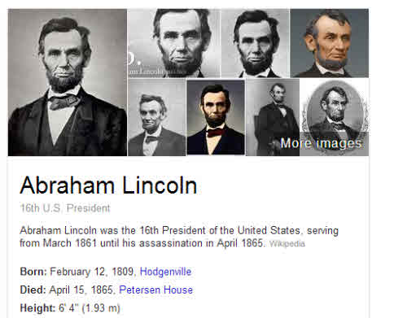
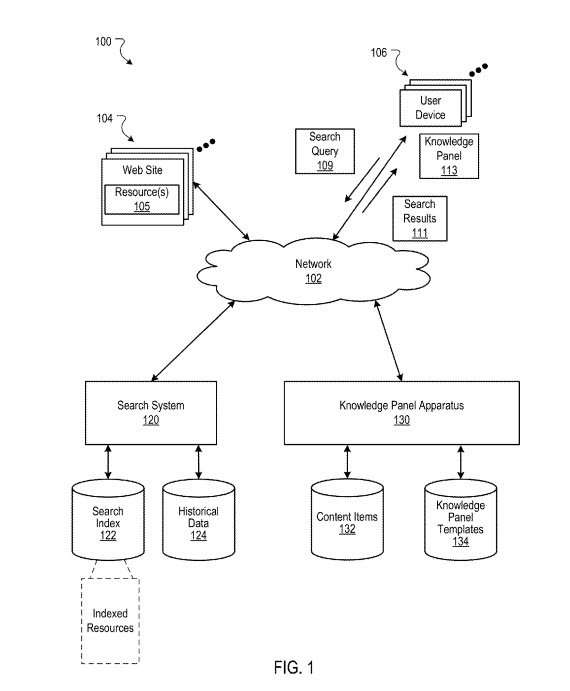
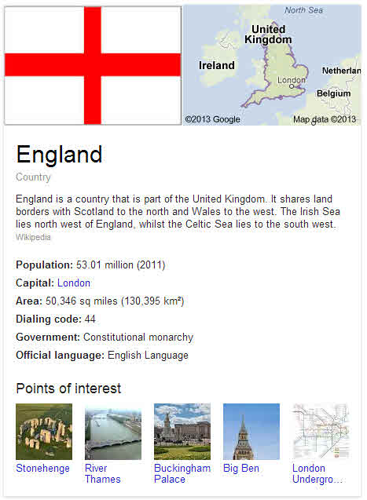
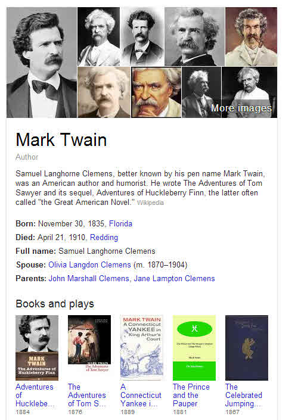
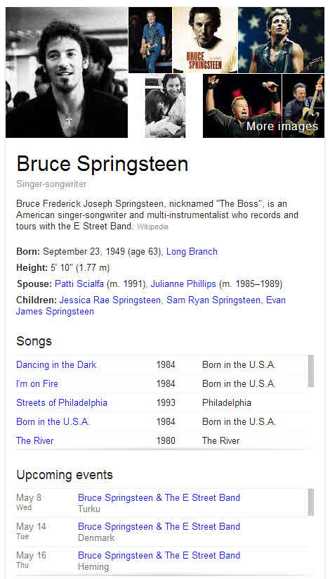
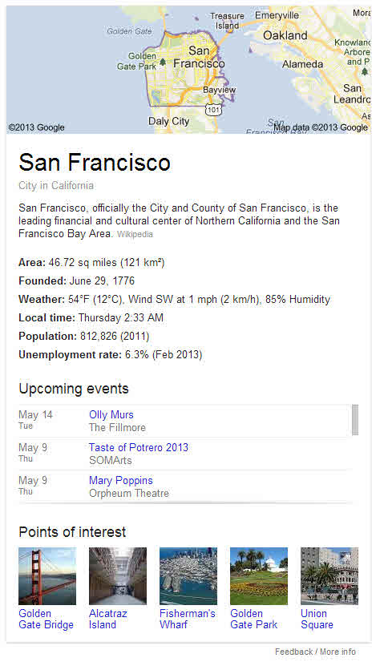

## What is a Knowledge Panel?

A knowledge panel is an information box that provides additional information about an entity that appears in a query. The information shown depends upon the type of entity mentioned in the query, and there are templates associated with specific entities that may be mentioned in a knowledge panel.

A transformation was triggered at Google with their announcement of the Knowledge Graph in the Official Google Blog post, [Introducing the Knowledge Graph: things, not strings](https://search.googleblog.com/2012/05/introducing-knowledge-graph-things-not.html). That transformation was one less concerned with matching keywords, and more concerned with matching concepts, understanding entities, and bringing knowledge about entities to searchers in knowledge panels next to search results.

Google published a patent application last week that describes the knowledge panel that appears next to search results as part of the new knowledge graph. Here’s the video that accompanied the post (note the reference to a “panel” in the presentation):

Google’s post tells us that there were three things we need to know that Google would be doing with a Knowledge Panel, from the announcement:

***Finding the Right Things*** – by giving us a choice as to the entity that Google might be showing information about in a knowledge panel.

***Getting the Best Summaries*** – by organizing and presenting information about an entity that appears within our queries in a meaningful way by studying in aggregate what people have been asking Google about each entity to be displayed in a knowledge panel.

***Going Deeper and Broader*** – by including information about a followup search that you might perform about those entities that show up next to search results.

How does Google know what to show about these things in a knowledge panel? One hint from the patent, echoed in the video, is that what people ask about in Google can determine what Google will display in the knowledge panel. If people tend to ask about Abraham Lincoln’s height, for instance, the search engine will show it in the knowledge panel:

When we look at the knowledge panel for George Washington, height isn’t included. Height also isn’t part of the information shown for William Howard Taft, Franklin Roosevelt, Bill Clinton, and Jimmy Carter. People must ask Google a fair number of times how tall Abraham Lincoln is for height to show up as an attribute for Lincoln and to not show for these other presidents.

The patent describes different templates that might be presented in a knowledge panel for different types of entities and the kinds of information that could be shown within them.

[Providing Knowledge Panels With Search Results](http://appft.uspto.gov/netacgi/nph-Parser?Sect1=PTO1&Sect2=HITOFF&d=PG01&p=1&u=%2Fnetahtml%2FPTO%2Fsrchnum.html&r=1&f=G&l=50&s1=%2220130110825%22.PGNR.&OS=DN/20130110825&RS=DN/20130110825)
Invented by Jeromy W. Henry
Assigned to Google
US Patent Application 20130110825
Published May 2, 2013
Filed August 3, 2012

Abstract

> Methods, systems, and apparatus, including computer programs encoded on a computer storage medium, for providing knowledge panels with search results. In one aspect, a method includes obtaining search results that are responsive to a received query.
>
> A factual entity referenced by the query is identified. Content is identified for display in a knowledge panel for the factual entity. The content includes at least one content item obtained from a first resource and at least one second content item obtained from a second resource different than the first resource.
>
> Data is provided that causes the identified search results and the knowledge panel to be presented on a search results page. The knowledge panel presents the identified content in a knowledge panel area that is alongside at least a portion of the search results.

Knowledge panel information can include answers to common questions that searchers ask, image files, sometimes chosen with an image search for an entity as the time of the original query where the knowledge panel is created. The patent points to the possibility of audio files and video files and other interactive user interface objects being provided in knowledge panels as well.

Some optional items indicated in the patent might include at least two images for a factual entity, a title for the entity, and facts related to the entity. We’re also told that the knowledge patent area “can consume a larger area than each of the search results.”

The content might be identified to be displayed based upon a ranking of content for the entity and upon “user search events” related to it – like “height” being chosen as a fact to display for Abraham Lincoln.

If a query might be associated with multiple and distinct meanings, we might see content for two or more meanings displayed in a knowledge panel area.

A knowledge panel for a person can include a placeholder for an image of the person, a description of the person, and at least one fact about the person.

A knowledge panel for a place may include an image showing a map associated with the place, a description of the place, and at least one fact about the place.

## The Purpose of Knowledge Panels in Search Results?

***Providing Relevant Data*** – The first, is to provide data about particular entities identified as relevant to a query.

***Speeding up time and effort*** – Reducing the number of pages that searchers would have to visit to obtain factual information and the amount of time they would have to spend to satisfy their informational needs.

***Improving users’ search experiences*** – Especially when it comes to queries aimed at “learning, browsing, or discovery,” by providing basic factual information or summary information about an entity

***Assisting Navigation*** – By providing links to topics that people tend to select as a follow-up query to the initial one, in a “seamless and natural way.”

***Supplying new content*** – By presenting information that might not have otherwise been seen by a searcher with them selecting several of the search results

## Some Possible Implementations of Knowledge Graph Information

Knowledge panel results may contain information from multiple web pages, such as an image from one page, and a set of facts from a second page and a different publisher.

The Knowledge Panel Results patent describes the possibility of knowledge panels being presented either adjacent to search results or in line with them.

A wide range of different types of entities within queries can have knowledge panel results, and the patent provides a list of examples: “a person, place, country, landmark, animal, historical event, organization, business, sports team, sporting event, movie, song, album, game, work of art, or any other entity.”

The patent tells us that a knowledge panel for a country might include a map, a flag, information about the official language of the nation, and other related facts and information. Here’s part of what is shown on a search for “England”:

Knowledge panel results could potentially be much larger than standard search results, and could be longer than three or more search results to give them room for the content items, and to “draw attention to the knowledge panel.”

Knowledge Panels may contain information from a social networking page related to an entity as well as the other types of content I’ve mentioned above.

Some types of content are deemed to be more relevant and/or appropriate. For example, an image of a person’s face is likely to be displayed over a picture of a person taken from a long-distance away.

While there are many example templates in the patent that might show what kind of information may be included within a panel, such as one for a famous actor or another for a famous musician, if someone is both an actor and a musician, information for both might be displayed, such as a list of movies the person has acted within, and a list of albums they have performed upon.

If the person is an actor or a musician, and they have won awards like an Oscar or Grammy or Golden Globe, those might be displayed. If they haven’t won awards like that, those types of facts wouldn’t be included.

When a query references an alias for a person, the knowledge panel might use that name as the title for the knowledge panel entry or include it within the entry itself, as we see below for Mark Twain.

This system might include templates for different entity types that contain place holders for images, titles, descriptions, and associated facts. The Knowledge panel results patent filing refers to the following types of templates for a knowledge panel:

- “person” templates,
- “place” templates,
- “landmark” templates,
- “movie” templates,
- “business” templates,
- “game” templates,
- “sports team” templates,
- “sports event” templates,
- “disambiguation” templates.

There may also be specific templates for entity subtypes, such as within the “person” templates, there might be one for actors, another for singers, a third for “historical figures.”

A large part of the Knowledge Panel patent is given over to providing examples of different templates for different types of entities, from different person subtypes to publicly traded businesses (with stock market information, to big-league sports teams, countries, and more. It might be more beneficial to perform many searches of different types from a list like that I provided above and see some of the kinds of information that shows up. Here are a few:

The knowledge panel for Bruce Springsteen includes images, biographical summary, songs, events, albums, and related people other searchers search for. The sections for songs and events are scrollable embedded sections, which makes this a pretty long knowledge panel. I only captured part of it with my screen capture.

This knowledge panel for San Francisco includes a map, information about the city, 10 events in a scrolling section, and local places of interest. Under it is a separate knowledge panel section for the San Francisco Giants, which seems to be a disambiguation entry in case a searcher wanted that result as a knowledge panel instead – it’s preferenced with “See results about” and if you click through, you see a pretty rich knowledge base entry for the team. I do like the “events” sections listed for cities.

Interestingly, the patent describes a template for publicly traded businesses and inclusion of a stock market graph, and yet when I searched for Google or Apple, there wasn’t a knowledge panel for me, and when I searched for Exxon Mobile, I saw a knowledge panel for the nearest Exxon gas station instead of for the company. Will Google treat knowledge panels for big companies with lots of locations as a local search feature, or as a way of providing information about the company itself?

Does anything surprise you in any Knowledge panels that you’ve seen?

Last updated June 25, 2019
