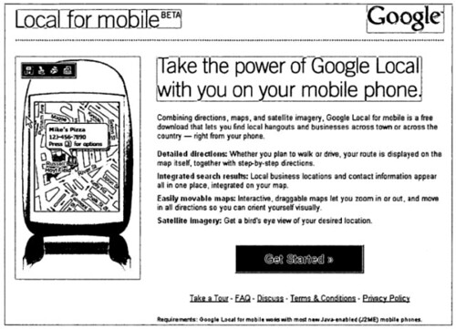

Patent applications for Google Local for Mobile were published this past week at the World Intellectual Property Organization (WIPO). The inventors listed on the documents are Adam Bliss, Mark Crady, Michael Chu, Scott Jenson, Sanjay Mavinkurve, Josh Sacks, Jerry Morrison.

Both were filed at the USPTO on November 7, 2005, filed internationally November 7, 2006, and published internationally on May 18, 2007. They haven’t been published at the United States Patent and Trademark Office yet.

These both go into a lot of detail on technical aspects of mapping, zooming, and directions. They discuss using keypads and even voice instructions. The real-time traffic that we see in the present implementation of Google Local for Mobile isn’t included within these documents.

[Mapping in Mobile Devices](https://patentscope.wipo.int/search/en/detail.jsf?docId=WO2007056449)
International Publication Number WO 2007/056449 A2
International Application Number: PCT/US2006/043473

Abstract

> A computer-implemented mapping method is disclosed and includes displaying a first map view of a geographic area on a display of a computing device, receiving a voice or key-press zoom command and generating a first zoom box of a predetermined size on the display relative to the first map view in response to the zoom command, and displaying a second map view of a zoomed geographic area corresponding to the zoom box.

[Local Search and Mapping for Mobile Devices](https://patents.google.com/patent/WO2007056450A2/en)
International Publication Number WO 2007/056450 A2
International Application Number: PCT/US2006/043474

Abstract

> A computer-implemented method is disclosed that includes receiving on a mobile device a search query associated with a geographic location, providing one or more search results in response to the search query, the search results each being associated with a geographic location, and presenting on a graphical display of the computing device icons corresponding to each search result and also corresponding to a key on the computing device.
