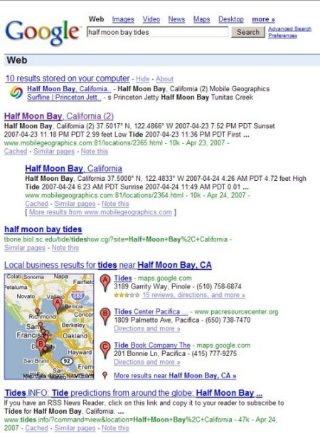

Last Week, Chris Sherman noted that Google News results are going to start appearing during search results integrated with other results, rather than above the organic Web results in [Google To Integrate News With Web Search Results](https://searchengineland.com/google-to-integrate-news-with-web-search-results-11012).

It appears that News might not be the only area that Google is experimenting with. My friend Keri Morgret sent me a screenshot of a local search results page that she received yesterday when checking a nearby beach:

It looks like it’s a personalized Web search with Google Desktop installed. Is that a difference that makes a difference?

Added (4/27/2007) – I should have caught some of the other changes that Google Local appears to undergo, but I didn’t. There’s a new look – more pins showing on the maps, and new wordings and links in the Google Maps OneBox display. Matt McGee saw this post here and noticed that there was something different about the map that Google is showing. He details the changes in his post – [Google Maps has a new Onebox Display](http://www.smallbusinesssem.com/google-maps-has-a-new-onebox-display/692/). Good catch, Matt.
