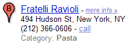
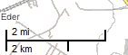
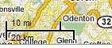
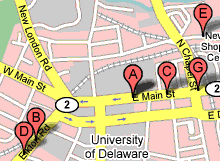
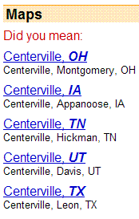
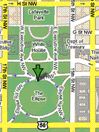
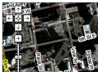
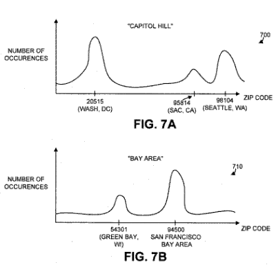

## Google Local Search Glossary

The following is a collection of Google local search glossary terms and definitions from many of Google’s patent filings on Local Search. The Local Search Glossary is organized by a Google patent, and then a post about that patent and then local search glossary terms from that patent, and definitions of those terms.

**********

12/23/2004 – Patent: [Search query categorization for business listings search](http://appft1.uspto.gov/netacgi/nph-Parser?Sect1=PTO2&Sect2=HITOFF&u=%2Fnetahtml%2FPTO%2Fsearch-adv.html&r=1&p=1&f=G&l=50&d=PG01&S1=20040260677.PGNR.&OS=dn/20040260677&RS=DN/20040260677)
Post: [Search Engine Classification and Assignment of Categories](https://www.seobythesea.com/2007/09/search-engines-classifications-and-assignment-of-categories/)

Local search glossary terms from the patent:

**Category Classification Component** – Finds appropriate categories for searchers’ queries. May use yellow page business listings or a category classification model automatically trained from different possible training data sources.

**Category Classification Model** – Based on training data from sources such as yellow page listings, categorized business web sites, consumer reports information, restaurant guides, query traffic data, and advertisement traffic data. Uses statistics to associate search queries with relevant business categories.

**Directory listings** – Business information may be taken from yellow page type directory listings, such as those compiled by various phone companies. These listings include business categories as well as business names associated with each of those categories.

**Miscellaneous Pre-Classified Business Data** – From sources like consumer reports information, restaurant guides, or web-based directory listings. Web pages about a specific business contain words fitting into specific categories which may be used to modify categories that businesses appear within. Example: a business listed on a page with words on it about “Italian Restaurants” may be placed in an “Italian Restaurant” category in Google local search.

**Query traffic data** – Searchers’ selections from searches may be used by the classification component to classify businesses when their query terms are ambiguous. Example: someone searches for “films” and they receive business listings from a “theater” category and a “photographic film” category. If they select listings from the “photographic film” category, the classification component may modify the probability that the query shows “photographic film” category results.

**Advertisement traffic data** – When a searcher selects a displayed advertisement, that may indicate that the advertisement was relevant to the search query. The search query and the category of the selected advertisement may be considered training data that can be used to modify or initially train the category classification model like the training performed for query traffic data.

**********

3/24/2005 – Patent: [Methods and systems for improving a search ranking using location awareness](http://appft1.uspto.gov/netacgi/nph-Parser?Sect1=PTO2&Sect2=HITOFF&u=%2Fnetahtml%2FPTO%2Fsearch-adv.html&r=1&p=1&f=G&l=50&d=PG01&S1=20050065916.PGNR.&OS=dn/20050065916&RS=DN/20050065916)
Post: [Location Sensitivity in Google Local Search](https://www.seobythesea.com/2006/12/location-sensitivity-in-google-local-search/)

Local search glossary terms from the patent:

**Location Awareness** – Uses some combination of location score and topical score to order documents related to a query to improve search rankings for that query. It may also include selecting a set of documents from the group of documents, determining a distance score for each document in the set of documents using a document location associated with the document and the location associated with the query, and ordering the set of documents as a function of both the topical scores of the set of documents and the distance scores of the set of documents.

**Location Sensitivity** – A location component may analyze the query to determine a keyword or a query topic. A location sensitivity of the identified topic or query is determined. Some topics are location-sensitive, and some aren’t. Different topics, query types, users, geographic locales, etc. may influence a different determination of location sensitivity. The amount or extent to which geographically-based search results are relevant to the topic and a relevant geographic range for the topic may be decided by examining such things as user behavior (e.g., user selection behavior, such as mouseover or click-through) of search results presented to the user. Examples of location sensitivity:

*Topic*: A topic, such as “pizza,” may be strongly associated with local documents or web pages (high location sensitivity), whereas a topic like “travel plans” may be less location sensitive.

Scale of default map on Search for pizza in Newark, Delaware.

Scale of default map on search for travel plans in Newark, Delaware

*Query Types*: Certain query types (e.g., commercial queries) may have different location sensitivity.

*User Specific*: Some users may specify a more local focus for their desired search results than other users, or maybe determined to have a more local focus based, at least in part, on browsing history, search history, or transactional or other kinds of available data.

*Location differences*: One location, such as Manhattan, N.Y., might be more location-sensitive compared to another geographic area, such as Camas County, Idaho (the most sparsely populated county in Idaho).

*Specificity of Query*: The specificity of a location term provided or inferred (e.g., a location specified by a user or a search query), such as a zip code versus a city versus a street address, may affect location sensitivity, as would information, such as a user-specified maximum distance (“I’m willing to travel 30 miles to . . . “).

*Example*:

> When a user types in search queries, such as “infinity auto” and “pizza,” a location component may determine associated topics of “car/automobile” and “restaurant.” The location component may determine the sensitivity of the topics “car/automobile” and “restaurant” to location-based search results. It may determine that users are generally more location-sensitive for the topic “pizza” than for the topic “automobiles/cars,” so that users may generally be interested in documents on the topic of “automobiles/cars” that are farther away from their location, whereas users may generally only be interested in documents on the topic of “pizza” that are nearer to their location. Location sensitivity can be determined relatively, or can also be mapped to a distance (e.g., users are generally interested in documents with a distance of up to 50 miles for “automobiles/cars,” but only 5 miles for “pizza”).

**Document Identification** – The search engine looks for previously indexed relevant documents in a search database in response to a query. This document data can include a universal resource locator (URL) that provides a link to a document, web page, or to a location from which a document or web page can be retrieved or otherwise accessed by the user, data indicating one or more locations with which documents are associated, and data corresponding to the text of the documents.

**Topic Score** – Various information retrieval and other techniques used by conventional search engines are used to determine the relevance of a document, such as text information, link information, and link structure, personalized information, etc. This topical score is generated from various sources and signals other than location information. A topic score is also used to find advertisements relevant to a target document.

**Distance Score** – One or more locations is determined to be associated with each of the identified documents, and a distance score is calculated for each based, at least in part, on the distance between the location(s) associated with the document and the location associated with the search query. This distance could be based upon such things as:

- straight-line distance
- Driving Distance
- Estimated Driving Time

**Combined relevance score** – The topical scores and distance scores could be merged to yield a combined relevance score for a document. The combined relevance score may result in different ranking orders than if documents were ranked by relevance to a topic or by distance alone. How the patent application describes this:

> In one embodiment of the invention, because the combined relevance score C considers both the topical score R and the distance score F of a document, it may be possible that the ordering of documents according to combined relevance scores C yields a different order than if the documents are ordered according to topical scores R or according to distance scores F. For example, consider three documents: document A, document B, and document C. Assume that document A has a topical score R1, a distance score F1, and a corresponding relevance score C1; document B has a topical score R2 (where R2>R1), a distance score F2 (where F2R1), a distance score F3 (where F3

**********

8/18/2005 – Patent: [Assigning geographic location identifiers to web pages](http://appft1.uspto.gov/netacgi/nph-Parser?Sect1=PTO2&Sect2=HITOFF&u=%2Fnetahtml%2FPTO%2Fsearch-adv.html&r=1&p=1&f=G&l=50&d=PG01&S1=20050182770.PGNR.&OS=dn/20050182770&RS=DN/20050182770)
Post: [Assigning Geographical Locations to Web Pages](https://www.seobythesea.com/2006/12/assigning-geographic-locations-to-web-pages/)

Local search glossary terms from the patent:

**Geographic Location Identifier** – may be a partial or complete postal address, telephone number, area code, etc, or any other suitable value associated with a physical geographic position, such as longitude and latitude. The geographic location identifier may be based on links, such as hyperlinks, that connect the nodes in the collection of documents – based upon the relevancy of the web documents to each other.

**Geographic Relevancy Criteria** – Geographic location identifiers included within web pages may be assigned to other web pages that may or may not contain that information if certain relevancy criteria are in place. This means that web pages that either does not include geographic descriptive information or include unrefined or incomplete geographic location information could be searched or identified based on an assigned geographic location identifier. Document relevancy may be determined based on several factors, such as relative distance between documents, terminology used, and local or web site determination. Example: a home page for a Web site doesn’t contain any address information, but the site has that information on an “About Us” page, a “contact page,” and a “directions” page – if certain criteria as defined in the patent application are met, then the home page is seen by the search engine as being relevant for the address information on those other pages.

**Forward or Outbound Link** – A link originating from a first page and leading to a second page may be called a forward or outbound link relative to the first page and indicate that the first page is a linking document.

**Backlink** – A link from a first page to a second page may be characterized as a backlink from the second page to the first page. A link originating from the second page and leading to the first page may be called an inbound link relative to the first page and indicate that the first page is a linked document.

**********

7/6/2006 -Patent: [Location extraction](http://appft1.uspto.gov/netacgi/nph-Parser?Sect1=PTO2&Sect2=HITOFF&u=%2Fnetahtml%2FPTO%2Fsearch-adv.html&r=1&p=1&f=G&l=50&d=PG01&S1=20060149734.PGNR.&OS=dn/20060149734&RS=DN/20060149734)

Local search glossary terms from the patent:

**Location Extraction** – During a Web search, the search terms may indicate the name of a geographic area, and a Google local search might be done when that geographic area is unambiguous enough.

**Ambiguous Search Query** – The names of some geographic areas correspond to common words (e.g., Mobile), and it can be hard to tell if a searcher was referring to a location in their search.

**Unambiguous Search Query** – A user-provided query clearly shows an intent for Google local search documents. A geographic reference may not be completely unambiguous if it is hard to tell which geographic location was being requested, as may happen in a search which includes a City name, but there may be more than one city with the same name.

**Unambiguous City** – If there are two cities with the same names in different states, this process may decide that the one with the largest population should be labeled as an unambiguous city. (The same may be done with counties.) Alternatively, a look at the searcher’s IP address may inform the search engine of which city was the one used in a query. Sometimes a searcher will be asked to choose which state they meant.

**Blacklist** – A blacklist may be maintained for unambiguous city names that, when combined with one or more other words, mean something other than their respective cities. For example, assume that the city of Orlando, Florida is unambiguous. When Orlando appears in a search query with the word Bloom, however, the user likely desires information associated with the actor “Orlando Bloom” and not information concerning flower shops in the city of Orlando. If the city name together with one or more other search terms of the query appear on the blacklist, then a regular web search may be performed based on the search term(s) of the query.

**********

7/6/2006 – Patent: [Authoritative document identification](http://appft1.uspto.gov/netacgi/nph-Parser?Sect1=PTO2&Sect2=HITOFF&u=%2Fnetahtml%2FPTO%2Fsearch-adv.html&r=1&p=1&f=G&l=50&d=PG01&S1=20060149800.PGNR.&OS=dn/20060149800&RS=DN/20060149800)
Post: [Authority Pages for Businesses in Google’s Local Search](https://www.seobythesea.com/2006/07/authority-documents-for-googles-local-search/)

Local search glossary terms from the patent:

**Authoritative Document** – The identification of a document or web page (URL) that is associated with a business at a location in Google local search. This system determines documents that are associated with a location, identifies a group of signals associated with each of the documents, and determines the authoritativeness of the documents for the location based on the signals.

**Candidate Documents** – Documents associated with a particular location, they may be analyzed to identify snippets of text (where a snippet of text may be defined as a portion of a document or the entire document) that include information associated with the location, such as a full or partial address of the location, a full or partial telephone number associated with the location, and/or a full or partial name of a business associated with the location. Links from these may point to the authoritative document. Other signals may be viewed to determine which candidate document is the authoritative document amongst the group of candidates, such as domain names, the business name used in the anchor text, etc.

**********

7/6/2006 – Patent: [Document segmentation based on visual gaps](http://appft1.uspto.gov/netacgi/nph-Parser?Sect1=PTO2&Sect2=HITOFF&u=%2Fnetahtml%2FPTO%2Fsearch-adv.html&r=1&p=1&f=G&l=50&d=PG01&S1=20060149775.PGNR.&OS=dn/20060149775&RS=DN/20060149775)
Post: [Google and Visual Segmentation for Local Search](https://www.seobythesea.com/2006/07/google-and-document-segmentation-indexing-for-local-search/)

Local search glossary terms from the patent:

**Document Segmentation** – A document may be segmented based on a visual model of the document. The visual model is determined according to an amount of visual whitespace or gaps that are in the document. The visual model is used to identify a hierarchical structure of the document, which may then be used to segment the document.

**Geographic Signals** – Information related to a geographic location, such as full or partial mailing address or telephone number, or a name of a business. A page may be filled with different geographical signals, which are segmented from each other by visual gaps. Example: a web page may include a list of restaurants in a particular neighborhood and a short synopsis or review of each restaurant. Or, a page may be filled with multiple reviews of the same restaurant, and segmentation may be used to separate those.

7/6/2006 – Patent: [Indexing documents according to geographical relevance](http://appft1.uspto.gov/netacgi/nph-Parser?Sect1=PTO2&Sect2=HITOFF&u=%2Fnetahtml%2FPTO%2Fsearch-adv.html&r=1&p=1&f=G&l=50&d=PG01&S1=20060149774.PGNR.&OS=dn/20060149774&RS=DN/20060149774)
Post: [Pizza at the Center of New York: Relevancy, Google Local, and Local Results in Organic Searches](https://www.seobythesea.com/2006/07/pizza-at-the-center-of-new-york-relevancy-google-local-and-local-results-in-organic-searches/)

Local search glossary terms from the patent:

**Indexing by Geographical Relevance** – Indexing documents relevant to a geographical area by indexing, for each document, multiple location identifiers that collectively define an aggregate geographic region. When creating the index, the search engine may determine a set of geographical areas surrounding a geographical area relevant to a document and associated references to the set of geographical areas with the document index.

**Geographical Regions** – With some local search engines, the local geographic region of interest is a region defined by a certain distance or radius from a starting location, such as a certain number of miles from a zip code or street address. Ideally, the Google local search engine should efficiently locate and return relevant results in the desired geographic region.

**Location Identifiers** – Documents in a database may each be associated with a geographical region. The region may be specified by a location identifier associated with the document. Location identifiers might be derived from a model of the Earth’s surface using a hierarchical grid, such as the well known Hierarchical Triangular Mesh (HTM) model.

**Geographically Relevant Documents** – Any document that, in some manner, has been determined to have particular relevance to a geographical location. Business listings, such as yellow page listings, for example, may each be considered to be a geographically relevant document that is relevant to the geographic region defined by the address of the business. Other documents, such as web pages, may also have particular geographical relevance. Example: a business may have a home page, maybe the subject of a document that comments on or reviews the business, or maybe mentioned by a web page that in some other way relates to the business. The particular geographic location for which a document is associated may be determined from postal address or other geographic signals.

**Aggregate Geographic Region** – The Google local search engine efficiently indexes documents relevant to a geographical area by indexing, for each document, multiple location identifiers that collectively define an aggregate geographic region. When the index is used to respond to individual search queries, the aggregate geographic region may be efficiently searched by merely adding a location identifier to the search query.

**********

7/6/2006 – Patent: [Local item extraction](http://appft1.uspto.gov/netacgi/nph-Parser?Sect1=PTO2&Sect2=HITOFF&u=%2Fnetahtml%2FPTO%2Fsearch-adv.html&r=1&p=1&f=G&l=50&d=PG01&S1=20060149565.PGNR.&OS=dn/20060149565&RS=DN/20060149565)

Local search glossary terms from the patent:

**Confidence Scores** – When a system identifies a document that includes an address and locates business information, that system may assign a confidence score to the business information, where the confidence score relates to a probability that the business information is associated with the address. The system determines whether to associate the business information with the address based on the assigned confidence score.

**Local Item Extraction** – When looking at a document, attempting to assign a location and assign confidence scores to that document by looking at the business information on the page, at terms that precede the address to see if any is a business name, and if there are telephone numbers, whether or not the numbers are associated with that business. Landmarks associated with the business may also be identified and assigned a confidence score.

**Business Information** – A business name (also referred to as a “title”), a telephone number associated with the address, other information related to business.

**Yellow Pages Data** – Information commonly associated with a business that is taken from a telecom directory. Some addresses may not have associated yellow pages data or possibly incorrect yellow pages data. Businesses with associated yellow pages data may be used as part of a training set used to extract location information from pages that don’t have associated yellow pages data. The documents in the training set may be analyzed to collect features regarding how to recognize business information in a document when the document includes an address.

**Training Set Features** – These could include such things as a distance that a candidate term is from a reference point (e.g., the address in the document), characteristics of the candidate term, boundary information associated with the candidate term, and/or punctuation information associated with the candidate term. The particular features that are useful to determine a title may differ from those features that are useful to determine a telephone number. The features may differ still for determining other types of business information.

**Landmarks** – Information about the location of a business, such as a postal address. This information is tied to attributes of the landmarks such as business name, telephone number, business hours, or a link to a website or a map) in a document. In other implementations, the above processing may apply to other landmarks and attributes, such as finding the price (attribute) or a product identification number (attribute) associated with a product (landmark).

**********

11/30/2006 – Patent: [Scoring local search results based on location prominence](http://appft1.uspto.gov/netacgi/nph-Parser?Sect1=PTO2&Sect2=HITOFF&u=%2Fnetahtml%2FPTO%2Fsearch-adv.html&r=1&p=1&f=G&l=50&d=PG01&S1=20060271531.PGNR.&OS=dn/20060271531&RS=DN/20060271531)
Post: [Location Prominence at Google in Ranking Businesses at a Location](https://www.seobythesea.com/2006/12/google-local-search-patent-application-on-ranking-businesses-at-a-location/)

Local search glossary terms from the patent:

**Location Prominence** – A system may identify a first document associated with a geographic location within a geographical area and identify a second document associated with a geographic location outside the geographical area. The system may also assign a first score to the first document based on a first scoring function and assign a second score to the second document based on a second and possibly different scoring function. These scoring functions can be related to distances and other scoring factors. Location prominence may refer to a score generated for a document based on one or more factors unrelated to the geographical area with which the document is associated, the searches performed by users, and/or the search queries provided by the users. Location prominence may use factors that are intended to convey the “best” documents for the geographical area rather than documents based solely on their distance from a particular location within the geographical area.

The location prominence score may be based on a set of factors that are unrelated to the geographical area over which the user is searching. This set may include one or more (a combination) of the following factors:

1. A score associated with an authoritative document;
2. The total number of documents referring to a business associated with the document;
3. The highest score of documents referring to the business;
4. The number of documents with reviews of the business;
5. The number of information documents that mention the business (such as Dine.com, Citysearch, and Zagat.com); and,
6. The set of factors may include additional or different factors.

These factors may be combined with distance scores in some instances.

**Centerpoint** – When scoring Google local search results, the search engine may identify a location within the geographical area. It may be associated with the location of city hall, downtown, or a geographic center of the area, or based upon some other Centerpoint using geographic information. The Google local search engine identifies all business listings and/or web pages within a predetermined radius of the identified location. The Google local search engine may then identify those business listings and/or web pages that match the search query. The identified business listings and/or web pages are assigned distance scores according to their distance from the identified location and ranked based on their scores.

**Postal Codes** – A geographical area might be identified by a set of postal codes allocated to the geographical area, determine a postal code associated with a document, determine whether the postal code is included in the set of postal codes associated with the geographical area, score the document based on a first scoring function when the postal code is included in the set of postal codes associated with the geographical area, and score the document based on a second scoring function when the postal code is not included in the set of postal codes allocated to the geographical area.

**Latitude and longitude coordinates** – A geographic area might be identified by latitude and longitude coordinates associated with the geographical area, determine a latitude and longitude coordinate associated with a document, determine whether the latitude and longitude coordinate is included in the set of latitude and longitude coordinates associated with the geographical area, score the document based on a first scoring function when the latitude and longitude coordinate is included in the set of latitude and longitude coordinates associated with the geographical area, and score the document based on a second scoring function when the latitude and longitude coordinate is not included in the set of latitude and longitude coordinates associated with the geographical area.

**Combination Scores** – A score may be assigned to a document based on a combination of two or more of a score associated with another document that is identified as authoritative for the document, a total number of documents referring to a business associated with the document, the highest score associated with the documents referring to the business, a total number of documents with reviews of the business, or many information documents that mention the business, and using the score to rank the document.

**Broad Area** – May be identified as being associated with the search query. It is intended to refer to any geographic location that is specified as an incomplete postal address (i.e., less than a full postal address). Any geographic location that is identified by less than a street name and street number can be considered a broad area. A broad area may include a city, a zip code, a street, a city block, a state, a country, a district, a county, a metropolitan area, a large area (e.g., Lake Tahoe area), a combination of areas (e.g., Sunnyvale and Mountain View), etc. When a search query includes information regarding a geographical area, then the broad area may be identified from the search query.

**Zcodes** – If a search query includes the phrase “Mountain View,” then the broad area may be identified as “Mountain View.” A set of “zcodes” may be identified that correspond to the broad area. These could be postal codes, such as a U.S. Postal Service zip code in the United States, or something similar to a zip code outside the United States. A set of zcodes corresponding to a broad area may include those zip codes that have been allocated to the geographical area associated with the broad area.

*Example*:

> For the Mountain View example above, assume that the set of zcodes includes the zip codes 94039, 94040, 94041, 94042, and 94043. To compress space, the zcode sets may be stored as a series of ranges. In the case of Mountain View, the zcode set may be stored as 94039:5, which corresponds to the zip code range of 94039 to 94043. If a zip code is unallocated to any other broad area, then it may be added to the range of a surrounding or adjacent zcode set. For example, if the zip code 94044 is unallocated, then it may be added to the Mountain View zcode set.

**Map Boundaries** – The entire visible map area within a map window. If a search query doesn’t include information regarding a geographical area, then the broad area may be identified in another way. If the user is accessing a map, the entire visible map area within the map window may be considered a broad area. So, a search for a business type or category while looking at Google maps might use a broad area associated with the map. As the user zooms in or out on the map or moves the map left or right, and/or provides an identifier relating to a geographical area of interest, the broad area is within the map window. The latitude and longitude of the map window may define the broad area.

**Search Area** – Associated with the broad area, a location within the broad area may be determined. This location may be associated with the location of city hall, a downtown area, a geographic center, or some other location within the broad area. A circle with a predetermined radius (e.g., 30 miles, 45 miles, 90 miles, etc.) may effectively be drawn around this location. The area of this circle may constitute the search area.

**Relevant Documents** – A relevant set of identified documents may be determined based on the search query, possibly based upon whether the documents that contain the term(s) of the search query in their title, content and/or category string. When the query includes multiple terms, documents that contain the terms as a phrase, include all of the terms, but not necessarily together, contain less than all of the terms, or synonyms of the terms may be included in the relevant set.

**Broad Area Relevant Documents** – A determination is made for documents in the relevant set as to whether they fall within the broad area. If they do not, then a distance score may be calculated for those documents. The distance score associated with a document may be determined based on the distance the postal address and/or the latitude and longitude coordinate associated with the document is from the location within the broad area (e.g., the location representing the middle of the search area). If the document is within the broad area, then a location prominence score associated with the document may be determined.

**Additional Scoring Factors** – In addition to the scoring factors above for location prominence, it’s possible for other scoring factors to be used also. Examples:

- Numeric scores of the reviews (e.g., how many stars or thumbs up/down),
- Some function (e.g., an average) of all the scores of the reviews,
- Type of document containing the review (e.g., a restaurant blog, Zagat.com, Citysearch, or Michelin),
- Types of language used in the reviews (e.g., noisy, friendly,dirty, best),
- Derived from user logs, such as what businesses users frequently click on to get detailed information and/or for what businesses they obtain driving directions,
- Financial data about the businesses, such as the annual revenue associated with the business and/or how many employees the business has,
- Number of years the business has been around or how long the business has been in the various listings, and;
- Others.

**********

5/11/2010 – Patent: [Classification of ambiguous geographic references](https://patents.google.com/patent/US20060149742A1/en)
Post: [Which Newark is the Dominant Newark? Classification of Ambiguous Geographical References in Local Search](https://www.seobythesea.com/2006/07/which-newark-is-the-dominant-newark-classification-of-ambiguous-geographical-references-in-local-search/)

Local search glossary terms from the patent:

**Ambiguous Geographic References** – Partial geographic information is associated with a document, which makes it difficult to classify as belonging to a specific geographical location.

**Geo-Relevance Profile** – A geographic location may be associated with a string of text in a document by looking at a geo-relevance profile that contains that geographic information. A geo-relevance profile is built by looking at several documents relating to a business at a specific location.

**Known Geographic Signals** – A known geographic signal may include, for example, a complete address that unambiguously specifies a geographic location. The geographic signal can be located by, for example, pattern matching techniques that look for sections of text that are in the general form of an address. For example, location classifier engine 100 may look for zip codes as five-digit integers located near a state name or state abbreviation and street names as a series of numerals followed by a string that includes a word such as “street,” “st.,” “drive,” etc. In this manner, the Location classifier may locate the known geographic signals as sections of text that unambiguously reference geographic addresses.

**Known Geographic Regions** – Documents that are determined to be associated with valid geographic signals are assumed to documents that correspond to a known geographic region.

**Training Text for Geographical Location Associations** – Text selected as training text associated with a document could be chosen in many ways. Examples: A fixed window (e.g., a 100 term window) around each geographic signal may be selected as the training text. The whole document may be selected. Or, documents with multiple geographic signals may be segmented based on visual breaks in the document and the training text taken from the segments.

**Location Identifier Fields** – Collected Information based upon types of geographic signals which are filled with text selected for each geographic signal. An example may be zip codes corresponding to the geographic signals.

**Zip Codes** – Postal codes, which can be used as a geographic signal. They tend to be particularly useful to use as an identifier for a geographic location because zip codes that are close to one another numerically tend to correspond to locations that are close to one another geographically.

**Histograms** – A way of mapping the occurrence of strings in text selections relative to location identifiers for which the terms or phrases occur. The histogram can also be referred to as the geo-relevance profile of the term/phrase. Example: a histogram is created for the bi-gram “capitol hill.” It might include three dominant peaks, a large peak centered in the vicinity of zip code 20515, which corresponds to the “Capitol Hill” area in Washington, D.C., a relatively small peak centered in the vicinity of zip code 95814, which corresponds to the “Capitol Hill” area in Sacramento, Calif., and a moderate peak centered in the vicinity of zip code 98104, which corresponds to the “Capitol Hill” area in Seattle, Wash. While references to “capitol hill,” may involve other places, the histogram illustrates that overall, “capitol hill” tends to be used when referring to one of these three locations. Washington, D.C., which corresponds to the largest peak, can be interpreted as the most likely geographic region intended by a person using the phrase “capitol hill.”

**Statistically Significant Spikes** – When it appears that certain terms or phrases may be relevant to a particular geographic location, based upon their proximity to geographic location information while looking at the training text. If certain phrases tend to be tied to certain locations in a way that appears meaningful based upon several occurrences over data collected from the training text, their appearance could be said to be statistically significant.

**********

11/2/2010 – Patent: [Methods and systems for endorsing local search results](https://patents.google.com/patent/US20060004713A1/en)
Post: [Community Endorsements for Local Searches](https://www.seobythesea.com/2006/01/commmunity-endorsements-for-local-searches/)

Local search glossary terms from the patent:

**Google Local Search Endorsements** – Users associated with each other in a social network can create and share personalized lists of Google local search results and/or advertisements through their endorsements of local search results and/or ads. Those endorsements can be used to personalize the search engine’s ranking of Google local search results by letting users re-rank results for the people endorsing them, and for the people who trust those endorsers.

**Google Local Search Endorsement Entries** – Entries made in a social network including information associated with an endorsed local article. These can include a particular local search query, one or more article identifiers for local articles and/or ads that the user has endorsed for the Google local search query, and the kind of endorsement for each of the endorsed local endorsed articles and/or ads.

## Local Search Glossary Notes:

I’ve organized the items in the Google local search glossary by patent filing because their use may be limited to the context of the document they are found within. There is some crossover on a number of these documents, so that when for instance, the patent application on “Location Prominence” refers to “Authority Documents,” it’s clear that they are referring to the definition in the patent application on “Authoritative Documents.”

More Google local search glossary items will be added from Google’s patent documents on digital maps, driving directions, and out of home advertising, and from Google’s Help and FAQs on Local Search.

If you have any suggestions or questions, please [contact me](https://www.seobythesea.com/contact-us/) or comment below.
