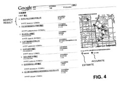

A Google patent application published at the World Intellectual Property Organization (WIPO) on local search describes some of the challenges that Google faces in providing local search to China and other Asian countries.

These may include a need to filter some sensitive keywords; finding ways to work around export restrictions that make the use of latitude and longitude coordinates difficult in some areas; and dealing with limited street numbers and address information, inconsistent yellow page formats, and the existence of common synonyms for many words and categories of businesses and other points of interest (POI).

The patent application tells us:

> In some countries, like China, for example, map data and yellow page data may not be available from a single provider and must be obtained from several different providers. Due to export restrictions, it may not be possible to get detailed map data to render the map of an area or to get the actual latitude and longitude of addresses within the area.
>
> As a result, address approximation may be used for geocoding of addresses. When results from a local search are sent to a user, the local results page may include a list of relevant results and a pointer to a map provider’s server (third party). The map provider may be responsible for generating the map displayed to the user.

This section of the patent application stood out for me:

> Front end server 440 (or components of front end server 440) may perform some tasks that may be specific to China. For example, front end server 440 may hide driving directions, provide a display unit (kilometer versus mile) that may be country dependent, **perform filtering for sensitive keywords when the user is in China***, provide specific formatting of Chinese addresses and telephone numbers for display, show the geocoded location on top of the map, and/or round the distance to 0.5 kilometers instead of 0.1 kilometers and remove the direction.

* My emphasis

Here are some of the other issues that may cause problems with local search:

1. Because of unavailable latitude and longitude information for businesses and other points of interest such as parks and hospitals and universities, maps might possibly be divided into grids (e.g., three-hundred meter by three- hundred meter grids) with a grid index for each point of interest and a program to compute the distance between the grids.

2. Street numbers might not be available for many of those POIs – the patent filing tells us that only 20% to 30% have numbers. Because of that, in showing a map, locations that are marked as accurate might be displayed in one color. Locations that don’t have a street number might be shown with a different colored marker.

3. Yellow page data for rural areas may be in a free format rather than consistently structured, making indexing the information difficult.

4. Since the number of web document clusters may be much smaller for Chinese data compared to English data, there may be more reliance upon a match in a business title or category to a query term to return valid results.

5. In Chinese, there may be several synonyms referring to the same term, so that for instance the term “restaurant” may have several common synonyms in Chinese. A list of synonyms may be shown to a searcher for these categories, so that they can choose, or a local search query many be rewritten and expanded to provide results for all of the common synonyms for one of those types of categories.

6. Different providers of yellow page data might use different names to represent the same category.

7. Geotargeting of advertisements may be difficult or impossible to do, and may have to rely upon the use of a location included in a query.

The patent application is definitely worth reading through carefully if you are interested in Google’s local search, regardless of where you are located. It provides some insights that may have apply in places other than China or other parts of Asia.

Local Search
Published March 8, 2007
International Publication Number WO 2007/027608 A2
International Application Number: PCT/US2006/033537
International Filing Date: August 30, 2006
Applicant GOOGLE INC.
Invented by Kun Shing Luk, Hucan Zhu, and Hongjun Zhu
