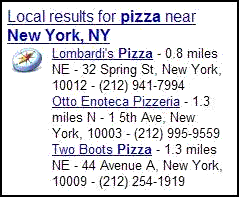

I was showing someone Google Local [one box results](https://support.google.com/websearch/answer/134479) (see H.) for a specific search, and they asked me why Google was showing distances in those results, and where the search engine got the distances from. A good question; my answer was that it was from the CenterPoint of a defined geographic region that Google assigned to the businesses listed. And no, I couldn’t tell her where that point was located at. But it appears that something called location prominence plays a role in rankings in local search now.

My answer was based upon a patent application from Google that was published earlier this summer – [Indexing documents according to geographical relevance](http://appft1.uspto.gov/netacgi/nph-Parser?Sect1=PTO2&Sect2=HITOFF&u=%2Fnetahtml%2FPTO%2Fsearch-adv.html&r=1&f=G&l=50&d=PG01&p=1&S1=20060149774&OS=20060149774&RS=20060149774). The process in that document depends upon finding a geographic region related to a local search query and then returning results within a certain range of the CenterPoint of that region.

**One Box Local Results vs. Google’s Local Search Results**

Interestingly, when I click on the link for [Local results for pizza near New York, NY](https://www.google.com/maps/search/pizza/@40.697488,-73.979681,10z/data=!3m1!4b1?hl=en), found on the page that the screenshot above is from, and look at the list on the Google Local page, I no longer see distances in miles, and one of the results has changed.

Why are the results different on the Google Local page than on the Google one box results? Is Google using something else to rank those businesses?

That’s a good question, too. I’m not sure that I would have asked myself that until I came across the following new location prominence patent application from Google, which discusses providing results based upon additional factors other than just distance from some geographic center point.

**Google’s New Location Prominence Patent Application**

[Scoring local search results based on location prominence](http://appft1.uspto.gov/netacgi/nph-Parser?Sect1=PTO2&Sect2=HITOFF&u=%2Fnetahtml%2FPTO%2Fsearch-adv.html&r=1&p=1&f=G&l=50&d=PG01&S1=20060271531.PGNR.&OS=dn/20060271531&RS=DN/20060271531)
Invented by Brian O’Clair, Daniel Egnor, Lawrence E. Greenfield
US Patent Application 20060271531
Published November 30, 2006
Filed May 27, 2005

Abstract

> A system may identify a first document associated with a geographic location within a geographical area and identify a second document associated with a geographic location outside the geographical area. The system may also assign a first score to the first document based on a first scoring function and assign a second score to the second document based on a second scoring function.

The first patent filing I mentioned was submitted to the US Patent and Trademark Office in December 2004. This newer one on location prominence was filed in May 2005. So it could indicate a change in the way that Google thought about the order of sites listed on the local search page. We’re told in an early section of the patent filing, the *Description of Related Art* (a section that usually explains what issues a patent filing is intended to address), the following:

> When scoring the results, a local search engine may identify a location within the geographical area. This identified location may be associated with the location of the city hall, downtown, or a geographic center of the area. The local search engine identifies all business listings and/or web pages within a predetermined radius of the identified location. The local search engine may then identify those business listings and/or web pages that match the search query. The identified business listings and/or web pages are assigned scores according to their distance from the identified location and ranked based on their scores. If the user does not live near the identified location or is not interested in business listings and/or web pages near the identified location, the search results are not meaningful to the user.

So the idea behind this new patent application looks to be to provide results in an order that may more meaningfully reflect a relationship with a specific area instead of a distance from an arbitrary center point.

**Google’s Use of Location Prominence**

The “location prominence” noted in the title to the document refers to “factors that are intended to convey the “best” documents for the geographical area rather than documents based solely on their distance from a particular location within the geographical area.”

What kind of location prominence factors would those be?

The patent describes how it might associate a query with a certain set of geographical locations based upon such things as postal codes, or it might take the latitude and longitude of the map window when the search takes place while the searcher is looking at a map of the area in question. After that, it might look at factors such as:

1. A score associated with an authoritative document,
2. The total number of documents referring to a business associated with the document,
3. The highest score of documents referring to the business,
4. The number of documents with reviews of the business, and;
5. The number of information documents that mention the business.

The patent describes each of those in more detail, including what it might consider an authoritative document associated with a business. That may be described in another patent application that came out this summer looking at some ways of determining which web site is the most authoritative for a business. See: [Authority Documents for Google’s Local Search](https://www.seobythesea.com/2006/07/authority-documents-for-googles-local-search/).

**References and Mentions as Location Prominence Factors**

While the first listed factor (location associated with an authoritative document) may involve links, a review, reference or mention of a business with some geographical location information attached to it doesn’t mean that “links” are being looked at:

> The number of information documents that mention a business associated with a document may be used as a factor in determining the location prominence score for the document. An information document may refer to a document that provides important information about a business, such as the address, telephone number, and/or hours of operation of the business, reviews and/or atmosphere of the business, whether the business accepts credit cards, etc. Examples of information documents may include Dine.com, Citysearch, and Zagat.com. In one implementation, the total number of information documents mentioning a business may be used as a factor in determining the location prominence score of a document associated with the business.

**Distance as a (Continued) Factor?**

The document does mention that these factors may be considered in conjunction with a distance score, to “provide better user experience by presenting the user with documents associated with businesses that are closer together rather than scattered apart.”

The distance score is defined here as being the CenterPoint of the postal codes associated with the query, or the midpoint of the latitude and longitude showing in a map area when the search is conducted while the searcher is looking at a map of the region.

**Conclusion**

Distance, links, and mentions all could contribute to having a business listed first based on location prominence. But what if all of the links pointing to a site are warnings, the reviews are bad ones, and the mentions less than kind? Like PageRank, this method seems unable to distinguish between popularity and infamy.

So a bad restaurant in the center of town that people talk about frequently may be listed higher than an excellent eatery on the outskirts of town that fewer sites link or refer to. Guess that’s why they let you see those reviews.

**Added (12/2/2006): Another Google Local Patent application This Week and Another Local Search Blog**

This additional patent application is closely related enough to the one I originally wrote about in this post, that I felt it was more appropriately added to this post instead of a new post. I mention above how a distance score could be defined as “a midpoint of the latitude and longitude showing in a map area when the search is conducted while the searcher is looking at a map of the region.” This patent filing explores using those map boundaries as an area to focus upon when someone is searching with a map in front of them:

[Using boundaries associated with a map view for business location searching](http://appft1.uspto.gov/netacgi/nph-Parser?Sect1=PTO2&Sect2=HITOFF&u=%2Fnetahtml%2FPTO%2Fsearch-adv.html&r=1&p=1&f=G&l=50&d=PG01&S1=20060271280.PGNR.&OS=dn/20060271280&RS=DN/20060271280)
Invented by Brian O’Clair
US Patent Application 20060271280
Published November 30, 2006
Filed May 27, 2005

Abstract

> A system aggregates entity location information from multiple documents distributed among multiple locations in a network. The system searches the entity location information to identify the first set of entities located within the entirety of the first geographic region selected by a user. The system provides a first digital map to the user via a network, the first digital map including the first geographic region, and further including visual representations of the first set of identified entities and their associated geographic locations.

I also wanted to point out the blog of Frank Fuchs, who is EU Product Manager for local search at Yahoo!, and covers issues related to maps and local search in locally type(d) thoughts a local search & maps blog. His latest post provides some thoughtful feedback on this one.

I decided that it might be a good idea to identify and link to some interesting posts about local search, and came up with the following list:

- [Assigning Geographical Locations to Web Pages](https://www.seobythesea.com/2006/12/assigning-geographic-locations-to-web-pages/)
- [Was Google Maps a Proof of Concept for Google’s Knowledge Base Efforts?](https://www.seobythesea.com/2014/09/google-maps-proof-of-concept/)
- [Location Prominence at Google in Ranking Businesses at a Location](https://www.seobythesea.com/2006/12/google-local-search-patent-application-on-ranking-businesses-at-a-location/)
- [Location Sensitivity in Google Local Search](https://www.seobythesea.com/2006/12/location-sensitivity-in-google-local-search/)
- [Authority Pages for Businesses in Google’s Local Search](https://www.seobythesea.com/2006/07/authority-documents-for-googles-local-search/)
- [10 Most Important SEO Patents: Part 8 – Assigning Geographic Relevance to Web Pages](https://www.seobythesea.com/2012/02/assigning-geographic-relevance-web-pages/)
- [How Google May Identify Implicitly Local Queries](https://www.seobythesea.com/2012/06/how-google-may-identify-implicitly-local-queries/)

Last Updated June 26, 2019.
