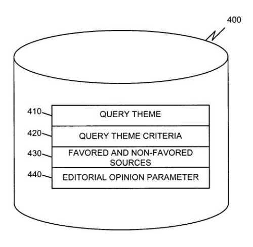

## What Role Does Editorial Opinion Play in Ranking Search Results?

Assignments of query themes, favored and non-favored pages, ranking based upon editorial opinion – a new patent from Google provides an interesting way of ranking search results in response to queries. Here’s a quick summary of the processes described in this patent granted today to Google.

(1) A method that provides search results which includes:

(a) Receiving a search query,
(b) Retrieving one or more pages in response to the search query,
(c) Determining whether the search query corresponds to at least one query theme of a group of query themes,
(d) Ranking the one or more pages based on a result of the determination, and;
(e) Serving those ranked pages.

(2) A method for determining an editorial opinion parameter for use in ranking search results:

(a) Developing one or more query themes,
(b) Identifying, for each query theme, a set favored pages,
(c) Identifying, for each query theme, a set of non-favored pages, and;
(d) Determining an editorial opinion parameter for all of the pages in those sets.

Here’s the editorial opinion patent:

[System and method for supporting editorial opinion in the ranking of search results](https://patents.google.com/patent/US7096214B1/en)
Invented by Krishna Bharat, Benedict Gomes, Georges R. Harik, and Marissa Mayer
Assigned to Google
US Patent: 7,096,214
Granted August 22, 2006
Filed: December 13, 2000

Abstract

> A server improves the ranking of search results. The server includes a processor and a memory that stores instructions and a group of query themes. The processor receives a search query containing at least one search term, retrieves one or more objects based on the at least one search term, and determines whether the search query corresponds to at least one of the group of query themes. The processor then ranks the one or more objects based on whether the search query corresponds to at least one of the group of query themes and provides the ranked one or more objects to a user.

The database used in this editorial opinion process may include:

- A query theme field,
- A query theme criteria field,
- A favored and non-favored sources field,
- An editorial opinion parameter field,and;
- Additional fields that aid in searching and sorting information in a database and/or information retrieved from the network.

**Query Theme Field**

The query theme field would store information identifying query themes, which are topics commonly occurring in search queries from users in the network. Editors may develop these query themes by looking at search query logs and developing categories of information for those queries.

Examples of query themes:

- sites that provide free software downloads
- sites that help people find an accommodation

**Query Theme Criteria Field**

The query theme criteria field may store criteria for determining whether a search query satisfies a particular query theme identified in the query theme field. These criteria can be established in at least two different ways.

(1) Editors may create a rule for each query theme to decide if a future search query belongs to the theme.

> For the query theme “sites that provide free software downloads,” the rule may be the requirement that the query contains the word “free” and “download.” For the query theme “sites that help in finding an accommodation,” the rule may be the requirement that the query contains one of the words: {“accommodation,” “lodging,” “hotels,” . . . } and also that the query contains the name of a place (e.g., by matching one of a list of place names).
>
> In an implementation consistent with the present invention, the rule may be represented as a boolean expression. For example, a rule for sites that provide free software downloads may be (“free” AND “download”). A rule for sites that help in finding accommodation maybe
>
> ((“accommodation” OR “lodging” OR “hotels” OR “motels”)
>
> AND
>
> (“Alabama” OR “Alaska” OR . . . “Wyoming”)).

(2) Editors may establish categories/topics from a directory to compare it to the search query, to see if the query fits within a particular query theme.

The topics could be the topics in an online hierarchical directory, such as the Open Directory, Yahoo!, or Google.

**Favored and Non-Favored Sources Field**

Sets of web pages/sites that are either:

1. Favored Sources – Identified sources of useful or authoritative content on the desired subject.

2. Non-Favored Sources – Identified as sources of misinformation or over-promotion on that subject.

*Example*

> For the query theme “sites that provide free downloads,” web sites providing free software downloads would be considered “favored sources” and web sites that mislead search engines with words such as “free” and “download” (popularly known as “spam techniques”) but do not provide access to free downloads, would be considered “non-favored sources.”

*Classifying web sites as “favored” based on host names*

For example, the site of the World Wildlife Fund is hosted by www.wwf.org. It would be a favored source for queries dealing with wildlife or animals.

A host can contain more than one web site, with some parts relevant while others aren’t. Relevant parts can be denoted by a set of URL prefixes (e.g., www.geocities.com/A/B/C).

*Automatic determination of favored and non-favored sources*

Favored and non-favored sources may be automatically determined. This would be done by classifying exemplary queries in the query theme into a set of topics as described above. Web hosts appearing in the URLs associated with the best matching topics to the query theme may be taken to be favored sources.

> For example, if the query theme is “sites that help in finding accommodation,” then web hosts listed under the Open Directory category “http://dmoz.org/Recreation/Travel/Lodging” can be taken as favored sources.

**Editorial Opinion Parameter Field**

The editorial opinion parameter field may include parameters that quantify the editorial opinion for specific favored and non-favored sources for search queries that match specific query themes. It can be used to modify the placement of web pages in the ranking of search results.

**Determining Editorial Opinion Parameters**

1. Processing may begin with an editor or group of editors developing a set of query themes.
2. The editors may develop these query themes by:

- Surveying user search query logs,
- Experimenting with test search queries, and;
- Examining search result lists.

3. For each theme, editors may determine query theme criteria for identifying whether a particular search query satisfies a query theme.

Query theme criteria may be in the form of one or more rules and/or sets of categories or topics from a directory.

> For the query theme identified above, an exemplary rule may be that the search query must contain the words “free” and “download” and an exemplary directory topic may be “Computer: Software: Shareware.”

4. After developing query themes and associated criteria, the editors may identify, for each query theme, sets of web sites as being from “favored sources” and “non-favored sources”.

This identification of favored sources and non-favored sources may be performed manually by the editors by performing test queries and identifying web sites that are misleading or automatically by the client device or server by identifying web hosts that exist under conventional hierarchical online directories as “favored sources” or “non-favored sources”.

5. After identification as favored or non-favored, the editors may determine an editorial opinion parameter for that site.

A server may use the editorial opinion parameter to adjust the score of a particular web page up or down depending upon whether the web site is “favored” or “non-favored.”

> In extreme cases, the applicable editorial opinion parameter may cause the web page to be moved to the top of the ranked list or removed from the list completely. In another case, the applicable editorial opinion parameter of a web site may selectively affect one of the scores used in determining the final ranking (e.g., the text match score, the connectivity-based score, or the popular opinion score).

**Integration with other parameters**

Editorial opinion may be considered as an additional input parameter that combines with other factors such as textual-matching, connectivity analysis scoring, etc., for determining the overall ranking.

This would likely provide a better result than simply returning web pages on favored sites that match the query. So, a web page could be assigned a higher rank if it is on a web site that hasn’t been identified as a favored source than another which is from a favored source if it is found to better match the query.

**Conclusion**

Interesting things afoot here, with queries being part of a relevance and ranking measure, and favored sites mentioned. How does one get to be a favored site? Is inclusion in DMOZ or Yahoo! a requirement? Not sure that I’m that fond of that. Is this something that Google is doing? Keep in mind that the processes described in this patent may never be used, or that they could be implemented in different ways than described here.
