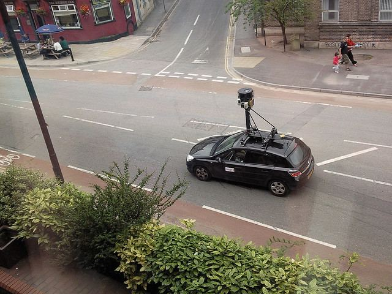
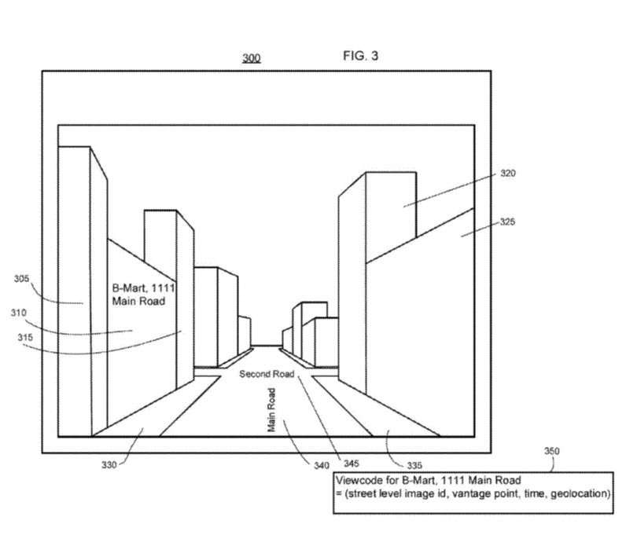
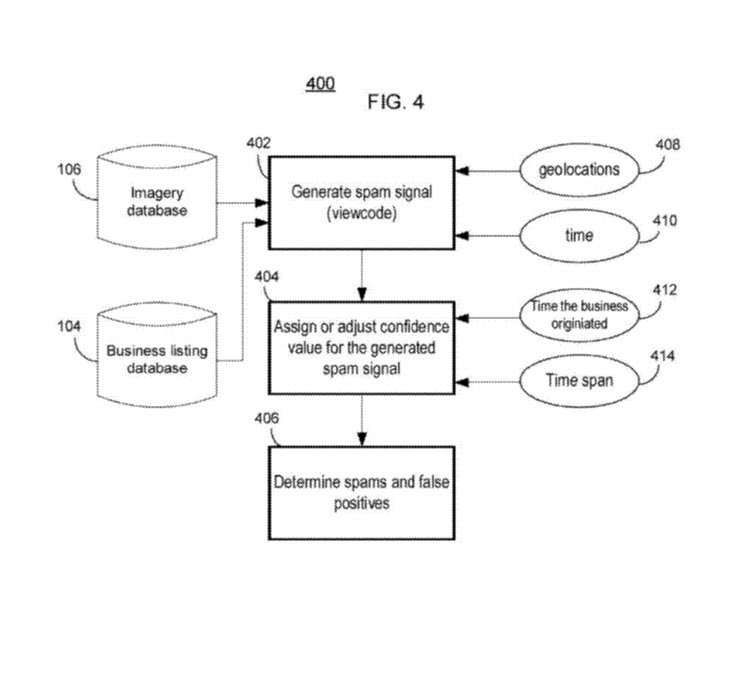
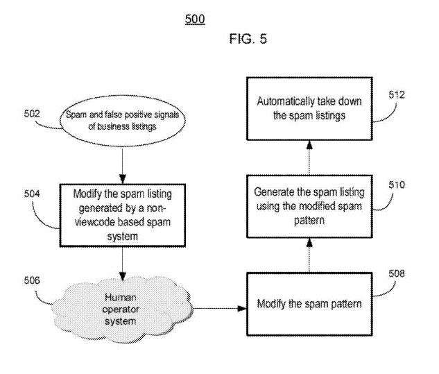
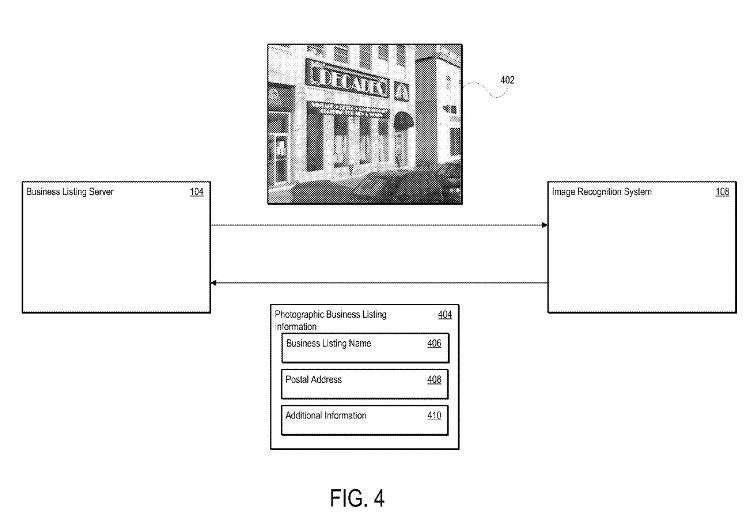
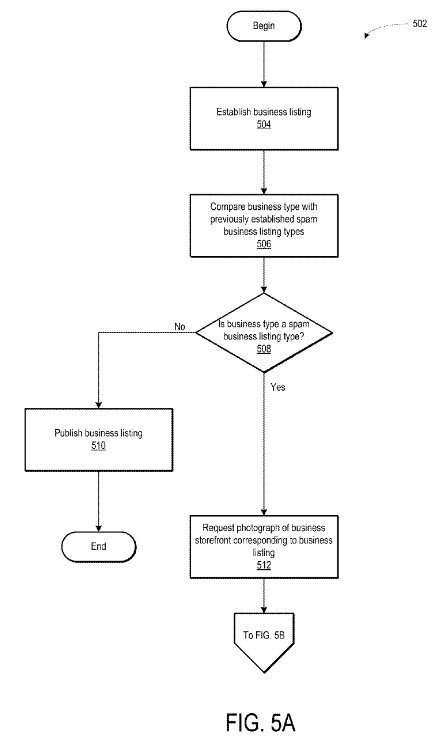

A couple of interesting patent applications surfaced at Google recently, involving the use of photography to identify whether or not businesses exist, or might be closed, or might be Web Spam.

_Google Street View Car in Bristol, Byrion Smith, [Some rights reserved](https://creativecommons.org/licenses/by/2.0/)_

The first of these looks at Street Views images, and is:

[Systems and Methods of Correlating Business Information to Determine Spam, Closed Businesses, and Ranking Signals](http://appft.uspto.gov/netacgi/nph-Parser?Sect1=PTO1&Sect2=HITOFF&d=PG01&p=1&u=%2Fnetahtml%2FPTO%2Fsrchnum.html&r=1&f=G&l=50&s1=%2220150154607%22.PGNR.&OS=DN/20150154607&RS=DN/20150154607)
Inventors: Andrea Frome, Howard Wellington Trickey, Melanie Clements, Ethan G. Russell, Paul Eastlund, Diego Ariel Gertzenstein, Douglas Richard Grundman, Baris Yuksel
Assigned to: Google, Inc.
US Patent Application 20150154607
Published June 4, 2015
Filed: February 24, 2011

Abstract

> Systems and methods are provided for determining whether given business listings are spam or are closed businesses. In one example, a system receives a business listing from a user. The business listing contains geolocation and the name of a business. The system also receives one or more street-level images related to a geographic object that is at or near the same geolocation as the business listing. The system determines if the business listing is spam or is closed based on the received street-level images by determining if the geographic object is the business or by analyzing whether the business associated with the listing is shown in any of the street-level images.

This patent is aimed at detecting business listing spam and closed businesses in Google Maps.

Fake business listings can impact people using Google because business listings can appear in Google Maps results, in Google Search Results, and location-based services.

These listings may include input from business owners that can include the business’s name, address, contact numbers, web site and geolocation data (latitude/longitude), and other information. Those listings might include unwanted spam (fake listings for businesses that do not exist) as well as closed businesses, which may mislead searchers.

Google has been sending out cars with cameras on top of them, filming streets across the country. Reports have surfaced recently that [Apple is Now sending out vehicles to film businesses in a similar manner](https://www.nbcnews.com/tech/mobile/apple-maps-competes-google-street-view-n372961).

The street Level images from Google are shown in Google Maps, and usually display photos of buildings, neighborhoods, and other features to enable people to take in a geographical location from the perspective of a person rather than from a satellite view or aerial view from above. These can include places such as “a museum, a gourmet shop, a restaurant or other point of interest” You could also see storefronts and the signs of businesses. Google shows off other sites at their [Views](https://www.google.com/streetview/) pages.

This patent uses something it calls view codes, to “rank business listings relative to one another and to decide which businesses to present for prominent display on a map.”

_This is referred to as a viewcode in the patent’s drawings._

## How Google Determines if a Business Listing is Valid Under this Patent

1) It starts with Google receiving a business listing containing geolocation information and the name of a business
2) An image related to the geographic object initially associated with the business listing may also be received, from a street views vehicle
3) The geographic object may be verified to see if it is associated with the business, by comparing the geolocation information of the business listing with location information of the image
4) If the business listing is not associated with the location information of the image, The business listing may be considered to be spam or a closed business.

_These are the steeps Google may take in response to this process._

The image may contain timing information, which indicates the time when the image was captured.

The originating time of a business might be identified that says when business was set up at an address indicated by the geolocation information of the business listing, and that may be compared to the time the image was captured.

If other business listings were submitted by the same account, and they have been determined to be spam or closed businesses, that may indicate a need for further scrutiny of this particular account, and possibly the shutting down or locking for the account that submitted this business listing.

A view code may be received that shows a different business in the same geographic location, along with timing information that indicates when the image was taken. That might be used to tell if the other business that was submitted as being at that location might be a spam business or a closed business.

_This is how Google may use streetviews to fight mapspam._

## Other Photographs and Spam Businesses

Another patent application published today at the United States Patent at Trademark Office seems to be very related but doesn’t rely upon Street Views images.

That patent shares one inventor with the patent listed above, Baris Yuksel.

[Verifying a Business Listing Based on Photographic Business Listing Obtained through Image Recognition](http://appft.uspto.gov/netacgi/nph-Parser?Sect1=PTO1&Sect2=HITOFF&d=PG01&p=1&u=%2Fnetahtml%2FPTO%2Fsrchnum.html&r=1&f=G&l=50&s1=%2220150161619%22.PGNR.&OS=DN/20150161619&RS=DN/20150161619)
Inventors: Baris Yuksel
US Patent Application 20150161619
Published June 11, 2015
Filed: January 5, 2012

Abstract

> An apparatus for verifying the authenticity of a potentially false business listing is provided. The apparatus may include a memory that stores a plurality of business types and a plurality of business listings. The business types may identify one or more spam business types. The apparatus may further include a processor in communication with the memory that identifies a selected one of the business listings as a potentially false business listing when the business type of the selected business listing is identified as one of the spam business listing types.
>
> The apparatus may then communicate a request for a photograph of a business corresponding to the identified business listing and extract photographic business listing information from the requested photograph. When the extracted photographic business listing information does not match the identified business listing, the apparatus may remove the business listing from the plurality of business listings.

This patent identifies a problem that it has been created to address, involving fake locations:

> Because an online search provider can present many different businesses at once to a user, there may be a high degree of competition among businesses, especially where there is a high concentration of businesses of the same type in a geographic region. As businesses have learned that a user may typically seek out businesses that are geographically closer to him or her, a business may exploit an online search provider to take advantage of this fact. For example, a business may provide a false address to the online search provider such that when the business listing for the business appears in the search result webpage, the business listing may include the false address. The false address may entice the user into contacting the business and thereby may mislead the user away from choosing a business that is geographically closer to him or her. An online search provider has an interest in preventing these types of misleading business listings.

This patent tells us that it may attempt to request photographs of a business, corresponding to a potentially false business listing, and if it receives one and that doesn’t match the geographic location where the business is located, it may identify the business as being a false business listing.

That request for a photograph would be sent to the person listed as the owner of a business listed in the submission of a business.

A photograph returned in response to such a request would be submitted to an image recognition system to determine if the photographic business listing information matches images at the geographic image location submitted by the business owner. This patent doesn’t mention Street Views, and yet I could see how it might be used with Google’s Street Views system to determine if a photo submitted by a business owner might match any images taken for the Street Views project at Google.

This patent tells us that it might look at any business signs or postal address information within received photographs for businesses to see if the business name and the postal address shown to match up with the business name and geographical information submitted about a business. That kind of information would be recognized through an image recognition process.

_Image matching may identify information from a building to verify a business listing._

This patent has a section in the description part where it discusses a spam business type database, where it might store information about business types that are known to be spam business types:

> As discussed above, a spam business type is a business type that is usually associated with a business listing that a user creates to drive more consumers to his or her business, where the business listing contains purposefully false or inaccurate information. A typical spam business listing may include a false address such that users in proximity to the false address are drawn to the spam business listing and away from business listings that have correct addresses but may be slightly further away. Other business information that a spam business listing may include maybe a false business phone number, a false or misleading business name (e.g. a business named “Joe’s” may be listed in the business listing as “Joe’s Compare Best Jewelry Prices Lowest”), or any other type of false or misleading business.

It appears that under this patent, Google may only be sending requests for photographs of businesses to check up upon to business types listed in the Business Spam Type Database.

_Businesses that fit into spam businesses categories may be the only ones that go through this process._
